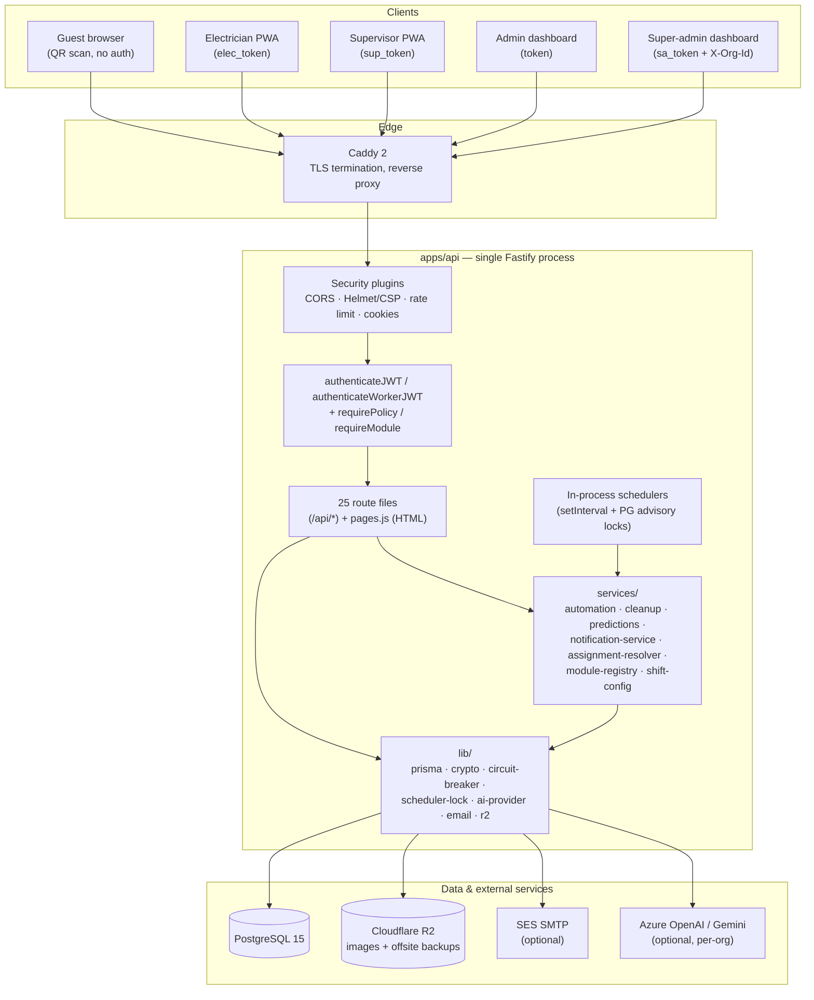
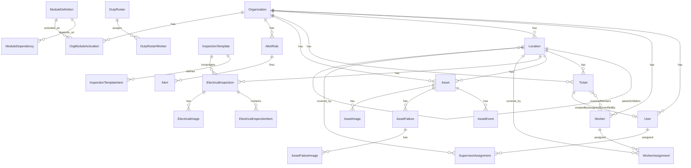
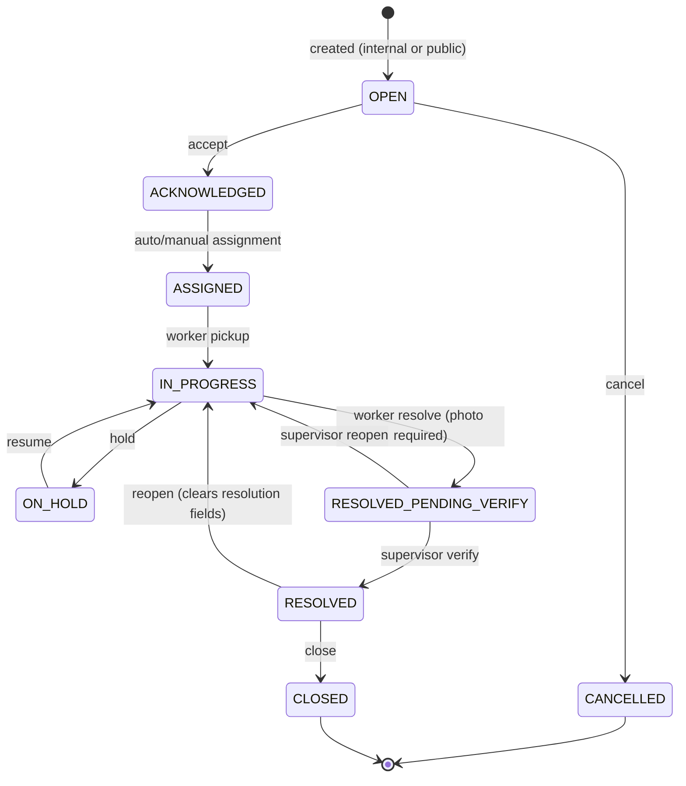
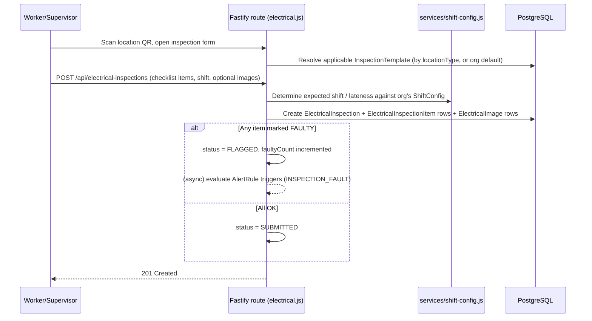
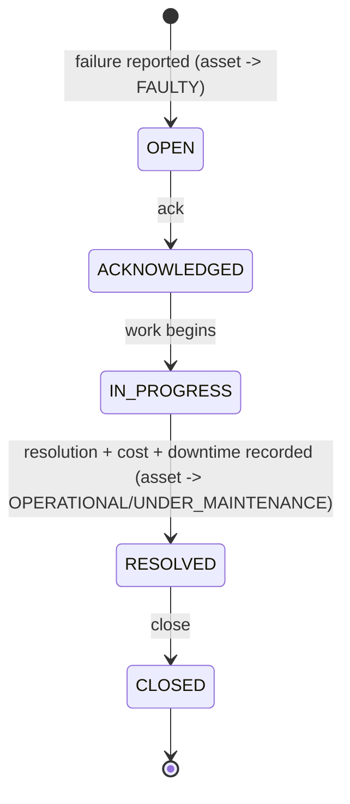
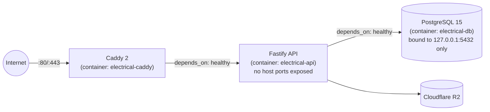

# Kodspot Electrical Platform — AI Knowledge Base

**Standalone reference document.** This file is generated for external knowledge-sharing
purposes only. It is **not** part of the repository's own documentation system (see
`docs/README.md` for that canonical, actively-maintained knowledge base) and is not
updated automatically when the code changes. Every statement below is sourced from the
repository as it exists at the time of writing (commit history through
`91c538c fix(workflow): module-scoped supervisor/electrician queues and QR print
reliability`, dated 2026-07-22). Where the repository did not provide evidence for a
claim, this document says so explicitly rather than guessing.

---

## Table of Contents

1. [Executive Summary](#1-executive-summary)
2. [Product Overview](#2-product-overview)
3. [System Architecture](#3-system-architecture)
4. [Technology Stack](#4-technology-stack)
5. [Repository Structure](#5-repository-structure)
6. [Data Model](#6-data-model)
7. [API Reference](#7-api-reference)
8. [Business Modules](#8-business-modules)
9. [Core Workflows](#9-core-workflows)
10. [Authentication, Authorization & Multi-Tenancy](#10-authentication-authorization--multi-tenancy)
11. [Resilience & Background Jobs](#11-resilience--background-jobs)
12. [Notifications](#12-notifications)
13. [Frontend / PWA](#13-frontend--pwa)
14. [Deployment & Infrastructure](#14-deployment--infrastructure)
15. [Environment Variables](#15-environment-variables)
16. [Monitoring, Runbooks & Disaster Recovery](#16-monitoring-runbooks--disaster-recovery)
17. [Testing](#17-testing)
18. [Architecture Decision Records (Summaries)](#18-architecture-decision-records-summaries)
19. [Known Risks (Frozen Snapshot, 2026-07)](#19-known-risks-frozen-snapshot-2026-07)
20. [Engineering Conventions & Governance](#20-engineering-conventions--governance)
21. [Glossary](#21-glossary)
22. [AI Knowledge Snapshot](#22-ai-knowledge-snapshot)

---

## 1. Executive Summary

**Project name:** Kodspot Electrical Platform (package name `electrical-api`, version `1.0.0`,
unreleased/untagged as of this writing).

**What it is:** A multi-tenant SaaS platform for electrical-inspection and facility-ticket
management. One deployment serves many organizations (hospitals, hotels, offices, colleges,
etc. — `Organization.type` is a free-text field with examples "hospital", "hotel", "office"
in the schema comment). Each organization's data is strictly isolated by a server-derived
`orgId` present on nearly every database row.

**Business problem it solves:** Facilities and electrical-maintenance teams need a way to
(a) run structured, checklist-based electrical safety inspections on a recurring shift
schedule, (b) let anyone — staff or an unauthenticated guest — report a facility problem via
QR code and track it through to a verified resolution, (c) track physical assets (panels,
transformers, generators, etc.) and their failure/maintenance history, and (d) give
administrators visibility (analytics, AI-assisted insights, audit trails) across all of the
above, without needing separate software for each of these needs.

**Target users / roles** (five, in increasing privilege): **guest** (unauthenticated public
complainant) → **electrician/worker** → **supervisor** → **admin** → **super-admin**
(cross-tenant platform operator).

**Core technologies:** Fastify 4 (Node.js HTTP framework) + Prisma 5 ORM over PostgreSQL 15;
server-rendered static HTML + vanilla JavaScript PWA frontend (no build step, no SPA
framework); Caddy as reverse proxy/TLS terminator; Cloudflare R2 (S3-compatible) for object
storage; optional Azure OpenAI / Google Gemini integration for AI features; Docker Compose
for deployment orchestration on a single AWS EC2 VM.

**Architecture style:** Deliberate **modular monolith** (one Node process, one PostgreSQL
database) — explicitly *not* microservices. This is [ADR 0002](#18-architecture-decision-records-summaries),
not an accident of scope. Business capability is organized into four **feature modules**
(`ele`, `civil`, `asset`, `complaints`) that an organization can selectively enable.

**Scale / deployment model:** Single-VM, single-instance Docker Compose deployment today.
The codebase has been explicitly audited and partially hardened for eventual horizontal
scaling (see [§14](#14-deployment--infrastructure) and `docs/SCALING.md`), but real-time
notifications (Server-Sent Events) are the one component **not yet safe** to run on more
than one instance without additional infrastructure (Redis pub/sub or Postgres
`LISTEN`/`NOTIFY`).

**Development philosophy / process maturity:** This is an unusually process-mature
codebase for its size. It has been through a formal, dated **17-work-package hardening
program (WP1–WP17)** driven by a production-readiness audit, the full record of which lives
in `docs/ENGINEERING_CHARTER.md`'s Amendment Log and `CHANGELOG.md`. The Charter is an
actively enforced "Definition of Engineering" (tenant-scoping contract, transaction
discipline, resilience-as-shared-primitives, documentation-trigger table, code-review
checklist) — not aspirational documentation. An in-repo `docs/` knowledge base (architecture
docs, ADRs, generated route index, environment reference, runbooks) already exists and is
the **authoritative, living** source; this file is a point-in-time export of the same
underlying facts for portability.

**Current status (as of the last internal Production Readiness Audit, 2026-07, post-WP17):**
Verdict was **NOT READY FOR PRODUCTION**, blocked on exactly two critical findings — known
CVEs in production dependencies with no CI gate to catch them, and a non-functional offsite
backup path (Cloudflare R2 credentials returning `403` on all operations in the audited
environment). Every other assessed area (auth/authz/tenancy, business logic, automated
testing — 256 tests passing at audit time, lint, Docker hardening, CI/CD) was assessed as
production-grade. See [§19](#19-known-risks-frozen-snapshot-2026-07) for the full,
frozen list — verify current state before relying on it, since this document (like the
audit it summarizes) is a point-in-time snapshot, not a live status page.

**Key strengths (evidenced):**
- A written, enforced tenant-isolation contract (Charter §6.1) backed by an exhaustive
  file-by-file sweep and a large regression-test suite (`test/integration/tenant-isolation-*.test.js`,
  16+ files, one per tenant-owned resource).
- Resilience (DB circuit breaker, AI-provider circuit breaker) is baked into shared
  primitives (a Prisma Client Extension, a shared AI-calling function) so new code inherits
  protection automatically rather than depending on each author remembering to add it
  ([ADR 0004](#18-architecture-decision-records-summaries)).
- A single, unified notification interface (`notify()`) rather than ad hoc, independently
  maintained notification+email call pairs.
- PostgreSQL advisory locks make every scheduled background job safe to run from more than
  one instance without new infrastructure.

**Known limitations (evidenced):** see [§19](#19-known-risks-frozen-snapshot-2026-07) in
full; headline items are the dependency-CVE/offsite-backup blockers above, an unconfigured
error-alerting channel by default, and the SSE real-time-notification single-instance
limitation.

---

## 2. Product Overview

### Why this software exists

Institutions that operate physical facilities (hospitals, hotels, campuses, offices) need to
(1) prove their electrical infrastructure is being inspected on a regular cadence for safety
and compliance, and (2) give both staff and visitors/occupants ("guests") a fast way to
report a problem (a broken light, a faulty socket, a leaking pipe) and have it tracked to
resolution with accountability. Point solutions for inspection checklists, ticketing, and
asset maintenance tend to be separate tools; this platform combines them under one
multi-tenant system with one identity model, one notification system, and one analytics
layer.

### Who uses it, and how

| Role | Identity | Typical use |
|---|---|---|
| **Guest** | Unauthenticated | Scans a QR code at a physical location, submits a complaint (no login). Can later check status via a review link sent by SMS/notification-adjacent flow (a `reviewToken`). |
| **Electrician / Worker** | `Worker` row, PIN-based login | Scans a location QR to log in contextually, sees a pool of unassigned tickets in their coverage area, picks up work, submits inspection checklists, resolves tickets with a mandatory photo. |
| **Supervisor** | `User` row, role `SUPERVISOR` | Manages workers and duty rosters for assigned locations, verifies worker-submitted ticket resolutions, runs their own electrical inspections, tracks assets and attendance for their locations. |
| **Admin** | `User` row, role `ADMIN` | Full within-org control: locations, workers, supervisors, tickets, assets, analytics, AI settings, complaint categories, inspection templates, alert rules, audit logs. |
| **Super-admin** | `User` row, role `SUPER_ADMIN` | Cross-tenant platform operator: creates/suspends/deletes organizations, manages module activations per org, manages AI configuration and usage across orgs, views a global audit log, can "enter" any org via `X-Org-Id` (fully audited). |

### Typical customer journey (evidenced from route/page structure)

1. A **super-admin** provisions a new `Organization`, selects which modules
   (`ele`/`civil`/`asset`/`complaints`) it has access to, and creates its first admin user.
2. The org's **admin** sets up the location hierarchy (buildings → floors → rooms, etc.,
   using 32 predefined `LocationType`s), prints QR codes per location
   (`/:orgSlug/:mod/admin-qr-print`), configures shift windows, and onboards
   supervisors/workers.
3. **Supervisors and workers** run scheduled electrical inspections against a checklist
   template, scanning a location QR to start.
4. **Guests** scan the same (or a purpose-specific) QR code to file a complaint without
   logging in; the system resolves the correct organization and location server-side from
   the QR code/location record, never trusting a client-supplied org.
5. Tickets (from either an internal inspection fault or a guest complaint) flow through a
   nine-state lifecycle to a supervisor-verified resolution.
6. **Admins** monitor everything through dashboards (analytics, AI insights, alerts, audit
   logs) and can escalate via configurable `AlertRule`s.

### Success metrics (evidence-based inference, not asserted by the repo)

*Evidence not found in repository* — no analytics/KPI definitions, business dashboards
outside the product itself, or stated OKRs were found in the codebase. The `analytics.js`
route and admin analytics pages expose operational metrics (inspection trend, fault trend,
problem locations, SLA/attendance reporting) that the product itself surfaces to admins, but
no document states target values or business success criteria.

---

## 3. System Architecture

### High-level shape



### Request lifecycle (authenticated request)

1. **Caddy** terminates TLS and forwards to the `api` container with `X-Forwarded-*`
   headers; Fastify's `trustProxy: true` honors them for the real client IP (used by rate
   limiting).
2. **Security plugins** run: CORS (`@fastify/cors`), Helmet (CSP/HSTS), global rate limiting
   (`@fastify/rate-limit`), cookie parsing.
3. **Route `preHandler`s** run in order: `authenticateJWT` or `authenticateWorkerJWT`
   (verifies signature, reloads the user/worker from the DB, checks `isActive`, checks
   `tokenInvalidBefore`, checks org `status === 'ACTIVE'`), then `requirePolicy(...)` and/or
   `requireModule(...)`.
4. **The handler** runs Prisma queries through the shared client, which transparently routes
   every operation through the database circuit breaker.
5. **Response** is serialized by Fastify; errors funnel through the global error handler
   (`errors.js`), which logs to a size-capped file and can alert (Telegram/webhook,
   best-effort).

The app is deliberately assembled in two halves: `buildApp()` constructs the Fastify
instance and `registerApp()` wires plugins/routes **without** connecting to the database or
listening (so the test suite can exercise the full HTTP stack in-memory); `start()` adds the
DB connection (with retry), module-registry seeding, schedulers, and the listener.

### Backend structure (`apps/api/src/`)

| Directory | Responsibility |
|---|---|
| `config/` | `env.js` — loads and validates environment variables at boot; fails fast on missing/weak secrets. |
| `plugins/` | Cross-cutting Fastify registrations: `security.js` (CORS/Helmet/rate-limit/cookies), `content.js` (multipart uploads, static file serving). |
| `middleware/` | `auth.js` (authentication + `requirePolicy`/`requireModule` guards + the SuperAdmin audit hook), `tenant-context.js` (derives the trusted `orgId`), `permission-policy.js` (the frozen role/policy matrix), `rateLimits.js` (stricter per-endpoint limits). |
| `routes/` | 25 files, one per resource/concern, registered under `/api` (except `pages.js`, which serves HTML). |
| `services/` | Business logic reused across routes or run on a schedule: `automation.js`, `cleanup.js`, `predictions.js`, `notification-service.js`, `sse.js`, `assignment-resolver.js`, `module-registry.js`, `module-policy.js`, `shift-config.js`, `ticket-status.js`, `complaint-categories.js`. |
| `lib/` | Infrastructure primitives: `prisma.js`, `crypto.js` (AES-256-GCM PII encryption), `circuit-breaker.js`, `scheduler-lock.js`, `ai-provider.js`, `email.js`, `r2.js`, `security.js`. |

### Background work

Two `setInterval`-based schedulers start after boot (`apps/api/index.js`):
`startCleanupScheduler` (image retention, guest-PII anonymization, template seeding) and
`startAutomationScheduler` (alert evaluation, escalation, daily AI insights). Both are
guarded by PostgreSQL advisory locks (`lib/scheduler-lock.js`) so they remain correct if
more than one instance is ever run — see [§11](#11-resilience--background-jobs).

---

## 4. Technology Stack

| Layer | Technology | Version (as pinned) | Notes |
|---|---|---|---|
| Runtime | Node.js | 20 (Docker base image) | Non-root container user. |
| HTTP framework | Fastify | ^4.26.0 | `apps/api/index.js` assembles the app; 30s request timeout, `trustProxy: true`. |
| ORM | Prisma | ^5.9.0 (`@prisma/client` ^5.9.0) | Single shared client (`lib/prisma.js`), wrapped in a Client Extension for the DB circuit breaker. |
| Database | PostgreSQL | 15 (`postgres:15-alpine` image) | Single shared database, `orgId`-scoped multi-tenancy. |
| Frontend | Server-rendered static HTML + vanilla JS | — | No build step, no SPA framework, no bundler. Delivered as an installable PWA. |
| Reverse proxy / TLS | Caddy | 2 (`caddy:2-alpine`) | Automatic HTTPS; config at `infrastructure/Caddyfile`. |
| Object storage | Cloudflare R2 (S3-compatible API) | via `@aws-sdk/client-s3` ^3.726.1 | Images + offsite DB backups; `STORAGE_DRIVER=local` is a filesystem fallback for local dev. |
| Email | Nodemailer over SES SMTP | ^6.9.8 | Optional; no-ops silently if unconfigured. |
| AI | Azure OpenAI and/or Google Gemini | — | Optional, configurable per organization; a `GLOBAL_AI_*` fallback key can serve orgs without their own key. |
| Auth tokens | JSON Web Tokens | `jsonwebtoken` ^9.0.2 | Symmetric `JWT_SECRET`, HS256. 24h for staff, 30d for workers. |
| Password/PIN hashing | bcrypt | ^5.1.1 | |
| Validation | Zod | ^3.22.4 | Partial adoption — "formalize incrementally," per the Charter, not retrofitted everywhere. |
| PDF generation | pdfkit | ^0.18.0 | Used for attendance report PDF export. |
| QR codes | `qrcode` | ^1.5.4 | Location QR generation for print sheets and login QR. |
| Image processing | sharp | ^0.33.2 | |
| Static/multipart | `@fastify/static`, `@fastify/multipart` | ^6.12.0 / ^8.0.0 | |
| Security headers/CORS/cookies | `@fastify/helmet`, `@fastify/cors`, `@fastify/cookie` | ^11.1.1 / ^9.0.1 / ^9.3.1 | |
| Rate limiting | `@fastify/rate-limit` | ^9.1.0 | In-memory store (not shared across instances — see [§14](#14-deployment--infrastructure)). |
| Linting/formatting | ESLint 9, Prettier 3 | ^9.39.5 / ^3.9.5 | Scoped to `src/`, `test/`, `index.js`; `public/` is not yet linted/formatted. |
| Test runner | Node's built-in `node --test` | — | No separate test framework dependency. |
| Container orchestration | Docker Compose | — | Three services: `db`, `api`, `caddy`. |

**Why these choices, where evidenced:** Fastify + Prisma + Postgres + a modular monolith is
explicitly [ADR 0002](#18-architecture-decision-records-summaries)'s choice over
microservices, justified by team size and the product's need for local transactional
consistency (an asset's status must always agree with its own failure records, for example).
No job queue, message broker, or Redis is in the stack by design (Charter §7): "Do not
assume a job queue or shared cache exists." *Evidence not found in repository* for why
Fastify specifically was chosen over Express/Koa/NestJS, or why Prisma over a raw SQL
query builder — no ADR covers this framework-selection decision.

---

## 5. Repository Structure

```
electrical-platform/
├── apps/api/                    # The entire application (backend + frontend)
│   ├── index.js                 # Entry point: buildApp() / registerApp() / start()
│   ├── src/
│   │   ├── config/env.js        # Boot-time env validation
│   │   ├── plugins/             # security.js, content.js
│   │   ├── middleware/          # auth.js, tenant-context.js, permission-policy.js, rateLimits.js
│   │   ├── routes/              # 25 resource-scoped route files + pages.js
│   │   ├── services/            # Cross-route / scheduled business logic
│   │   ├── lib/                 # prisma, crypto, circuit-breaker, scheduler-lock, ai-provider, email, r2, security
│   │   └── errors.js            # Global error handler
│   ├── prisma/
│   │   ├── schema.prisma        # Canonical data model (31 models, 15 enums)
│   │   └── migrations/          # One directory per applied migration
│   ├── public/                  # ~37 server-rendered HTML pages + shared JS (app.js, offline-sync.js)
│   ├── scripts/                 # gen-route-index.js, backup-r2.js, and other one-off scripts
│   ├── test/                    # Unit + integration tests (node --test)
│   ├── Dockerfile
│   └── package.json
├── docs/                        # The repository's own living engineering knowledge base
│   ├── ENGINEERING_CHARTER.md   # Enforced rules ("Definition of Engineering")
│   ├── README.md                # Documentation index
│   ├── architecture/            # overview, auth-and-tenancy, data-model, module-system, notifications, resilience, frontend
│   ├── reference/                # routes.generated.md (machine-generated), environment.md
│   ├── adr/                      # Architecture Decision Records
│   ├── history/                  # Frozen, dated snapshots (production-readiness audit)
│   ├── DEPLOYMENT.md, MONITORING.md, RUNBOOKS.md, DISASTER_RECOVERY.md, SCALING.md
├── infrastructure/               # Caddyfile, setup-vm.sh, backup-db.sh, restore-db.sh
├── .github/workflows/            # deploy.yml (production), deploy-staging.yml (inert until staging host exists)
├── docker-compose.yml            # db + api + caddy
├── .env.example / .env.dev.example
├── CHANGELOG.md
└── CLAUDE.md                     # AI-assistant orientation, points into docs/
```

**Why this shape:** The repository is effectively a single application (`apps/api`) plus its
documentation and deployment scaffolding — not a multi-app monorepo in the sense of sharing
code between multiple deployables. There is no separate frontend package; the frontend lives
inside `apps/api/public/` and is served by the same Fastify process that serves the API.
*Evidence not found in repository* for any other `apps/*` directory — `apps/api` is the only
one.

---

## 6. Data Model

**Canonical source:** `apps/api/prisma/schema.prisma` — 31 models, 15 enums, applied via
Prisma Migrate (`prisma migrate deploy`). This section explains the entity groups and
lifecycle rules; it does not restate every field (read the schema directly for that — it is
commented).

### Tenancy keying

`Organization` is the tenant root. Nearly every other model carries `orgId` with an
org-first composite index. The only models **without** `orgId`, and why each is safe:

- **`Organization`** — it *is* the tenant.
- **`ModuleDefinition`, `ModuleDependency`** — the global module catalog, intentionally
  system-wide.
- **`DutyRosterWorker`, `AssetImage`, `AssetFailureImage`, `InspectionTemplateItem`,
  `ElectricalInspectionItem`, `ElectricalImage`** — child/junction rows reachable only
  through an `orgId`-scoped parent, cascade-deleted with it, never queried by bare `id`
  outside the parent's scope.

### Entity groups



| Group | Models | Purpose |
|---|---|---|
| **Tenant & access** | `Organization`, `User`, `Worker`, `AuditLog` | Tenant root; staff identity (`ADMIN`/`SUPERVISOR`/`SUPER_ADMIN`); worker identity; append-only actor/action audit trail. |
| **Module registry** (global) | `ModuleDefinition`, `ModuleDependency`, `OrgModuleActivation` | The `ele`/`civil`/`asset`/`complaints` catalog, dependency graph, and per-org activation audit trail. |
| **Locations & assignment** | `Location`, `WorkerAssignment`, `SupervisorAssignment` | Self-referential location hierarchy (`parentId`, 32 `LocationType`s); who covers which location, optionally inheriting to children (`coverChildren`). |
| **Tickets** | `Ticket`, `ComplaintCategory` | The central workflow entity — internal or public-guest-sourced; per-org (optionally per-hostel) complaint categories. |
| **Electrical inspections** | `InspectionTemplate`, `InspectionTemplateItem`, `ElectricalInspection`, `ElectricalInspectionItem`, `ElectricalImage` | Checklist templates and submitted inspection records, versioned so historical inspections keep their original template snapshot. |
| **Assets** | `Asset`, `AssetEvent`, `AssetFailure`, `AssetImage`, `AssetFailureImage` | Physical asset tracking: status/condition lifecycle, event history, failure reports with resolution tracking. |
| **Scheduling & attendance** | `ShiftConfig`, `Attendance`, `DutyRoster`, `DutyRosterWorker` | Per-org shift time windows; daily attendance marking; duty roster assignment per shift/location. |
| **Automation & AI** | `AlertRule`, `Alert`, `AiInsight`, `AiUsageLog` | Configurable alert rules (8 trigger types) with escalation policy; generated alerts; AI-generated daily/weekly insights; per-request AI usage/cost logging. |
| **Real-time / delivery** | `Notification` | Persisted notification rows (durable — backs both the poll fallback and the read/unread UI). |

### Key enums

| Enum | Values | Governs |
|---|---|---|
| `UserRole` | `SUPER_ADMIN`, `ADMIN`, `SUPERVISOR` | Staff privilege level. |
| `OrgStatus` | `ACTIVE`, `SUSPENDED`, `DELETED` | Whether an org (and everything in it) is reachable at all. |
| `TicketStatus` | `OPEN`, `ACKNOWLEDGED`, `ASSIGNED`, `IN_PROGRESS`, `ON_HOLD`, `RESOLVED_PENDING_VERIFY`, `RESOLVED`, `CANCELLED`, `CLOSED` | The ticket lifecycle state machine (see [§9](#9-core-workflows)). |
| `TicketPriority` | `LOW`, `NORMAL`, `HIGH`, `URGENT` | Drives SLA deadline computation at creation. |
| `AssetStatus` | `OPERATIONAL`, `UNDER_MAINTENANCE`, `FAULTY`, `DECOMMISSIONED` | Must stay consistent with open `AssetFailure` records (enforced). |
| `AssetCondition` | `NEW`, `GOOD`, `FAIR`, `POOR`, `CRITICAL` | Subjective condition rating, independent of operational status. |
| `FailureStatus` | `OPEN`, `ACKNOWLEDGED`, `IN_PROGRESS`, `RESOLVED`, `CLOSED` | Asset failure-report lifecycle. |
| `FailureSeverity` | `LOW`, `MEDIUM`, `HIGH`, `CRITICAL` | |
| `AlertTrigger` | `INSPECTION_FAULT`, `INSPECTION_LATE`, `INSPECTION_MISSED`, `ASSET_FAILURE_REPORTED`, `ASSET_FAILURE_UNRESOLVED`, `ASSET_MAINTENANCE_OVERDUE`, `TICKET_HIGH_PRIORITY`, `ATTENDANCE_LOW` | What an `AlertRule` can watch for. |
| `AlertSeverity` | `INFO`, `WARNING`, `HIGH`, `CRITICAL` | |
| `Shift` | `MORNING`, `AFTERNOON`, `NIGHT`, `GENERAL` | |
| `AttendanceStatus` | `PRESENT`, `ABSENT`, `LEAVE`, `HALF_DAY` | |
| `LocationType` | 32 values (`BUILDING`, `FLOOR`, `ROOM`, `ICU`, `SUBSTATION`, `PANEL_ROOM`, `TRANSFORMER`, `SERVER_ROOM`, …) | Domain-specific location taxonomy spanning hospital, hotel, and industrial facility types. |
| `AssetEventType` | `INSTALLED`, `INSPECTED`, `MAINTAINED`, `REPAIRED`, `RELOCATED`, `DECOMMISSIONED`, `RECOMMISSIONED`, `NOTE` | |
| `InspectionStatus` | `SUBMITTED`, `FLAGGED` | Whether an inspection contains a fault. |

### Lifecycle state machines (the two with the most enforced business logic)

**Ticket status.** Canonical groupings live in `services/ticket-status.js` (imported
everywhere so classification can't drift):
- Open-like: `OPEN` → `ACKNOWLEDGED` → `ASSIGNED`
- Active (open-like + in flight): + `IN_PROGRESS`, `ON_HOLD`
- Verify-pending: `RESOLVED_PENDING_VERIFY` — reachable **only** by a worker submitting
  resolution evidence (a mandatory photo); a generic admin edit is rejected (`400`) if it
  tries to set this state directly.
- Done: `RESOLVED`, `CANCELLED`, `CLOSED`

Moving a resolved/verified ticket back to an active status clears its resolution/verification
fields (mirroring the dedicated `/reopen` endpoint), so a generic admin PATCH can never leave
a self-contradictory record (ticket marked active but still carrying stale resolution data).

**Asset status vs. failures.** An `Asset` cannot be hand-moved from `FAULTY` to
`OPERATIONAL`/`UNDER_MAINTENANCE` while it still has open `AssetFailure` records — rejected
with `409` — because that would make the asset's own status contradict its failure history.
Decommissioning is exempt (it makes open failures moot, not contradicted).

**Organization status.** `ACTIVE` is the only status that permits access anywhere in the
system — `SUSPENDED`/`DELETED` orgs are unreachable at every authenticated entry point *and*
at public page-serving, checked consistently.

### Data integrity rules

- Multi-record writes that must describe one consistent reality (e.g., an asset's status
  changing alongside its own `AssetEvent`/`AssetFailure` row) are wrapped in `$transaction`.
  A primary write plus its own `AuditLog` entry is *not* required to be transactional
  (classified as a non-critical secondary effect, matching the fire-and-forget notification
  pattern).
- PII (Aadhaar numbers, blood group, and similar identity/health fields on `User`/`Worker`)
  is encrypted at rest via `lib/crypto.js` (AES-256-GCM), unconditionally — never gated on
  `NODE_ENV`.
- Permanent deletes are dependency-guarded: a worker or supervisor with inspection history
  is blocked (`409`) rather than silently orphaning records.
- Soft-delete-first convention: `isActive: false` before any permanent/hard delete is even
  possible.

---

## 7. API Reference

**Full machine-generated index:** the repository maintains `docs/reference/routes.generated.md`,
regenerated from Fastify's live route table via `node scripts/gen-route-index.js`
(`npm run docs:routes`) — never hand-edited. As of the last generation: **203 API routes**
under `/api`, plus **72 page/other routes** (HTML pages, health checks, QR/scan short links,
PWA manifests/service workers). This section groups and explains that index by resource;
for exact request/response shapes, read the corresponding handler in `apps/api/src/routes/`.

All `/api` routes are versionless (no `/v2/` convention in use) and are gated per-route-file
by an encapsulated `preHandler` chain — see [§10](#10-authentication-authorization--multi-tenancy)
for exactly which policy gates which group.

| Route file | Base area | What it covers |
|---|---|---|
| `auth.js` | `/api/auth/*` | Staff login, bootstrap (initial SuperAdmin creation via `ADMIN_KEY`), self-service password reset/forgot-password, password change, `/auth/me`, login QR generation, CSV export. |
| `worker-auth.js` | `/api/auth/worker-*`, `/api/worker/*` | Worker PIN login/reset, worker session (`/auth/worker-me`), worker's own ticket pool/pickup/resolve, worker notifications + SSE stream. |
| `tickets.js` | `/api/tickets/*` | The core ticket CRUD + lifecycle actions: `accept`, `pickup`, `resolve`, `verify`, `reopen`. |
| `public.js` | `/api/public/*` | Unauthenticated: submit a complaint, look up a location/QR code, list child locations, list complaint categories for a location, view/act on a review link. |
| `locations.js` | `/api/locations/*` | Location CRUD, hierarchy tree, QR image generation, QR lookup. |
| `workers.js` | `/api/workers/*` | Worker CRUD, assignments, stats, PIN reset, permanent delete, lookup by location. |
| `supervisors.js` | `/api/supervisors/*` | Supervisor CRUD, assignments, stats, password reset, permanent delete. |
| `attendance.js` | `/api/attendance/*` | Daily attendance marking (bulk), reporting (JSON/CSV/PDF), floor list. |
| `duty-roster.js` | `/api/duty-roster/*` | Roster CRUD, worker assignment per roster, "my roster," suggested-worker helper. |
| `electrical.js` | `/api/electrical-inspections/*` | Inspection submission, listing, detail, flagging, CSV export. |
| `templates.js` | `/api/inspection-templates/*` | Checklist template CRUD, duplication, version resolution. |
| `assets.js` | `/api/assets/*` | Asset CRUD, image upload, category list, CSV export, summary stats, timeline. |
| `asset-events.js` | `/api/asset-events/*` | Asset event (maintenance/repair/etc.) logging and listing. |
| `asset-failures.js` | `/api/asset-failures/*` | Failure report CRUD, image evidence, CSV export. |
| `alerts.js` | `/api/alert-rules/*`, `/api/alerts/*` | Alert rule CRUD, alert acknowledgement (single/bulk), manual trigger of scheduled checks/escalations, summary. |
| `complaint-categories.js` | `/api/complaint-categories/*` | Per-org (optionally per-hostel) complaint category CRUD. |
| `notifications.js` | `/api/notifications/*` | Staff notification list/unread-count/read/read-all/delete, SSE stream. |
| `analytics.js` | `/api/analytics/*` | Dashboard summary, fault/inspection trend, problem locations, per-location history, supervisor/worker performance, room heatmap, full report. |
| `predictions.js` | `/api/predictions/*` | AI-assisted anomaly detection, risk scores, trend analysis, per-asset predictions. |
| `ai.js` | `/api/ai/*` | Chat/analyze endpoints against the org's configured AI provider, status, suggestions. |
| `ai-insights` (part of `automation.js`/routes wiring) | `/api/ai-insights/*` | List/detail/manually-generate AI-authored daily/weekly summaries. |
| `audit-logs.js` | `/api/audit-logs/*` | Org-scoped audit trail browsing (actions/entity-types filters). |
| `health.js` | `/api/health*`, `/health*` | Liveness/readiness probes (see [§16](#16-monitoring-runbooks--disaster-recovery)). |
| `images.js` | `/api/images/*` | Private-storage proxy — serves uploaded images (R2 or local) without exposing a public bucket URL. |
| `superadmin.js` | `/api/superadmin/*` | Organization CRUD/suspend, module-activation management + audit, AI config/usage per org, admin/supervisor/worker provisioning inside any org, global audit log, global user list. |

**Example resource lifecycle actions** (ticket, the most state-machine-heavy resource):

| Method | Path | Purpose |
|---|---|---|
| `POST` | `/api/tickets` | Create a ticket (internal). |
| `GET` | `/api/tickets`, `/api/tickets/:id` | List / detail. |
| `PATCH` | `/api/tickets/:id` | Generic edit — blocked from producing states only a dedicated action route should produce (see [§6](#6-data-model)). |
| `POST` | `/api/tickets/:id/accept` | Acknowledge/take ownership. |
| `POST` | `/api/tickets/:id/pickup` | Worker claims an unassigned ticket. |
| `POST` | `/api/tickets/:id/resolve` | Worker submits resolution evidence → `RESOLVED_PENDING_VERIFY`. |
| `POST` | `/api/tickets/:id/verify` | Supervisor confirms → `RESOLVED`. |
| `POST` | `/api/tickets/:id/reopen` | Move back to active, clearing resolution/verification fields. |

**Pages** (`routes/pages.js`, `/{orgSlug}/{module}/{page}` convention): ~37 distinct page
templates × per-module-scoped routing = the 72 non-API routes, plus static top-level pages
(`/`, `/superadmin-login`, `/privacy`, `/terms`, `/scan/:code`, `/s/:code` short link,
`/review/:token`) and per-org-module PWA manifest/service-worker endpoints.

---

## 8. Business Modules

The platform's primary feature-gating and extensibility mechanism is a **module system**
(`services/module-registry.js`), not per-tenant custom code branches.

| Code | Name | Core? | Depends on | What it unlocks |
|---|---|---|---|---|
| `ele` | Electrical | **Yes** — every org must keep this enabled | — | Electrical inspections, inspection templates, the core ticket workflow, locations, workers/supervisors, attendance, duty rosters. This is the platform's original/foundational capability. |
| `civil` | Civil | No | `ele` | A parallel ticket/complaint surface for non-electrical facility issues (module-scoped `Ticket.module` field), sharing the same ticket lifecycle machinery. |
| `asset` | Asset Management | No | `ele` | The `Asset`/`AssetEvent`/`AssetFailure` tracking subsystem, its own admin pages (`admin-assets`, `admin-failures`) and analytics. |
| `complaints` | Complaints | No | `ele` | The guest-facing public complaint surface with configurable, optionally per-location complaint categories. |

### Why there are two representations of "which modules are on"

1. **`Organization.enabledModules`** (a plain string array on the org row) — the **runtime
   gate**, read on every module-gated request. Kept as a flat array specifically to avoid a
   join on the hot path.
2. **`ModuleDefinition` / `ModuleDependency` / `OrgModuleActivation`** (the **registry**) —
   the global catalog plus a full per-org activation **audit trail** (who
   activated/deactivated a module and when). This is the source of truth for *validation*
   (dependency checks) and *history*, not the request-time gate.

A SuperAdmin change to an org's modules runs `validateActivationPlan` (rejects removing the
core module, missing dependencies, or deactivating a module a still-active module depends
on), writes the `OrgModuleActivation` audit rows via `syncOrgModuleActivations`, and only
then updates `enabledModules` to match.

### Role capabilities by module context

Module gating (`requireModule`) is combined with role gating (`requirePolicy`) per route
file — see the policy matrix in [§10](#10-authentication-authorization--multi-tenancy).
SuperAdmin bypasses module gating entirely (it operates above the module system). Workers'
access is further scoped by **location coverage**, not just org + module membership — a
worker whose org has the `asset` module enabled still cannot act on a ticket outside their
assigned locations.

---

## 9. Core Workflows

### 9.1 Ticket lifecycle (internal + public complaint, unified)



**Guest complaint path specifically** (`POST /api/public/complaint`): the server resolves
the organization and location **only** from the scanned QR code / `locationId` — never from
a client-supplied org identifier. A spam/abuse **risk score** (0–100) is computed from
duplicate-submission and IP-hash signals and is **enforced** (HTTP `429` at its top
threshold), checked as early as possible in the handler — before category validation, image
upload, or ticket creation — so a rejected submission never does unnecessary work. The
abuse-detection IP hash is peppered with `IP_HASH_PEPPER` when configured (HMAC-SHA256, with
an unpeppered fallback if unset). A guest can later check status and confirm/reject a
resolution via a single-use, expiring `reviewToken` link (`GET`/`POST /api/public/review/:token`) —
never by any authenticated session.

**Auto-assignment:** ticket auto-assignment to a supervisor/worker resolves and writes in a
single step (no create-then-update double write), and location coverage is resolved via a
single-round-trip recursive CTE (`services/assignment-resolver.js`) rather than one query per
hierarchy level — this runs on nearly every worker-app request and every ticket
creation/public complaint, so it is one of the hottest paths in the app.

### 9.2 Electrical inspection submission



Templates are **versioned** (`InspectionTemplate.version` increments on edit) so a
historical inspection retains the checklist shape it was actually submitted against, even if
the template is edited later.

### 9.3 Asset failure lifecycle



An asset cannot be hand-edited back to a healthy status while it still has any `OPEN`/
unresolved `AssetFailure` row — the generic asset-edit route rejects that transition (`409`)
to prevent the asset's status from contradicting its own failure history. Resolving via the
dedicated `PATCH /api/asset-failures/:id` endpoint is the only path that correctly flips the
asset's status back.

### 9.4 Escalation & alerting

`AlertRule` rows define trigger conditions (JSON) and an action list (JSON) — e.g., notify
admins, create a ticket. If `escalateAfterMinutes` is set and an alert isn't acknowledged in
time, `escalationActions` fire (up to `maxEscalations` rounds). Alerts deduplicate per
calendar day via a `dedupKey`, which is what makes safely re-running a skipped scheduler tick
possible. Two scheduled jobs drive this: a 30-minute "scheduled checks" job (missed/overdue
conditions) and a 5-minute escalation-check job.

---

## 10. Authentication, Authorization & Multi-Tenancy

### Identities

| Identity | Table | Token lifetime | Middleware |
|---|---|---|---|
| Staff (`ADMIN`/`SUPERVISOR`/`SUPER_ADMIN`) | `User` | 24h JWT | `authenticateJWT` |
| Worker/electrician | `Worker` | 30d JWT (PIN-based login) | `authenticateWorkerJWT` |
| Guest | — | none | Org/location resolved server-side from a QR code or token, never from the client |

Both token types are signed/verified with a single symmetric `JWT_SECRET` (validated for
**≥32 characters** at boot). There is no refresh-token flow; the 30-day worker token reflects
that field devices stay logged in for long periods.

### Authentication is re-verified on every request, not just at login

`authenticateJWT` (and its worker equivalent) does **not** trust the JWT's claims alone. On
every request it: (1) verifies the signature, (2) reloads the user/worker row and rejects if
missing or `isActive === false`, (3) rejects tokens issued before `tokenInvalidBefore` (the
mechanism a password/PIN reset uses to invalidate every existing session at once), and (4)
re-checks that the org's `status === 'ACTIVE'`.

### The tenant-scoping contract (the single most important invariant in the codebase)

**Every tenant-owned query's `orgId` is server-derived — from the verified JWT via
`getTenantOrgId(request)` / `request.user.orgId` / `request.worker.orgId` — never from a
request body, query string, or URL parameter.** A client-supplied `orgId` may at most be
*compared against* the trusted value to reject a mismatch. Every mutation by bare `id` is
preceded by an `orgId`-scoped ownership check (`findFirst({ where: { id, orgId } })`) before
any `update`/`delete`. This was verified by an exhaustive, file-by-file manual sweep (found
no exploitable leak) and is now backed by a large regression-test suite —
`test/integration/tenant-isolation-*.test.js` has one dedicated file per tenant-owned
resource (locations, workers, supervisors, predictions, attendance, complaint-categories,
analytics, duty-roster, notifications, audit-logs, ai, electrical, templates, public, assets,
asset-events, pages, asset-failures, superadmin, alerts, worker-auth, auth) — new
tenant-owned routes are expected to ship with an equivalent test proving a second org gets a
`404` (not a `403` — the API must not even confirm another org's resource exists).

### Authorization: the policy matrix

`requirePolicy(policyName)` (`middleware/auth.js`), backed by the frozen table in
`middleware/permission-policy.js`:

| Policy | Roles allowed | Requires org context | SuperAdmin allowed |
|---|---|---|---|
| `SUPER_ADMIN` | SUPER_ADMIN | No | Yes |
| `ORG_ADMIN` | ADMIN | Yes | Yes |
| `ORG_STAFF` | ADMIN, SUPERVISOR | Yes | Yes |
| `SUPERVISOR` | SUPERVISOR | Yes | Yes |
| `ADMIN_OR_SUPER_ADMIN` | ADMIN, SUPER_ADMIN | No | Yes |

`requirePolicy` can additionally take a `moduleCode` to combine role + module gating in one
guard; `requireModule(code)` gates an entire route file on the org having that module
enabled. **Worker routes layer an additional location-coverage check** on top of org
membership: `getWorkerCoverageLocationIds(workerId, orgId)` must place a ticket within the
worker's assigned (and optionally child-inherited) locations before any list/detail/pickup/
resolve action is authorized — org membership alone is not sufficient for a worker.

### The one cross-tenant capability: SuperAdmin `X-Org-Id`

A `SUPER_ADMIN` can operate inside any organization by sending an `X-Org-Id` header;
`authenticateJWT` validates the target org is `ACTIVE` and sets the request's effective
`orgId` to it. This is the platform's **only impersonation-like mechanism**, and it is fully
audited: `registerSAuditHook` writes an `AuditLog` entry for **every** request made under
`X-Org-Id`, reads (`sa_org_context_read`) included, not just writes
(`sa_org_context_write`) — and because those entries carry the real `orgId`, they surface
automatically in the affected org's own `GET /api/audit-logs`, so cross-tenant access is
visible to the org whose data was accessed, not only to the SuperAdmin's own audit viewer.
Routes under `routes/superadmin.js` identify their target org from an explicit path
parameter, never the ambient header — no route outside `superadmin.js` reads `X-Org-Id` for
authorization purposes.

### Brute-force protection

Beyond the global rate limit (`@fastify/rate-limit`, in-memory, applied to all traffic):
`loginRateLimit` (10 requests/15 min per IP) on login; `strictRateLimit` (5 requests/15 min
per IP, env-configurable) on password/PIN reset and public complaint submission. Both key off
`req.ip`, correctly honored via `trustProxy` behind Caddy.

### Credential recovery

Self-service password reset (`User`) and PIN reset (`Worker`) use a single-use, random
32-byte hex `resetToken` with a 1-hour expiry, cleared in the same write that consumes it.
The request side always returns an identical, generic response regardless of whether the
account exists, and response *timing* is normalized too (`antiEnumerationDelay()`) — not
just the body. Completion sets `tokenInvalidBefore` (invalidating every prior session) and
issues a fresh token in the same response.

### PII encryption

Sensitive personal fields (Aadhaar number, blood group, and similar) are encrypted at rest
via `lib/crypto.js` using AES-256-GCM, keyed by `DATA_ENCRYPTION_KEY` (must be exactly 64 hex
characters). This enforcement is **unconditional** — never gated on `NODE_ENV`.

### Session storage in the browser

Four role dashboards can be open simultaneously in one browser because each stores its
session under a **separate** localStorage key: `token`/`user` (admin), `sa_token`/`sa_user`
(super-admin), `sup_token`/`sup_user` (supervisor), `elec_token`/`elec_user` (electrician).
The SuperAdmin's currently-selected org is `selectedOrgId` (`selectedOrgName`), sent as the
`X-Org-Id` header. A `401` clears only the active role's token set and redirects to that
role's login, leaving other open role sessions untouched.

---

## 11. Resilience & Background Jobs

### Circuit breakers (`lib/circuit-breaker.js`)

A `CircuitBreaker` state machine (`CLOSED → OPEN → HALF_OPEN → CLOSED`) with two shared
singletons, both reported live on `/health`:

- **`dbBreaker`** — wired into **every** Prisma operation automatically via a Prisma Client
  Extension in `lib/prisma.js` (`$extends` wrapping `$allOperations`). No route file opts in
  individually. Scope note: this covers per-model operations (`findMany`/`create`/...), not
  `$queryRaw`/`$transaction` as top-level client methods — but each statement *inside* a
  `$transaction` callback is still covered, since the transactional client inherits the
  extension.
- **`aiBreaker`** — wrapped inside the single shared `callAiProvider()` (`lib/ai-provider.js`),
  so every AI caller (`/ai/chat`, `/ai/analyze`, automation's daily insight job, the
  predictions anomaly job) is protected by construction, with no per-caller choice to get
  wrong.

The design principle: **bake resilience into a shared primitive a caller cannot forget**,
rather than requiring opt-in wrapping at each call site — see
[ADR 0004](#18-architecture-decision-records-summaries) for the full reasoning, including the
earlier state where both breakers existed but were largely decorative (wired into nothing, or
only a background job).

### Scheduler locks (cross-instance safety)

`lib/scheduler-lock.js`'s `runExclusive(prisma, lockKey, jobFn, logger)` uses **PostgreSQL
advisory locks** (`pg_try_advisory_xact_lock`, transaction-scoped) — no Redis or new
infrastructure. If more than one instance ever runs, only the instance that wins the lock
executes a given tick; others skip it, safely, because every job only acts on rows past an
age cutoff and a skipped tick is caught by the next interval. Transaction-scoped (not
session-scoped) locks were specifically chosen because a pooled Prisma client could otherwise
run a lock/unlock pair on two different pooled connections and leak the lock.

### Scheduled jobs

| Job | Scheduler | Cadence | Lock key |
|---|---|---|---|
| Image retention cleanup (30-day) | `cleanup.js` | daily | `IMAGE_CLEANUP` |
| Guest-PII anonymization (180-day) | `cleanup.js` | daily | `GUEST_ANONYMIZATION` |
| Default template seeding | `cleanup.js` | at startup | `TEMPLATE_SEEDING` |
| Scheduled alert checks | `automation.js` | 30 min | `SCHEDULED_CHECKS` |
| Escalation checks | `automation.js` | 5 min | `ESCALATION_CHECKS` |
| Daily AI insights | `automation.js` | daily window | `AI_DAILY_INSIGHTS` |
| Alert/insight retention cleanup (90-day) | `automation.js` | daily | `ALERT_INSIGHT_CLEANUP` |

Missed-inspection alerting reads each org's own configured `ShiftConfig`
(`services/shift-config.js`) rather than a hardcoded deadline table, so orgs with
non-default shift windows still get correctly-timed alerts. All scheduler timer handles are
captured by `index.js` and cleared on `SIGINT`/`SIGTERM` for a clean shutdown.

### Error handling & process safety

The global Fastify error handler (`errors.js`) logs 5xx errors to a size-capped,
auto-rotated `data/logs/error.log` and can send a best-effort, per-route-debounced alert
(Telegram/webhook) if configured — never blocking the actual response. `index.js` handles
both `unhandledRejection` (log, keep running) and `uncaughtException` (log, then exit — a
process in an undefined state is not safe to resume).

### Connection resilience

`connectWithRetry` (`lib/prisma.js`) retries the initial DB connection with exponential
backoff + jitter so a slow-to-start database doesn't fail boot. Pool sizing defaults to
`connection_limit=10` (tunable per instance for multi-instance deployments — see
[§14](#14-deployment--infrastructure)).

---

## 12. Notifications

```
business event (ticket assigned, complaint filed, alert fires)
   │
   ▼
notify({ orgId, to, type, title, body, entityId, isUrgent, email? })   ← services/notification-service.js
   │                                                        └─ optional paired email → lib/email.js
   ▼
audience dispatch (NOTIFY_CHANNELS): userId · workerId · admins · supervisors · supervisorIds · workerIds
   │
   ├─► persist a Notification row (createNotification / batched createMany)      [durable]
   │
   └─► pushNotification() → SSE  (services/sse.js)                               [real-time]
   ▼
recipient's browser:  live via EventSource   OR   polled on next load
```

**The single-entry-point rule:** `notify()` is the **only** way a notification and its
paired email should be triggered together — this replaced two independently-maintained
call sites in `tickets.js` and `public.js` that used to call an in-app notification function
and an email function as two separate statements (easy for a future edit to update one and
forget the other). Adding a future channel (SMS, push) is now one addition to the
`NOTIFY_CHANNELS` table, not a new statement at every call site.

**Persistence first:** every notification is a durable `Notification` row before (or
alongside) any real-time push — this is what makes the poll fallback correct: a recipient
who was offline still sees it on next load. Multi-recipient sends use a single `createMany`,
never a loop of individual inserts.

**Real-time delivery:** `services/sse.js` is an **in-memory** `Map<orgId, Map<"user:id"|
"worker:id", Set<reply>>>` registry. `GET /api/notifications/stream` (staff) and
`GET /api/notifications/worker-stream` (workers, token via query param since EventSource
can't set headers) register a connection, kept alive with a 30-second heartbeat.
`pushNotification` targets one recipient; `pushAlert` broadcasts to every connected member of
an org.

**⚠️ Scaling constraint:** the SSE registry is per-process. With more than one app instance,
a client connected to instance A will **not** receive a push triggered on instance B — the
notification is still persisted (poll fallback catches it), but real-time delivery is
single-instance only. This is the single most significant known gap standing between the
current architecture and safe horizontal scaling (see [§14](#14-deployment--infrastructure)).

---

## 13. Frontend / PWA

The frontend is **server-rendered static HTML with vanilla JavaScript** — no build step, no
SPA framework, no bundler — delivered as an installable Progressive Web App. ~37 HTML page
templates live under `apps/api/public/`. The shared client library is
`apps/api/public/js/app.js` (exposed globally as `window.App`); its public surface (toasts,
modals, `confirmDialog`, skeleton loaders, the notification bell, `apiFetch`) is treated as a
contract that every page reuses rather than inventing bespoke UI patterns.

**API access contract:** all API calls go through `App.apiFetch(path, opts)`, which owns
attaching the correct role's auth header, injecting `X-Org-Id` when a SuperAdmin has an org
selected, and handling `401` centrally (clearing only that role's session and redirecting).

**Module-scoped routing & PWA identity:** pages are served under
`/:orgSlug/:mod/<page>` (e.g. `/acme/ele/admin-dashboard`); `routes/pages.js` validates the
org slug exists and is `ACTIVE` before serving, matching the backend gate. Each
org+module combination gets a **dynamically generated PWA manifest and service worker**
(`/:orgSlug/:mod/manifest.json`, `/:orgSlug/:mod/sw.js`), themed per module — which is why the
platform installs as a visually distinct app per module rather than one generic PWA.

**Offline sync:** field devices (electrician/supervisor) can lose connectivity mid-task, so
writes are queued durably through `apps/api/public/js/offline-sync.js`
(`window.KodspotSync`), an IndexedDB queue that survives page reloads. Queued requests
**never persist a bearer token** — `Authorization` headers are stripped on enqueue and
re-attached fresh at replay time, so a stale token is never stored.

**Static delivery & caching:** `@fastify/static` serves `public/`; Caddy applies long-cache
for `/css` and `/js`, `no-store` for org-scoped dashboard pages and every service
worker/manifest (so clients never run a stale SW). CSP is set once, by Helmet in the backend
(`plugins/security.js`), not duplicated in Caddy.

**Theming convention:** field-worker pages (electrician, supervisor) default to a dark
theme; admin/superadmin pages default to light — a deliberate UX decision, not a per-page
choice.

---

## 14. Deployment & Infrastructure

### Topology



Single AWS EC2 host running Docker Compose with three services (`db`, `api`, `caddy`).
The `db` container binds only to `127.0.0.1:5432` (not reachable from outside the host); the
`api` container exposes **no host ports at all**, reachable only via Caddy's internal
Docker network. The `api` container runs `security_opt: no-new-privileges:true` and mounts
`/tmp` as tmpfs.

### CI/CD

Two GitHub Actions workflows:

- **`deploy.yml`** — runs on every push/PR to `main`. The **Lint & Test** job always runs:
  lint, then the full `node --test` suite against a real, disposable PostgreSQL service
  container (so DB-backed integration tests are never skipped in CI). The **Deploy to
  Production** job only runs on a direct push to `main`, only `needs: test` (i.e., only after
  tests pass), and never for pull requests — it SSHes into the production EC2 host, writes a
  fresh `.env` from GitHub Actions secrets, runs `docker compose build && docker compose up -d`,
  then polls **`/health/ready`** (not the always-200 `/health`) until the new container
  reports genuinely healthy. **Net effect: a broken change cannot reach production** — it
  fails the test job and the deploy job simply doesn't run.
- **`deploy-staging.yml`** — mirrors production exactly (same test gate, same compose shape)
  but triggers on push to a `staging` branch and uses fully separate `STAGING_`-prefixed
  secrets. **Currently inert** — it is ready to use the moment a staging host exists
  (recommended: a second VM provisioned with `infrastructure/setup-vm.sh`) and the
  `STAGING_*` GitHub secrets are configured.

### Health endpoints (the deploy/orchestration gate)

| Endpoint | Status codes | Meaning |
|---|---|---|
| `GET /health` | always `200` | Liveness only — "the process is up." Never returns non-200 even if the DB is down; kept for backward compatibility. |
| `GET /health/ready` | `200` / `503` | Readiness — the database is actually reachable. **This is what Docker's `HEALTHCHECK`, the deploy gate, and Caddy's `depends_on` all check.** |

### Horizontal scaling readiness (`docs/SCALING.md`, Work Package 6)

**Already safe for multiple instances, no change needed:** authentication is fully
stateless (JWT, no server session store); file storage is externalized to R2, not local
disk; the database is the shared state layer; `ensureModuleRegistry()` uses `upsert()` so
simultaneous cold boots can't corrupt the registry; startup already gates traffic on DB
connectivity via `/health/ready`.

**Fixed for scaling readiness:** scheduled jobs now have cross-instance duplicate-execution
protection (`scheduler-lock.js`, described in [§11](#11-resilience--background-jobs));
graceful shutdown now actually clears scheduler timers (previously a real, if invisible,
gap); connection-pool sizing for multiple instances is documented.

**Not yet safe — genuine architectural gaps, not oversights:**

| Component | Why it's not multi-instance-safe |
|---|---|
| Realtime notifications (SSE) | In-process `Map` registry — a push on instance B never reaches a client connected to instance A. **The most significant gap.** |
| Global rate limiting | In-memory store per instance — effective rate limit scales up with instance count (degraded, not broken). |
| Circuit breakers | Each instance tracks failure history independently (not globally coordinated). |
| Error-alert debounce | Per-instance cooldown Map — could send one alert per instance instead of once total. |
| Shift-config cache | 5-minute per-instance in-memory cache — briefly inconsistent across instances after a config change, self-corrects. |

Closing the SSE gap would require either **Redis pub/sub** (new infrastructure, explicitly
out of scope for the current work package) or **PostgreSQL `LISTEN`/`NOTIFY`** (no new
infrastructure, but a real architectural change requiring a dedicated work package). Per the
project's release strategy, full multi-instance execution is explicitly **v2.0, growth-triggered
work** — not scheduled against a current milestone.

### Backup & disaster recovery

`infrastructure/backup-db.sh` runs daily at 2 AM IST via cron: `pg_dump` from the running DB
container → gzip → upload to Cloudflare R2 under `db-backups/` → prune local and offsite
copies older than 14 days. **Known blocker (as of the last restore drill, 2026-07-19):**
the offsite upload step failed with `403 Access Denied` on every R2 operation tested — the
same credential/request shape the application's own image-upload path uses — meaning if this
affects production credentials too, **both offsite backups and live image uploads would be
failing simultaneously**. This is recorded as a credentials/permissions issue to resolve in
the Cloudflare dashboard, not a code defect (`backup-r2.js` was verified correct against the
same request shape the application's working `lib/r2.js` uses). See
[§19](#19-known-risks-frozen-snapshot-2026-07) (finding C2).

Restore is scripted (`infrastructure/restore-db.sh`) with no default target (a target
container must always be specified explicitly) and requires typing `restore` to confirm
(or `--yes` for scripted/drill use). The last drill (2026-07-19, against a 24 KB / 9-org / 4-ticket
development dataset) measured a **1-second restore time** — explicitly **not** representative
of a production-scale dataset; the RPO is **up to 24 hours** (daily backup cadence), and the
documented fix if that's unacceptable is running the backup script more frequently, not a
code change.

---

## 15. Environment Variables

**Canonical value source:** `.env.example` (production defaults) / `.env.dev.example` (local
dev). **Enforcement source:** `apps/api/src/config/env.js`, which runs before anything else
at boot and fails fast on a missing or weak value.

### Required (boot fails if missing)

| Variable | Controls | Extra boot-time validation |
|---|---|---|
| `DATABASE_URL` | PostgreSQL connection | Pool params (`connection_limit=10&pool_timeout=10`) appended if absent |
| `JWT_SECRET` | Signs/verifies all JWTs | **≥ 32 characters** |
| `COOKIE_SECRET` | Signs cookies | **≥ 32 characters** |
| `ADMIN_KEY` | SuperAdmin bootstrap key (`POST /api/auth/bootstrap`) | **≥ 16 characters** |
| `R2_ACCOUNT_ID`, `R2_ACCESS_KEY_ID`, `R2_SECRET_ACCESS_KEY`, `R2_BUCKET_NAME` | Cloudflare R2 (images + offsite backups) | Required **only** when `STORAGE_DRIVER` is `r2` or unset — not required with `STORAGE_DRIVER=local` |

### Required-format (validated in every environment, unconditionally)

| Variable | Controls | Validation |
|---|---|---|
| `DATA_ENCRYPTION_KEY` | AES-256-GCM key for PII at rest | Must be exactly **64 hex characters**; never gated on `NODE_ENV` |

### Environment mode

| Variable | Controls | Notes |
|---|---|---|
| `NODE_ENV` | Query-log verbosity, CORS restriction, HSTS | Must be exactly `production` in real deploys; a value outside `production`/`development`/`test` triggers a startup **warning** (to catch a typo silently disabling production-safe defaults) |
| `APP_URL`, `COOKIE_DOMAIN`, `PORT` | Public URL, cookie scope, listen port | `APP_URL` defaults to `http://localhost:$PORT` |

### Image storage driver

| Variable | Controls | Notes |
|---|---|---|
| `STORAGE_DRIVER` | Where uploaded images go | `r2` (default) → Cloudflare R2, requires R2 credentials. `local` → filesystem (`data/uploads/`), no cloud credentials needed, and drops R2 vars from the required set. Production leaves this unset; local dev uses `local`. |
| `LOCAL_STORAGE_DIR` | Override local driver's storage root | Optional; defaults to `data/uploads/` (git-ignored). |

### Optional, with safe fallbacks

| Variable(s) | Feature | If unset |
|---|---|---|
| `CORS_ORIGINS` | Allowed CORS origins | Falls back to `APP_URL` |
| `IP_HASH_PEPPER` | Peppers the public-complaint abuse IP hash | Unpeppered fallback + production startup warning |
| `RATE_LIMIT_MAX` / `RATE_LIMIT_WINDOW` | Global rate limit | Defaults 1000 / 60000ms |
| `ADMIN_RATE_LIMIT_MAX` / `ADMIN_RATE_LIMIT_WINDOW` | Stricter admin-endpoint limit | Defaults |
| `SES_SMTP_HOST` / `SES_SMTP_USER` / `SES_SMTP_PASS` / `SES_FROM_EMAIL` | Email delivery | Email silently no-ops |
| `ALERT_TELEGRAM_BOT_TOKEN` / `ALERT_TELEGRAM_CHAT_ID` / `ALERT_WEBHOOK_URL` | 5xx error alerting | Alerting no-ops — errors only reach the log file |
| `GLOBAL_AI_API_KEY` / `GLOBAL_AI_PROVIDER` / `GLOBAL_AI_MODEL` | Org-level default AI key fallback | Orgs use only their own configured key |

### Known discrepancies (as of the 2026-07 audit — verify before relying on this)

- Some variables have appeared in a deployed `.env` that are referenced **nowhere in code**
  (`PIN_PEPPER`, `RAZORPAY_KEY_ID`/`_SECRET`/`_WEBHOOK_SECRET`) and are absent from
  `.env.example` — leftover secret surface flagged for confirm-and-remove.
- `IP_HASH_PEPPER` is documented in `.env.example` but was **not** present in either deploy
  workflow's secret list at audit time — configuring it in production requires adding it to
  the GitHub Actions secrets too.

---

## 16. Monitoring, Runbooks & Disaster Recovery

### What "healthy" looks like

`/health/ready` returns `200` with `database: connected`;
`circuitBreakers.database.state: CLOSED` with a low/zero recent-failure count;
`circuitBreakers.aiProvider.state: CLOSED` (transient `OPEN` during a real provider outage is
the breaker doing its job correctly, not a bug).

### Logs

Application error log: `data/logs/error.log` inside the container (size-capped at 50 MB,
auto-truncated). Request/lifecycle logs: pino to stdout at `warn` level in production
(per-request `info` noise suppressed at scale; startup/shutdown/scheduler-coordination
events are deliberately logged at `warn` to stay visible). Retrieved via `docker compose logs
api`.

### What is *not* monitored (a stated, known gap)

There is **no external APM or uptime monitor** beyond the health endpoints and Docker's
healthcheck-driven restart policy. Nothing pages a human on a sustained outage unless
Telegram/webhook error alerting has been explicitly configured — and as of the 2026-07 audit,
it was not configured in the reviewed environment.

### Runbooks (symptom → diagnose → act, condensed)

- **Bad deploy:** the deploy is `git pull` + rebuild; rollback is checking out the last
  known-good commit and rebuilding (there is no separate artifact to revert). A schema
  migration is **not** auto-reverted — consult its stated rollback approach first.
- **Database outage:** `dbBreaker` fast-fails requests instead of piling onto a down
  database; `connectWithRetry` reconnects automatically once Postgres returns. Priority is
  restoring Postgres, not restarting the app.
- **AI provider outage:** no server action required — `aiBreaker` opening is intended
  behavior (AI is an optional enhancement, not on any critical path); insights skip affected
  ticks and catch up next run.
- **R2/offsite-backup failure:** because the app's image uploads and the backup script share
  R2 credentials, a `403` on one implies the other is affected — verify the R2 token's
  bucket-scoped permissions in the Cloudflare dashboard.
- **Scheduler stuck/duplicated:** "another instance is already running lock N" at `warn`
  level is normal PostgreSQL-advisory-lock coordination, not an error.

### Disaster recovery summary

See [§14](#14-deployment--infrastructure)'s backup/DR subsection for the full mechanism —
daily `pg_dump` → gzip → R2 upload → 14-day pruning (local + offsite), scripted restore with
mandatory explicit target and confirmation, and the known offsite-upload credential blocker.

---

## 17. Testing

**Runner:** Node's built-in `node --test` — no separate test framework dependency.

**Tiering** (`apps/api/test/README.md`, not reproduced here — see that file for the full
strategy):
1. **Unit tests** — pure functions (crypto, password rules, module/status logic) — no
   external dependencies. Files: `lib-crypto.test.js`, `lib-security.test.js`,
   `ticket-status.test.js`, `module-policy.test.js`, `lib-storage.test.js`,
   `config-env-validation.test.js`.
2. **HTTP-level app smoke tests** — exercise the full Fastify stack in-memory via
   `buildApp()`/`registerApp()` without a real listener — no external dependencies.
3. **Database-backed integration tests** (`test/integration/`) — require a reachable
   `DATABASE_URL`; **skip cleanly with a clear message** if none is available (so local
   development without Docker still runs the first two tiers). In CI, a real disposable
   PostgreSQL service container is always available, so nothing is skipped there.

**Notable integration test coverage** (by filename, evidencing what's been deliberately
regression-tested): 21 `tenant-isolation-*.test.js` files (one per tenant-owned resource
area), `superadmin-impersonation-audit.test.js`, `account-recovery.test.js`,
`resilience-circuit-breakers.test.js`, `scheduler-lock.test.js`,
`workflow-transaction-safety.test.js`, `business-rule-enforcement.test.js`,
`performance-optimizations.test.js`, `public-complaint-abuse-prevention.test.js`,
`ai-provider-consolidation.test.js`, `notification-channel-unification.test.js`,
`permanent-delete-parity.test.js`, `health-ready.test.js`, `app-smoke.test.js`,
`ticket-lifecycle.test.js`, `public-complaint.test.js`.

At the time of the last Production Readiness Audit (2026-07, post-WP17): **256 tests
passing, 0 failures.** *(A live count was not re-verified for this document — treat as a
point-in-time figure, not a current guarantee; the Charter explicitly avoids citing a
running test count in its own docs for the same reason.)*

**Commands** (from `apps/api/`): `npm test` (full suite), `npm run test:phase1` (a single
legacy file, kept for backward compatibility with earlier tooling), `npm run lint` /
`npm run lint:fix`, `npm run format:check` / `npm run format`.

**Coverage gaps (evidenced):** `npm run format:check` currently reports pre-existing style
differences across the codebase (Prettier has not yet been run over the whole tree — a
full-codebase reformat is deliberately deferred as its own separate, explicitly-reviewed
change). Linting/formatting are scoped to `src/`, `test/`, `index.js` — **the frontend under
`public/` is not yet covered by either tool.**

---

## 18. Architecture Decision Records (Summaries)

Four accepted ADRs exist in `docs/adr/`. ADRs 0002–0004 were *backfilled* — they record
foundational decisions the codebase already embodied at the time of writing, not new
decisions.

| # | Title | Decision (condensed) |
|---|---|---|
| **0001** | Offsite backup storage on Cloudflare R2 | Upload DB backups to R2 under `db-backups/`, reusing the app's existing R2 credentials rather than a separate provider — zero new infrastructure, with an optional dedicated-bucket upgrade path. Rejected a dedicated backup-only cloud account (disproportionate isolation cost at this scale) and cloud-snapshot features (ties the backup mechanism to one cloud provider). |
| **0002** | Modular monolith over microservices | One Node/Fastify process, one PostgreSQL database, boundaries enforced by module structure rather than network calls. Rejected microservices (network/transaction/auth overhead a small team on one VM can't justify) and serverless (the app needs long-lived processes for scheduled jobs, SSE, connection pooling). Any move to a job queue/event bus/Redis/second service is now an architecture decision requiring a new ADR, not a per-PR call (codified as Charter §5). |
| **0003** | Shared-database, `orgId`-scoped multi-tenancy | Single shared database, row-level tenant scoping via a server-derived `orgId` on nearly every table. Rejected database-per-tenant and schema-per-tenant (both multiply migration/connection/provisioning overhead for a small team) and application-only scoping with no `orgId` column backstop (unsafe — isolation would depend purely on developer discipline with no columnar/index enforcement). |
| **0004** | Resilience baked into shared primitives | Circuit breakers and scheduler locking are wired into shared infrastructure (a Prisma Client Extension, a shared AI-calling function, `runExclusive`) so new code inherits protection automatically. Rejected per-call-site opt-in wrappers (exactly the failure mode this replaced — coverage depended on memory and silently had gaps) and Redis-based locking (new infrastructure the modular-monolith deployment deliberately avoids, when Postgres advisory locks already do the job with zero new infra). |

---

## 19. Known Risks (Frozen Snapshot, 2026-07)

> This section reproduces the *conclusions* of a dated, frozen internal audit
> (`docs/history/production-readiness-audit-2026-07.md`, performed post-WP17). It is a
> point-in-time record — **verify current state in the live repository/deployment before
> acting on any item below**; items may since have been resolved (check `CHANGELOG.md` and
> the Engineering Charter's Amendment Log for anything dated after 2026-07-22, this
> document's cutoff).

**Verdict at time of audit: NOT READY FOR PRODUCTION**, blocked on two critical findings.
Indicative readiness score: **62/100**, driven down almost entirely by C1 and C2 — everything
else assessed (auth/authz/tenancy, business logic, 256 passing tests / 0 lint errors, Docker
hardening, CI/CD, documentation depth) was rated production-grade.

| ID | Severity | Finding | Recommendation |
|---|---|---|---|
| C1 | Critical | `npm audit --omit=dev` reported 1 critical + 10 high + 1 moderate vulnerabilities in the exact production dependency set (including `fastify` itself, its JSON-serialization stack, `nodemailer` — actively used for password/PIN-reset emails — and `fast-xml-parser` via the AWS SDK used for R2). No CI workflow runs `npm audit`, so this class of issue can reach `main` with no automated warning. | `npm audit fix` for the non-breaking set; plan/test breaking `nodemailer`/`fastify` upgrades; add a blocking `npm audit --omit=dev --audit-level=high` CI step. |
| C2 | Critical | Offsite disaster-recovery backup (R2) self-documented as non-functional — last restore drill found `403 Access Denied` on every R2 operation, the same credentials/request shape the live image-upload path uses. If this affects real production credentials, **both no offsite backup exists and live photo uploads are failing.** | Run `node apps/api/scripts/backup-r2.js list` against real production credentials before go-live; fix the Cloudflare token scope if it fails; re-run the restore drill. |
| H1 | High | No dependency-vulnerability scanning gate in CI. The `prestart` audit script in `package.json` is non-blocking *and* never actually runs, because the Dockerfile's `CMD` invokes `node index.js` directly, bypassing npm lifecycle hooks. (Root cause behind C1's silent reachability.) | Add an explicit, blocking audit step to CI — don't rely on the npm lifecycle hook. |
| H2 | High | Error alerting (`errors.js` Telegram/webhook) is fully implemented but no-ops without env vars set — none were present in the audited environment. A 5xx spike would notify no one. | Configure at least one alert channel before go-live. |
| M1 | Medium | CSP still allows `'unsafe-inline'` for scripts and styles — a known, Charter-tracked weakening of XSS defense-in-depth. | Planned hardening (Charter references `[M12/WP12]`); until then, avoid new inline `<script>` blocks. |
| M2 | Medium | `IP_HASH_PEPPER` unconfigured and absent from both deploy workflows' secret lists. | Add to production secrets and both GitHub Actions workflows. |
| M3 | Medium | Undocumented, unused env vars present in a deployed `.env` (`PIN_PEPPER`, `RAZORPAY_KEY_ID`/`_SECRET`/`_WEBHOOK_SECRET`) — referenced nowhere in code. | Confirm unused, then remove — reduces leftover secret surface. |
| M4 | Medium | Deploys incur a brief full-stack outage window (`docker compose down` before rebuild). | Accepted single-VM trade-off; should remain a conscious one, not accidental. |
| M5 | Medium | Backup RPO up to 24h (daily cron only). | Already self-documented in DR doc; fix is more frequent backup runs, not a code change. |
| L1 | Low | Several migrations share identical timestamp prefixes. | Cosmetic — Prisma applies by unique directory name; ordering happens to be correct. |
| L2 | Low | Last restore drill used a 24 KB dataset — 1-second RTO not representative of production scale. | Re-run the drill periodically, especially after significant data growth. |
| L3 | Low | JWT verification passes no explicit `algorithms` allow-list. | Not currently exploitable (single symmetric secret, HS256-only) — worth adding as defense-in-depth. |

---

## 20. Engineering Conventions & Governance

This is a summary pointer, not a restatement — the full, enforced rule set is
`docs/ENGINEERING_CHARTER.md`, actively followed (not aspirational). Highlights an AI
assistant or new engineer would need most:

- **Coding pattern:** route-per-resource Fastify plugins with **direct Prisma calls in route
  handlers**; a services layer reserved for logic reused across a *second* call site or run
  on a schedule — not introduced preemptively. No repository layer, no DI container.
- **No comments unless they explain a non-obvious WHY** (a hidden constraint, a workaround, a
  subtle invariant) — never restate WHAT the code does.
- **Every schema change is a Prisma migration** — no manual/out-of-band database edits, ever.
- **Multi-step writes that must agree use `$transaction`**; a primary write plus its own
  audit-log entry does not (classified as non-critical, matching the fire-and-forget
  notification pattern).
- **No breaking response-shape/status-code/auth change** to an existing route without a
  Release Notes entry and advance notice for customer-visible routes. New fields are
  additive by default.
- **Documentation changes ship in the same PR as the code they describe** — a trigger table
  (Charter §22) maps every artifact type (README, CHANGELOG, architecture docs, generated
  route index, data-model doc, deployment docs, env-var docs, ADRs) to exactly when it must
  be updated.
- **A dated, append-only Amendment Log** (Charter) and **append-only ADRs** (a reversal is a
  new ADR that supersedes the old one, never an edit) are how architectural memory is kept
  from drifting or being silently rewritten.

---

## 21. Glossary

| Term | Meaning |
|---|---|
| **Org / tenant** | An `Organization` row — the top-level customer entity; all business data is scoped under one. |
| **Module** | A selectively-enablable business capability: `ele` (electrical, core), `civil`, `asset`, `complaints`. |
| **`orgId`-scoping / tenant-scoping contract** | The rule that every query against tenant-owned data filters by a server-derived org identifier, never a client-supplied one. |
| **SuperAdmin / SA** | The cross-tenant platform-operator role; can "enter" any org via `X-Org-Id`, fully audited. |
| **Worker** | An electrician/field-technician identity (separate table and auth transport from staff `User`s), PIN-based login, 30-day token. |
| **Guest** | An unauthenticated public complainant — no account, resolved server-side by QR/location. |
| **Ticket** | The central workflow entity representing a reported issue, internal or public-sourced, moving through a 9-state lifecycle. |
| **Complaint category** | Per-org (optionally per-location/"hostel") classification of the type of issue a ticket represents. |
| **Inspection template** | A versioned checklist definition (`InspectionTemplateItem`s) that an `ElectricalInspection` is submitted against. |
| **Asset** | A tracked physical item (transformer, panel, generator, etc.) with its own status/condition lifecycle, event history, and failure reports. |
| **Alert rule / Alert** | A configurable trigger-condition-and-action definition, and the fired instance of it, with optional escalation. |
| **AI Insight** | An AI-generated daily/weekly summary or anomaly report stored per org. |
| **`notify()`** | The single unified entry point for raising a notification (and optionally its paired email) — see [§12](#12-notifications). |
| **SSE (Server-Sent Events)** | The real-time push transport for notifications; an in-memory, per-process connection registry — the platform's key horizontal-scaling limitation today. |
| **Circuit breaker** | A `CLOSED`/`OPEN`/`HALF_OPEN` state machine that fast-fails calls to a failing dependency (database, AI provider) instead of piling requests onto it. |
| **Scheduler lock** | A PostgreSQL advisory lock ensuring only one instance executes a given scheduled job tick, with no new infrastructure. |
| **`X-Org-Id`** | The header a SuperAdmin sends to operate inside a specific org; the platform's only impersonation-like mechanism, fully audited. |
| **`tokenInvalidBefore`** | A timestamp field used to invalidate every JWT issued before a password/PIN reset, forcing re-authentication everywhere at once. |
| **Modular monolith** | The deliberate architecture choice: one process, one database, internal (not network) module boundaries — see ADR 0002. |
| **`[WPn]`** | A tag referring to one of the 17 dated Work Packages in the production-hardening program; the Charter's Amendment Log and `CHANGELOG.md` are the canonical record of what each changed. |
| **RTO / RPO** | Recovery Time Objective / Recovery Point Objective — DR metrics documented in `docs/DISASTER_RECOVERY.md` (see [§14](#14-deployment--infrastructure)). |

---

## 22. AI Knowledge Snapshot

Condensed, structured facts for another AI system to consume without re-reading the
repository.

```yaml
project:
  name: Kodspot Electrical Platform
  package_name: electrical-api
  version: "1.0.0 (unreleased/untagged)"
  domain: Multi-tenant SaaS for electrical-inspection and facility-ticket management
  status_as_of_last_audit: "NOT READY FOR PRODUCTION (2 critical blockers: dependency CVEs with no CI gate, non-functional offsite R2 backup credentials); everything else assessed production-grade"

architecture:
  style: modular monolith (ADR 0002) — explicitly not microservices
  processes: 1 (single Fastify/Node process)
  database: 1 shared PostgreSQL 15 database, orgId-scoped multi-tenancy (ADR 0003)
  deployment: single AWS EC2 VM, Docker Compose (db + api + caddy)
  frontend: server-rendered static HTML + vanilla JS PWA, no build step, no SPA framework
  key_scaling_gap: SSE notification registry is in-process/per-instance; not yet safe for >1 instance without Redis pub/sub or Postgres LISTEN/NOTIFY

roles:
  - guest: unauthenticated, org/location resolved server-side, files public complaints
  - worker/electrician: Worker table, PIN login, 30-day JWT, location-coverage-scoped
  - supervisor: User table, role SUPERVISOR, 24h JWT
  - admin: User table, role ADMIN, 24h JWT, full org control
  - super_admin: User table, role SUPER_ADMIN, cross-tenant via audited X-Org-Id header

modules:
  ele: {core: true, depends_on: []}
  civil: {core: false, depends_on: [ele]}
  asset: {core: false, depends_on: [ele]}
  complaints: {core: false, depends_on: [ele]}

data_model:
  models_count: 31
  enums_count: 15
  canonical_source: apps/api/prisma/schema.prisma
  ticket_status_states: [OPEN, ACKNOWLEDGED, ASSIGNED, IN_PROGRESS, ON_HOLD, RESOLVED_PENDING_VERIFY, RESOLVED, CANCELLED, CLOSED]
  central_entity: Ticket (internal or public-guest source, module-scoped)

api:
  api_routes_count: 203
  page_routes_count: 72
  versioning: none (versionless /api)
  route_file_count: 25 (+ pages.js for HTML)
  full_index_location: docs/reference/routes.generated.md (generated, do not hand-edit)

security:
  auth_tokens: JWT (HS256), JWT_SECRET >=32 chars, staff 24h / worker 30d, no refresh flow
  tenant_isolation_rule: "orgId is always server-derived from the verified JWT, never client-supplied; every bare-id mutation is preceded by an orgId-scoped ownership check"
  cross_tenant_mechanism: "X-Org-Id header, SUPER_ADMIN only, fully audited (reads and writes)"
  pii_encryption: AES-256-GCM via lib/crypto.js, unconditional (never gated on NODE_ENV), key = DATA_ENCRYPTION_KEY (64 hex chars)
  rate_limiting: "global (in-memory) + stricter per-IP limits on login and password/PIN reset + public complaint submission"

resilience:
  db_circuit_breaker: dbBreaker, wired via Prisma Client Extension into every Prisma call automatically
  ai_circuit_breaker: aiBreaker, wired inside shared callAiProvider() for every AI call site
  scheduler_safety: PostgreSQL advisory locks (pg_try_advisory_xact_lock), no Redis
  scheduled_jobs: [image cleanup (daily), guest PII anonymization (daily), template seeding (startup), alert checks (30min), escalation checks (5min), daily AI insights, alert/insight cleanup (daily)]

tech_stack:
  backend: Fastify 4 (^4.26.0) + Prisma 5 (^5.9.0) + PostgreSQL 15
  auth: jsonwebtoken ^9.0.2, bcrypt ^5.1.1
  validation: zod ^3.22.4 (partial adoption)
  storage: Cloudflare R2 (S3 API) default, local-filesystem driver for dev
  email: nodemailer over SES SMTP (optional)
  ai: Azure OpenAI or Gemini, optional per-org, GLOBAL_AI_* fallback
  reverse_proxy: Caddy 2 (automatic HTTPS)
  test_runner: node --test (no external framework)
  lint_format: ESLint 9 + Prettier 3, scoped to src/ + test/ + index.js only (not public/)

deployment:
  ci_cd: GitHub Actions (deploy.yml for production, deploy-staging.yml currently inert)
  deploy_gate: full lint+test suite must pass before any deploy job runs; deploy polls /health/ready
  health_endpoints: {"/health": "always 200, liveness only", "/health/ready": "200/503, real readiness — use this for orchestration"}
  backup: daily pg_dump -> gzip -> Cloudflare R2 upload -> 14-day prune (local + offsite)
  backup_known_issue: "offsite R2 upload returned 403 in last drill (2026-07-19) — same creds as live image uploads, unresolved as of that date"

governance:
  rules_document: docs/ENGINEERING_CHARTER.md (actively enforced, not aspirational)
  hardening_program: "17 dated Work Packages (WP1-WP17), full record in Charter's Amendment Log and CHANGELOG.md"
  adr_count: 4 (0001 offsite backup, 0002 modular monolith, 0003 shared-db tenancy, 0004 resilience-as-shared-primitives)
  documentation_index: docs/README.md (the repository's own living knowledge base — treat as authoritative over this snapshot for anything that may have changed)

critical_files_for_an_engineer_to_know:
  - apps/api/index.js: entry point, buildApp/registerApp/start split
  - apps/api/prisma/schema.prisma: canonical data model
  - apps/api/src/middleware/auth.js: authentication + policy/module guards + SA audit hook
  - apps/api/src/middleware/tenant-context.js: derives the trusted orgId
  - apps/api/src/lib/prisma.js: shared Prisma client + DB circuit breaker extension
  - apps/api/src/lib/circuit-breaker.js: CircuitBreaker state machine
  - apps/api/src/lib/scheduler-lock.js: PostgreSQL advisory lock wrapper for scheduled jobs
  - apps/api/src/services/notification-service.js: the unified notify() entry point
  - apps/api/src/services/assignment-resolver.js: recursive-CTE location coverage resolution
  - apps/api/src/services/ticket-status.js: canonical ticket-status groupings
  - apps/api/src/config/env.js: boot-time environment validation
  - apps/api/public/js/app.js: shared frontend client library (window.App)
  - docs/ENGINEERING_CHARTER.md: the enforced rule set
  - docs/reference/routes.generated.md: the generated, authoritative route index

common_developer_tasks:
  add_a_route: "Add to the correct routes/*.js file, gate with authenticateJWT/authenticateWorkerJWT + requirePolicy/requireModule, filter every tenant-owned query by server-derived orgId, add a tenant-isolation regression test, regenerate docs/reference/routes.generated.md with `npm run docs:routes`"
  add_a_schema_field: "Edit schema.prisma, create a Prisma migration (never a manual DB edit), update docs/architecture/data-model.md if it changes a relationship/lifecycle"
  add_a_new_module: "Add to DEFAULT_MODULE_DEFINITIONS/DEFAULT_MODULE_DEPENDENCIES in services/module-registry.js, gate its routes with requireModule, add its pages to routes/pages.js's page set, add default complaint categories if applicable"
  add_a_notification: "Call the shared notify() in services/notification-service.js — never write a separate notification call + a separate email call"
  wrap_a_new_ai_or_db_call: "Use the shared prisma export (DB) or callAiProvider() (AI) — both already route through their circuit breaker automatically; do not call a provider or the raw Prisma client bypassing these"

known_risks_summary: "See section 19 of this document for the full frozen 2026-07 audit table (2 critical, 2 high, 5 medium, 3 low findings) — verify current status before treating any item as still open"
```

---

*End of document. This is a standalone, point-in-time export for external knowledge-sharing.
It does not track future repository changes automatically — for the current, living
engineering knowledge base, see `docs/README.md` in the repository itself.*
