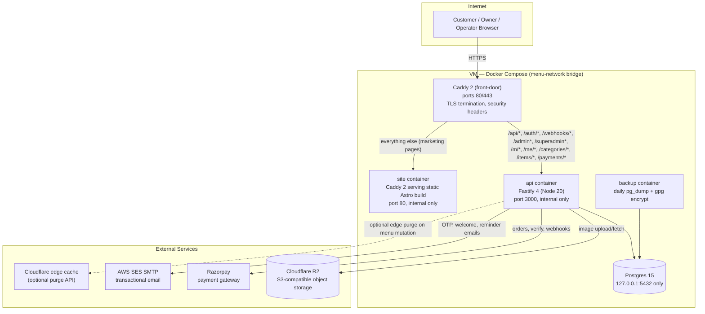
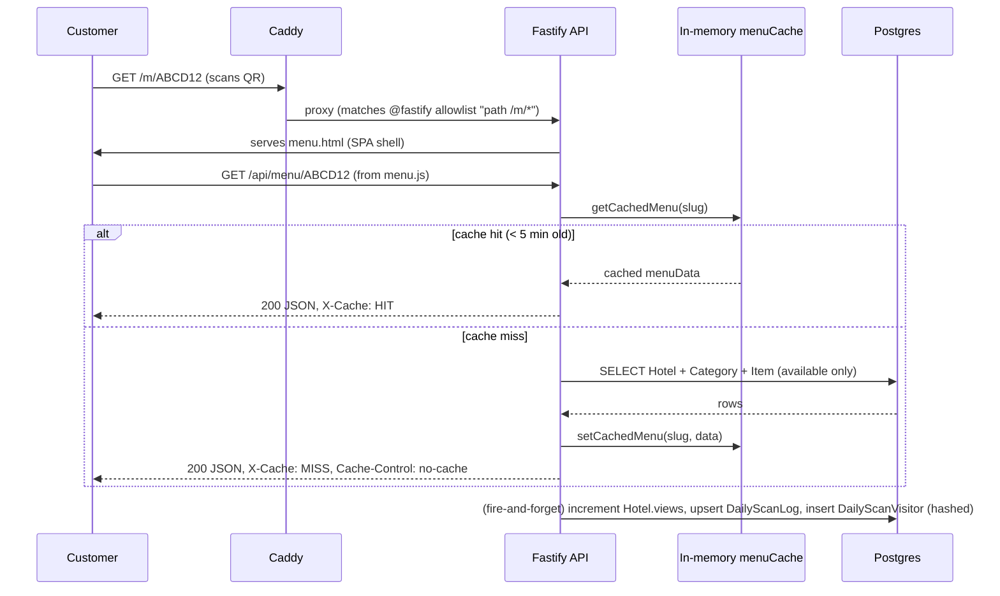
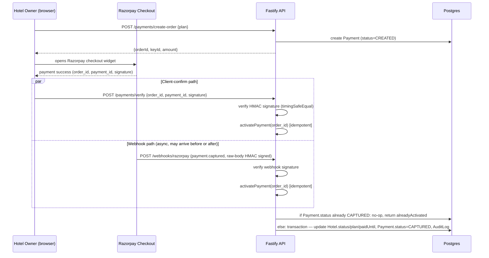
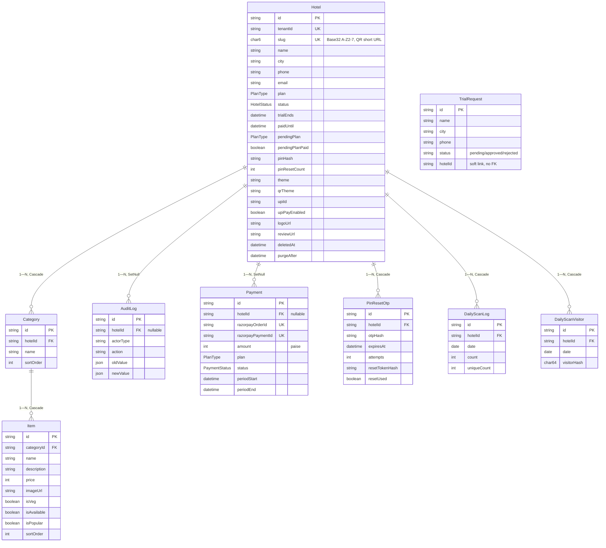

# KodSpot (menu-saas) — AI Knowledge Base

**Purpose of this document**: a standalone, evidence-based reverse-engineering of this repository, written for consumption by AI assistants (Claude, ChatGPT, Gemini, Grok, DeepSeek) and future engineers who need full context without re-reading the codebase. It is **not** part of the project's own documentation set — `README.md` remains the canonical human-facing doc and is not modified or superseded by this file.

Every claim below is sourced from the repository as it exists on branch `dev` as of 2026-07-22. Where evidence was insufficient to make a claim, this document says so explicitly rather than guessing. Statements about product status (shipped vs. planned) are qualified where the evidence is marketing copy rather than code.

---

## Table of Contents

1. [Executive Summary](#1-executive-summary)
2. [Repository Structure](#2-repository-structure)
3. [System Architecture](#3-system-architecture)
4. [Technology Stack](#4-technology-stack)
5. [Environment Variables Reference](#5-environment-variables-reference)
6. [Database Architecture](#6-database-architecture)
7. [API Reference](#7-api-reference)
8. [Authentication & Security](#8-authentication--security)
9. [Business Rules & Plan Entitlements](#9-business-rules--plan-entitlements)
10. [Background Jobs](#10-background-jobs)
11. [Third-Party Integrations](#11-third-party-integrations)
12. [Frontend / UI Layer (Product App)](#12-frontend--ui-layer-product-app)
13. [Marketing Site (`apps/site`)](#13-marketing-site-appssite)
14. [Infrastructure & Deployment](#14-infrastructure--deployment)
15. [Known Gaps, Dead Code & Risks](#15-known-gaps-dead-code--risks)
16. [Glossary](#16-glossary)
17. [Quick-Reference Card for AI Assistants](#17-quick-reference-card-for-ai-assistants)

---

## 1. Executive Summary

**Project name**: KodSpot (repository name: `menu-saas`).

**What it is**: a production, multi-tenant SaaS platform that lets restaurants, cafes, and hotels publish a digital menu accessible via a short QR-code URL (`kodspot.com/m/XXXXXX`). It includes a public customer-facing menu, a hotel-owner admin dashboard, and a superadmin platform console for the operator (KodSpot itself) to manage tenants, billing, and trial requests.

**Who runs it**: evidence in `apps/site/src/pages/about.astro` identifies a single named founder (Kishan Ashok Thorat), operating as a registered Sole Proprietorship on India's Udyam registry (`UDYAM-KR-04-0179635`, incorporated 2026-02-01). This is a solo-founder or very small operation, not a large engineering org — that context should shape expectations about code organization (e.g., a single 4,400-line server file rather than a microservice mesh; this is a stated, deliberate choice — see `README.md` "Known Product Decisions").

**Business model**: three monthly subscription tiers (STARTER ₹499, STANDARD ₹999, PRO ₹1,499), paid via Razorpay or recorded manually by the superadmin. New tenants get a 14-day trial with STANDARD-level feature access. A public marketing site drives trial-request signups; a superadmin approves/converts them into live tenants.

**Repository scope**: this single repo contains **two applications**:
- `apps/api` — the actual SaaS product: a Fastify/Node.js backend that also serves the product's static frontends (owner admin, superadmin console, public menu, and a self-contained landing page). This is the system of record — Postgres via Prisma.
- `apps/site` — a separate Astro-built static marketing/company website (kodspot.com's public-facing brochure site), deployed independently but sharing the same domain via a routing rule in the outer Caddy reverse proxy.

Plus `infrastructure/` (Caddy reverse proxy config, backup/restore scripts) and `.github/workflows/deploy.yml` (single-VM Docker Compose deployment via SSH).

**Important scope caveat**: the marketing site (`apps/site`) advertises **three** KodSpot products: "Menu Scanner" (this repo, confirmed shipped), "WTMS™" (housekeeping management, marketed as `status: 'Production'` with named case studies, but has **no corresponding code in this repository** — evidence not found in repository for its implementation), and "Electrical AI™" (marketed as `status: 'Coming Q3 2026'`, explicitly pre-launch/pre-order in its own copy). Treat only the Menu Scanner product as verifiable from this codebase.

**Current status**: live in production. `.github/workflows/deploy.yml` deploys on every push to `main` via SSH to a VM running Docker Compose. The Prisma migration history (17 migrations from 2026-02-18 through 2026-04-02) shows active, ongoing feature development — payments, unique-visitor analytics, trial requests, UPI payments, QR themes, and a late compliance-hardening pass.

**Architecture style**: a single Fastify monolith serving both JSON APIs and static frontend assets, backed by PostgreSQL via Prisma ORM, Cloudflare R2 for images, Razorpay for payments, AWS SES for email, all sitting behind a Caddy reverse proxy that also serves the separate static Astro marketing site. Frontend surfaces are hand-rolled vanilla JavaScript (no React/Vue/framework) — a deliberate choice per `README.md`.

**Known strengths** (evidence-backed): careful compliance work (DPDPA-aligned soft-delete/purge, consent tracking, payment/audit-log retention via `SetNull` FKs for 6+ year GST retention — see migration `20260402000000_payment_set_null`); layered PIN security (pepper + bcrypt + weak-PIN rejection + rate-limited OTP recovery); idempotent payment activation across both webhook and client-confirm paths; privacy-preserving analytics (hashed, salted visitor identifiers, no raw IP storage).

**Known limitations** (evidence-backed, detailed in [§15](#15-known-gaps-dead-code--risks)): single-process in-memory cache and single-process `setInterval` cron (no distributed lock, no backfill on downtime); soft-deleted tenants are never automatically hard-purged despite the API's own response text promising it; a single 4,400-line server file with no test suite found in the repository.

---

## 2. Repository Structure

```text
menu-saas/
├── apps/
│   ├── api/                      # THE PRODUCT — Fastify backend + static frontends
│   │   ├── index.js              # 4,436-line monolith: all routes, auth, business logic, cron
│   │   ├── package.json          # Fastify 4, Prisma 5, bcrypt, jsonwebtoken, razorpay, sharp, zod...
│   │   ├── Dockerfile            # node:20-alpine, non-root user, runs `prisma migrate deploy && node index.js`
│   │   ├── prisma/
│   │   │   ├── schema.prisma     # 9 models, 4 enums
│   │   │   └── migrations/       # 17 timestamped migrations, 2026-02-18 → 2026-04-02
│   │   ├── public/                # Static assets served directly by Fastify (@fastify/static)
│   │   │   ├── index.html         # API-app's own landing/marketing page (distinct from apps/site)
│   │   │   ├── admin.html/.js     # Hotel-owner dashboard (2,662 lines JS)
│   │   │   ├── superadmin.html/.js# Platform operator console (1,988 lines JS)
│   │   │   ├── menu.html/.js      # Public customer menu SPA (995 lines JS)
│   │   │   ├── qr-card.js         # Shared canvas-based QR card/asset generator (1,083 lines)
│   │   │   ├── admin-sw.js, admin.webmanifest, superadmin.webmanifest  # PWA support
│   │   │   ├── privacy.html, terms.html, refund.html  # Legal pages
│   │   │   └── menu.html.bak, menu.js.bak             # Dead leftover files (unreferenced)
│   │   └── scripts/upload-og-image.js  # One-off utility script
│   └── site/                      # Separate Astro static marketing site (kodspot.com brochure)
│       ├── astro.config.mjs       # output: 'static', tailwind integration
│       ├── src/
│       │   ├── layouts/BaseLayout.astro   # Shared shell: SEO meta, JSON-LD, dark mode, motion FX
│       │   ├── lib/site.ts        # Site-wide constants: nav, products, stats, pricing copy
│       │   ├── components/        # 14 Astro components (Nav, Footer, ProductCard, Schema, etc.)
│       │   ├── pages/              # 16 pages: home, about, products/*, legal pages, roadmap, etc.
│       │   └── styles/global.css   # Tailwind + custom design-system layer
│       └── Dockerfile              # Two-stage: astro build → caddy:2-alpine static file server
├── infrastructure/
│   ├── Caddyfile                  # FRONT-DOOR reverse proxy: routes kodspot.com traffic
│   ├── backup.sh                  # Daily encrypted Postgres backup (gpg AES256), 7-day retention
│   └── restore.sh                 # Encrypted backup restore/verify tool
├── data/                          # Runtime bind-mounts (postgres data dir, caddy data, logs) — not source
├── docker-compose.yml             # Orchestrates db, api, site, caddy, backup services
├── .github/workflows/deploy.yml   # CI/CD: SSH to VM, git pull, rebuild compose stack, health-check
├── README.md                      # Human-facing project README (already comprehensive — see below)
├── KIMI_SLIDES_PROMPT.txt         # Unrelated scratch file (prompt text for an external slide-generation tool)
└── package.json                   # Root-level package.json; only lists prisma/@prisma/client as deps (likely vestigial/unused at repo root — the real app deps live in apps/api/package.json and apps/site/package.json)
```

**Directory-level notes:**
- `apps/api/public/` is the actual product's UI layer — despite the name "public" (a Fastify/static-file-serving convention), this is not marketing content; it's the operational dashboards and customer menu.
- `apps/api/public/index.html` is a **third**, separate landing page (plain static HTML with inline CSS/JS, served at the API app's own root `/`), distinct from both `apps/site`'s Astro homepage and the admin/superadmin/menu apps. It has its own trial-request form, pricing section, and FAQ. The outer Caddyfile's routing rules mean in production this is likely superseded by `apps/site`'s homepage for the bare domain — see [§14](#14-infrastructure--deployment) for the exact routing allowlist.
- `data/postgres/`, `data/caddy-data/`, `data/logs/` are runtime state directories bind-mounted into containers by `docker-compose.yml` — not application source, and contain live production data references (do not treat as code).
- Root `package.json` only declares `prisma`/`@prisma/client` — evidence suggests this may be a leftover from before the `apps/` split, or a convenience for running Prisma CLI from the repo root; the authoritative dependency manifests are `apps/api/package.json` and `apps/site/package.json`.

---

## 3. System Architecture

### 3.1 High-level component diagram



### 3.2 Request lifecycle (public menu page)



### 3.3 Hotel status lifecycle (state machine)

Source: `apps/api/index.js` §5 (business rules) and the hourly cron (§10).

```mermaid
stateDiagram-v2
    [*] --> TRIAL: superadmin creates hotel (14-day trial, STANDARD-level features)
    TRIAL --> ACTIVE: payment captured (Razorpay or manual)
    TRIAL --> EXPIRED: trialEnds passes, no payment (hourly cron)
    ACTIVE --> GRACE: paidUntil passes, no pending renewal (hourly cron, or lazily at next login)
    ACTIVE --> ACTIVE: renewal/upgrade payment before paidUntil (stacks new period)
    GRACE --> ACTIVE: payment captured during grace window
    GRACE --> EXPIRED: 3 days after paidUntil, still unpaid (hourly cron)
    EXPIRED --> ACTIVE: payment captured
    ACTIVE --> SUSPENDED: superadmin manual action only
    SUSPENDED --> ACTIVE: superadmin manual action only
    TRIAL --> DELETED: superadmin soft-delete
    ACTIVE --> DELETED: superadmin soft-delete
    GRACE --> DELETED: superadmin soft-delete
    EXPIRED --> DELETED: superadmin soft-delete
    SUSPENDED --> DELETED: superadmin soft-delete
    note right of DELETED: anonymizes PII, purgeAfter = now+30d
    DELETED --> [*]: superadmin hard purge (irreversible; NOT automated — see §15)
```



Note: pending plan changes (upgrades apply immediately if the hotel isn't mid-period; downgrades are scheduled to take effect only when the current paid period ends) are handled via `Hotel.pendingPlan`/`pendingPlanPaid` fields rather than as separate states — see [§9](#9-business-rules--plan-entitlements).

### 3.4 Payment activation flow (dual-confirmation, idempotent)



### 3.5 Startup sequence

1. Load `.env` from repo root (two levels up from `apps/api`).
2. Validate 13 required env vars; `process.exit(1)` if any missing (see [§5](#5-environment-variables-reference)).
3. Construct Fastify instance (`trustProxy: true`, pino logger).
4. Register `preParsing` hook (captures raw body only for the Razorpay webhook route, needed for signature verification).
5. Connect to Postgres via Prisma, with retry (5 attempts, 2s delay).
6. Register plugins in order: `@fastify/cors` → `@fastify/helmet` → `@fastify/rate-limit` → `@fastify/cookie` → `@fastify/multipart` → `@fastify/static`.
7. Register error/not-found handlers.
8. Register all routes (61 total).
9. `fastify.listen({ port, host: '0.0.0.0' })`.
10. On successful listen, start the hourly cron `setInterval`.
11. `SIGINT`/`SIGTERM` → `fastify.close()` (triggers Prisma disconnect via `onClose` hook) → `process.exit(0)`.

---

## 4. Technology Stack

### 4.1 Product app (`apps/api`)

| Technology | Version | Purpose | Criticality |
|---|---|---|---|
| Node.js | 20 (Alpine base image) | Runtime | Critical |
| Fastify | ^4.26.0 | HTTP server, plugin ecosystem, static file serving | Critical |
| Prisma | ^5.9.0 (`@prisma/client` + CLI) | ORM, migrations, type-safe DB access | Critical |
| PostgreSQL | 15 (Alpine image) | Primary transactional datastore | Critical |
| Zod | ^3.22.4 | Request body/query validation schemas | Critical (security boundary) |
| jsonwebtoken | ^9.0.2 | Hotel-owner session tokens | Critical |
| bcrypt | ^5.1.1 | PIN hashing (cost factor 12) | Critical |
| @fastify/cookie | ^9.3.1 | httpOnly session cookies | Critical |
| @fastify/helmet | ^11.1.1 | Security headers | High |
| @fastify/rate-limit | ^9.1.0 | Per-route abuse throttling | High |
| @fastify/cors | ^9.0.1 | Cross-origin control | High |
| @fastify/multipart | ^8.0.0 | Image upload handling | High |
| @fastify/static | ^6.12.0 | Serves `public/` frontend assets | High |
| @aws-sdk/client-s3 + s3-request-presigner | ^3.726.1 | Cloudflare R2 object storage client (S3-compatible API) | High |
| razorpay | ^2.9.4 | Payment gateway SDK | Critical (revenue) |
| nodemailer | ^6.9.8 | SMTP client for AWS SES | Medium (degrades gracefully if unconfigured) |
| sharp | ^0.33.2 | Server-side image resize/re-encode (→ WebP) | High |
| qrcode | ^1.5.4 | Server-side QR SVG generation | High |
| dotenv | ^17.3.1 | `.env` loading | Low |
| pino-pretty | ^10.3.1 (dev) | Local dev log formatting | Dev-only |

### 4.2 Marketing site (`apps/site`)

| Technology | Version | Purpose |
|---|---|---|
| Astro | ^4.16.18 | Static site generator (`output: 'static'`) |
| @astrojs/tailwind | ^5.1.4 | Tailwind integration (`applyBaseStyles: false`) |
| Tailwind CSS | ^3.4.17 | Utility-first styling, custom `brand`/`ink` palettes, custom animations |
| @astrojs/sitemap | ^3.7.3 | **Installed but not registered** in `astro.config.mjs` integrations — sitemap.xml is hand-maintained instead (see [§15](#15-known-gaps-dead-code--risks)) |
| sharp | ^0.35.3 | Build-time image optimization |

### 4.3 Infrastructure

| Technology | Purpose |
|---|---|
| Docker / Docker Compose v2 | Container orchestration for db/api/site/caddy/backup services |
| Caddy 2 (Alpine) | Front-door reverse proxy (TLS, security headers, routing) + internal static file server for the Astro site |
| GitHub Actions | CI/CD — single job, SSH deploy on push to `main` |
| GPG (AES256) | Backup encryption |

### 4.4 Frontend rendering approach

Confirmed **vanilla JavaScript** throughout `apps/api/public/*.js` — no React, Vue, Angular, Svelte, JSX, virtual DOM, or bundler. Classic `<script src>` tags, manual DOM APIs, template-literal HTML construction. This is a deliberate choice documented in `README.md`'s "Known Product Decisions": *"Frontend surfaces are static vanilla JS pages, not SPA frameworks."*

---

## 5. Environment Variables Reference

Source: `apps/api/index.js` startup validation, `docker-compose.yml`, `.github/workflows/deploy.yml`, `README.md`. Only variable **names** are reported here — no secret values were read or are reproduced in this document.

### 5.1 Required at API startup (process exits if missing)

| Variable | Purpose | Failure impact |
|---|---|---|
| `DATABASE_URL` | Postgres connection string | API cannot start |
| `JWT_SECRET` | Signs/verifies hotel-owner session JWTs; also seeds `VISITOR_SALT` for analytics hashing | API cannot start |
| `R2_ACCOUNT_ID` | Cloudflare R2 account identifier | API cannot start |
| `R2_ACCESS_KEY_ID` | R2 S3-compatible credential | API cannot start |
| `R2_SECRET_ACCESS_KEY` | R2 S3-compatible credential | API cannot start |
| `R2_BUCKET_NAME` | Target bucket for images | API cannot start |
| `R2_PUBLIC_URL` | Public base URL for serving uploaded images | API cannot start |
| `ADMIN_KEY` | Superadmin login secret (compared via constant-time check) | API cannot start |
| `COOKIE_SECRET` | HMAC key for the superadmin session cookie | API cannot start |
| `PIN_PEPPER` | Server-side secret mixed into every owner PIN before bcrypt hashing | API cannot start |
| `RAZORPAY_KEY_ID` | Razorpay public key | API cannot start |
| `RAZORPAY_KEY_SECRET` | Razorpay secret key (order verification) | API cannot start |
| `RAZORPAY_WEBHOOK_SECRET` | Verifies Razorpay webhook HMAC signatures | API cannot start |

### 5.2 Common operational variables

| Variable | Purpose | Default if unset |
|---|---|---|
| `NODE_ENV` | Controls log level, cookie `secure`/`sameSite` behavior | `production` (compose default) |
| `PORT` | API listen port | `3000` |
| `APP_URL` | Base app URL | Evidence not found for a code default; referenced in README/deploy secrets |
| `COOKIE_DOMAIN` | Cookie domain scope, prod only | unset → cookie host-only |
| `CORS_ORIGINS` | Allowed CORS origins | Evidence not found in repository for exact parsing logic beyond presence in deploy secrets |

### 5.3 Email / notifications

| Variable | Purpose | Failure impact |
|---|---|---|
| `SES_SMTP_HOST` | AWS SES SMTP endpoint | If any of the three SMTP vars are missing, email is disabled entirely (`getSesTransporter()` returns `null`); OTP requests, welcome emails, and reminders silently no-op or (for OTP) fail the request cleanly |
| `SES_SMTP_USER` | SMTP auth username | see above |
| `SES_SMTP_PASS` | SMTP auth password | see above |
| `SES_FROM_EMAIL` | From address | defaults to `noreply@kodspot.com` |
| `ADMIN_NOTIFICATION_EMAIL` | Where trial-request notifications go | defaults to `support@kodspot.com` |
| `CONTACT_NOTIFY_EMAIL` | Where `/api/contact` submissions go | Evidence found referencing this var in the contact route; explicit default not confirmed — treat as required for that feature to notify anyone |

### 5.4 Database container (Docker Compose only)

| Variable | Purpose |
|---|---|
| `DB_USER` | Postgres role name |
| `DB_PASSWORD` | Postgres role password |
| `DB_NAME` | Database name |

### 5.5 Rate-limit tuning

| Variable | Purpose | Default |
|---|---|---|
| `RATE_LIMIT_MAX` | Global default rate-limit ceiling | 1000 (per window) |
| `RATE_LIMIT_WINDOW` | Global default rate-limit window (ms) | 60000 |
| `ADMIN_RATE_LIMIT_MAX` | Superadmin login attempt ceiling | 5 |
| `ADMIN_RATE_LIMIT_WINDOW` | Superadmin login window (ms) | 900000 (15 min) |

### 5.6 Backup / optional edge-cache purge

| Variable | Purpose | Failure impact |
|---|---|---|
| `BACKUP_ENCRYPTION_KEY` | GPG symmetric key for daily Postgres backups | `backup.sh` refuses to run unencrypted — exits fatally without this |
| `CF_API_TOKEN` | Cloudflare API token for optional edge-cache purge on menu mutation | If unset, cache purge is skipped silently (only in-memory cache is invalidated) |
| `CF_ZONE_ID` | Cloudflare zone ID | same as above |

**Security classification**: `JWT_SECRET`, `PIN_PEPPER`, `COOKIE_SECRET`, `ADMIN_KEY`, `R2_SECRET_ACCESS_KEY`, `RAZORPAY_KEY_SECRET`, `RAZORPAY_WEBHOOK_SECRET`, `SES_SMTP_PASS`, `DB_PASSWORD`, `BACKUP_ENCRYPTION_KEY` are all high-sensitivity secrets — compromise of any one materially weakens tenant data security, payment integrity, or the ability to impersonate the platform operator. All are supplied via GitHub Actions repository secrets at deploy time (`.github/workflows/deploy.yml`), never committed to the repo.

---

## 6. Database Architecture

**Engine**: PostgreSQL 15. **ORM**: Prisma 5. **Migration strategy**: Prisma Migrate, 17 sequential migrations from `20260218002303_init` to `20260402000000_payment_set_null`, deployed in production via `npx prisma migrate deploy` (run automatically as part of the API container's `CMD`, before `node index.js` starts).

### 6.1 Entity-relationship diagram



`TrialRequest` has no Prisma-level relation to `Hotel` — its `hotelId` field is a plain nullable string, populated by convention once a superadmin approves and links the request to a newly created hotel.

### 6.2 Enums

| Enum | Values | Used by |
|---|---|---|
| `PlanType` | `STARTER`, `STANDARD`, `PRO` | `Hotel.plan`, `Hotel.pendingPlan`, `Payment.plan` |
| `HotelStatus` | `TRIAL`, `ACTIVE`, `GRACE`, `EXPIRED`, `SUSPENDED`, `DELETED` | `Hotel.status` (`DELETED` added later via a migration `ALTER TYPE`) |
| `PaymentMode` | `MANUAL`, `RAZORPAY`, `CASH` | `Hotel.paymentMode` |
| `PaymentStatus` | `CREATED`, `CAPTURED`, `FAILED`, `REFUNDED` | `Payment.status` |

### 6.3 Cascade design intent

- **`onDelete: Cascade`** (Category→Hotel, Item→Category, PinResetOtp→Hotel, DailyScanLog/DailyScanVisitor→Hotel): child data is meaningless without the parent tenant — menu content, OTPs, and scan analytics are purged together with the tenant.
- **`onDelete: SetNull`** (AuditLog→Hotel, Payment→Hotel): compliance/financial records that must outlive the tenant. The `Payment` migration comment is explicit: *"Indian GST/Income Tax requires payment records retained for 6+ years."* Both relations started as `Cascade` in earlier migrations and were deliberately converted to `SetNull` (`20260401000001_audit_log_set_null`, `20260402000000_payment_set_null`).

### 6.4 Migration history narrative (chronological arc)

Core multi-tenant menu CRUD (`init`) → contact/consent fields → PIN-auth hardening (reset tracking → rate-limited OTP+token flow) → QR short-URL optimization (Base32 6-char slugs, chosen for QR "alphanumeric mode" density) → soft-delete/DPDPA lifecycle → monetization (Razorpay payments, pending-plan scheduling, UPI direct pay) → analytics evolution (raw scan counts → deduplicated, hashed unique-visitor tracking) → growth features (trial-request funnel, review URLs, premium QR card themes) → a late compliance-hardening pass (consent capture extended to trial requests; `SetNull` conversion on AuditLog/Payment for legal retention).

Full per-migration detail (all 17 files were read in full):

| Migration | Change | Inferred rationale |
|---|---|---|
| `20260218002303_init` | Core schema: `Hotel`, `Category`, `Item`, `AuditLog`; enums `PlanType`, `HotelStatus` (no `DELETED` yet), `PaymentMode` | Baseline product |
| `20260219000000_add_hotel_fields` | `+email, consentedAt, consentVersion` on `Hotel` | First DPDPA compliance work |
| `20260220000000_add_pin_reset_tracking` | `+pinResetCount, lastPinResetAt, lastPinResetBy` | Security hardening around PIN auth |
| `20260222000000_slug_to_base32_char6` | Backfills + converts `slug` to `CHAR(6)` Base32 with a `CHECK` constraint | QR short-URL density optimization |
| `20260222100000_add_hotel_soft_delete` | Adds `DELETED` enum value; `+deletedAt, deletedBy, purgeAfter` | DPDPA-compliant tenant offboarding |
| `20260227000000_add_pin_reset_otp` | New `PinResetOtp` table | Full rate-limited, fingerprinted, two-stage (OTP→token) PIN recovery |
| `20260301000000_add_payments_and_scans` | New `PaymentStatus` enum, `Payment` table, `DailyScanLog` table | Billing + first analytics |
| `20260304000000_add_hotel_logo` | `+logoUrl` | Branding feature |
| `20260310000000_add_pending_plan` | `+pendingPlan, pendingPlanPaid` | Plan-change scheduling workflow |
| `20260312000000_add_unique_visitors` | `+uniqueCount` on `DailyScanLog`; new `DailyScanVisitor` table | Privacy-preserving deduplicated analytics |
| `20260324000000_add_trial_requests` | New `TrialRequest` table | Public trial-signup funnel |
| `20260329000000_add_review_url` | `+reviewUrl` | Customer review funnel |
| `20260331000000_add_upi_payment` | `+upiId, upiPayEnabled` | Direct UPI payment collection |
| `20260401000000_add_qr_theme` | `+qrTheme` (default `walnut`) | Premium/plan-gated QR card themes |
| `20260401000000_add_trial_consent_fields` | `+consentedAt, consentVersion` on `TrialRequest` | Extends consent capture pre-tenant |
| `20260401000001_audit_log_set_null` | `AuditLog.hotelId` nullable, FK → `SetNull` | Preserve audit trail after hotel purge |
| `20260402000000_payment_set_null` | `Payment.hotelId` nullable, FK → `SetNull` | Preserve payment records for GST/Income Tax retention |

### 6.5 Views, stored procedures, triggers

None. All 17 migrations contain only `CREATE TYPE`/`CREATE TABLE`/`CREATE INDEX`/`ALTER TABLE`/`COMMENT ON COLUMN` DDL, plus a single one-off `DO $$ ... $$` PL/pgSQL block in the slug-conversion migration that backfills data (not persisted as a database object).

---

## 7. API Reference

**Framework**: Fastify 4. **Total routes**: 61 (grep-confirmed; no `PUT` verbs used). **Base URL in production**: `https://kodspot.com` (routed to this API by the outer Caddy for specific path prefixes — see [§14](#14-infrastructure--deployment)).

Auth legend: **PUB** = no auth · **JWT** = hotel-owner session (cookie `admin_token` or `Authorization: Bearer`) · **ADMIN** = superadmin session (cookie `superadmin_token`, HMAC-based) · **WEBHOOK** = Razorpay HMAC signature.

### 7.1 Public / infrastructure

| Method | Path | Auth | Notes |
|---|---|---|---|
| GET | `/health` | PUB (rate-limit exempt) | `SELECT 1` DB ping |
| GET | `/admin` | PUB | Serves `admin.html` |
| GET | `/superadmin` | PUB | Serves `superadmin.html` |
| GET | `/admin.html` | PUB | 301 → `/admin` |
| GET | `/superadmin.html` | PUB | 301 → `/superadmin` |
| GET | `/menu.html?h=CODE` | PUB | 301 → `/m/CODE` if valid slug |

### 7.2 Public menu, QR, media

| Method | Path | Auth | Rate limit | Notes |
|---|---|---|---|---|
| GET | `/api/menu/:code` | PUB | 500/min | Menu JSON payload; 5-min in-memory cache; fires analytics side-effects |
| GET | `/m/:code` | PUB | 500/min | Serves `menu.html` SPA shell (the QR-code target URL) |
| GET | `/api/qr/:code` | PUB | 60/min | SVG QR pointing to `https://kodspot.com/m/{code}` |
| GET | `/api/qr/review/:hotelId` | PUB | 60/min | SVG QR to the hotel's review URL |
| GET | `/api/qr/upi/:hotelId` | PUB | 60/min | SVG QR with `upi://pay` deeplink; 403 if plan lacks UPI |
| GET | `/api/logo/:hotelId` | PUB | 60/min | Same-origin proxy for the R2-hosted logo (CORS workaround for canvas rendering) |

### 7.3 Public forms

| Method | Path | Auth | Rate limit | Notes |
|---|---|---|---|---|
| POST | `/auth/request-trial` | PUB | 5/hr per IP | Creates `TrialRequest`; honeypot field; notifies admin by email |
| POST | `/api/contact` | PUB | 10/hr per IP | Email-only (no DB write); notifies admin, sets `replyTo` to submitter — **this is the endpoint the `apps/site` contact form posts to**, routed here by the outer Caddy's `/api/*` allowlist |

### 7.4 Auth / login

| Method | Path | Auth | Rate limit | Notes |
|---|---|---|---|---|
| POST | `/auth/login` | PUB | 20/hr per menu code | Owner login: code + 8-digit PIN → JWT cookie |
| POST | `/auth/forgot-pin/request` | PUB | 3/15min per IP | Step 1 of OTP recovery |
| POST | `/auth/forgot-pin/verify` | PUB | 10/hr per IP | Step 2 — OTP → short-lived reset token |
| POST | `/auth/forgot-pin/reset` | PUB | 5/hr per IP | Step 3 — reset token + new PIN |
| POST | `/auth/admin/login` | PUB | 5/15min per IP | Superadmin login via `ADMIN_KEY` |

### 7.5 Owner-protected (JWT required)

| Method | Path | Notes |
|---|---|---|
| POST | `/auth/hotel/logout` | Clears session cookie |
| GET | `/me` | Full hotel profile + all categories/items |
| GET | `/me/billing` | Plan, payment history, today's scan stats |
| GET | `/me/analytics` | Depth gated by plan (`analyticsDays`) |
| POST | `/payments/create-order` | Creates Razorpay order; blocks invalid downgrade/renewal states |
| POST | `/payments/verify` | Client-side payment confirmation (idempotent) |
| POST | `/me/downgrade` | Schedules a downgrade for period end |
| DELETE | `/me/pending-plan` | Cancels an unpaid pending plan change |
| PATCH | `/settings/theme` | Menu theme, plan-gated |
| PATCH | `/settings/qr-theme` | QR card theme, plan-gated |
| PATCH | `/settings/review-url` | Review link |
| PATCH | `/settings/upi` | UPI ID + enable flag, plan-gated |
| POST | `/me/logo` | Logo upload (multipart, validated, R2) |
| DELETE | `/me/logo` | Logo removal |
| POST | `/categories` | Create category |
| PATCH | `/categories/:id` | Rename category |
| POST | `/items` | Create item (JSON or multipart w/ image) |
| POST | `/items/:id/image` | Replace item image |
| PATCH | `/items/:id` | Update item fields |
| DELETE | `/items/:id` | **Soft delete** (`isAvailable=false`) |
| PATCH | `/items/:id/restore` | Undo soft delete |
| DELETE | `/items/:id/permanent` | **Hard delete** + R2 image cleanup |

There is no owner-facing route to change `name`/`city`/`phone`/`email` (superadmin-only) and no "change PIN while logged in" route (only forgot-PIN OTP flow or superadmin reset).

### 7.6 Superadmin-protected (ADMIN required)

| Method | Path | Notes |
|---|---|---|
| POST | `/auth/admin/logout` | Clears superadmin cookie |
| GET | `/auth/admin/me` | Session check (note: returns a synthetic `expiresAt`, not the real cookie expiry — see [§15](#15-known-gaps-dead-code--risks)) |
| GET | `/admin/stats` | Global dashboard: hotel counts, revenue, MRR, payment breakdowns |
| GET | `/admin/trial-requests` | List trial signups |
| PATCH | `/admin/trial-requests/:id` | Approve/reject/link to hotel |
| POST | `/admin/hotels` | Create a new tenant (generates PIN + slug, 14-day trial, sends welcome email) |
| GET | `/admin/hotels` | Paginated, searchable, filterable tenant list |
| GET | `/admin/hotels/:id` | Full tenant detail incl. audit log |
| PATCH | `/admin/hotels/:id` | Edit name/city/phone/email (plan field accepted but ignored — see [§15](#15-known-gaps-dead-code--risks)) |
| PATCH | `/admin/hotels/:id/status` | Manual status transition (blocks reverting `DELETED`) |
| POST | `/admin/hotels/:id/reset-pin` | Generates + sets a new random PIN |
| GET | `/admin/hotels/:id/payments` | Full payment history |
| POST | `/admin/hotels/:id/record-payment` | Manual/cash payment recording |
| POST | `/admin/hotels/:id/logo` / DELETE | Logo management for any tenant |
| PATCH | `/admin/hotels/:id/qr-theme` / `/review-url` | Same as owner settings, any tenant |
| GET | `/admin/hotels/:id/pin-reset-count` | Reset metadata |
| DELETE | `/admin/hotels/:id` | **Soft delete** — anonymizes PII, `purgeAfter = now+30d` |
| DELETE | `/admin/hotels/:id/purge` | **Hard purge** — irreversible, deletes R2 images, redacts audit/payment JSON, deletes row |

### 7.7 Webhook

| Method | Path | Auth | Notes |
|---|---|---|---|
| POST | `/webhooks/razorpay` | WEBHOOK | Handles `payment.captured`, `payment.failed`, `refund.created`/`refund.processed`; always returns 200 for recognized-but-unhandled events to prevent retry storms |

---

## 8. Authentication & Security

### 8.1 Hotel-owner authentication

- Login: 6-char base32 code + 8-digit PIN (`POST /auth/login`).
- PIN storage: `bcrypt(HMAC-SHA256(pin, key=PIN_PEPPER), cost=12)` — a server-side pepper means a database-only breach cannot brute-force the 8-digit (10^8) PIN space offline.
- Session: JWT (`type: 'hotel_owner'`, 24h expiry, includes `pinChangedAt`) stored in an httpOnly cookie (`admin_token`), falling back to `Authorization: Bearer` header.
- **Automatic invalidation on PIN change**: the JWT embeds the `pinChangedAt` timestamp at issuance; every authenticated request compares it against the current DB value — any PIN reset (self-service or superadmin) instantly invalidates all previously issued tokens without needing a server-side token blocklist.
- **Live lifecycle correction**: on every authenticated request, if the hotel's `paidUntil` has passed since the last hourly cron tick, the auth middleware eagerly applies the `ACTIVE→GRACE` (or pending-plan) transition before serving the request, so owners never see stale status between cron runs.
- Weak-PIN rejection (`isWeakPin`): blocklist of ~28 common patterns, ascending/descending sequence detection, repeated-digit/repeated-pattern detection — enforced at hotel creation, self-service reset, and superadmin reset.

### 8.2 Superadmin authentication

- Not JWT-based. Single shared secret (`ADMIN_KEY`) compared via `crypto.timingSafeEqual` (constant-time, avoids timing side-channels).
- Session cookie (`superadmin_token`) holds `HMAC-SHA256(ADMIN_KEY, key=COOKIE_SECRET)` — a fixed, non-expiring hash whose only session boundary is the cookie's own 24h `maxAge`.
- Additional CSRF mitigation: requires header `X-Requested-With: XMLHttpRequest` on every protected request (defeats simple cross-site form-based CSRF, since forms can't set custom headers).

### 8.3 PIN recovery (forgot-PIN OTP flow)

Three-stage, rate-limited, anti-enumeration flow:
1. `POST /auth/forgot-pin/request` — always returns a generic response regardless of match (anti-enumeration); 10/day cap, 60s cooldown; OTP is bcrypt-hashed before storage (never stored plaintext); captures IP/user-agent/device fingerprint for fraud detection.
2. `POST /auth/forgot-pin/verify` — 5-attempt lockout, attempts incremented **before** comparison (race-condition-safe); on success issues a 32-byte random reset token (only its SHA-256 hash is stored), 5-minute expiry.
3. `POST /auth/forgot-pin/reset` — validates the reset token via `crypto.timingSafeEqual` against the stored hash; rejects weak PINs; all steps are individually audit-logged (`pin_reset_otp_requested/verified/failed/max_attempts`, `pin_reset_self_service`).

### 8.4 Rate limiting

Global default 1000 req/min/IP (`@fastify/rate-limit`), with 10+ named per-route overrides tuned to the sensitivity of the endpoint (e.g., 5/15min for superadmin login, 20/hr **per menu code** — not per IP — for owner login, which specifically defends a single tenant against distributed/proxied brute-force attempts regardless of source IP). Full table in [§7](#7-api-reference) and the original agent report; `/health` is explicitly rate-limit-exempt.

### 8.5 Payment security

- Razorpay order creation is server-authoritative (amount/plan determined server-side from the plan config, never trusted from the client).
- Payment verification via `HMAC-SHA256(order_id|payment_id, key=RAZORPAY_KEY_SECRET)` compared with `timingSafeEqual`.
- Webhook signature verified against the **raw request body bytes** (captured by a dedicated `preParsing` hook specifically for this route, since Razorpay signs exact bytes and JSON re-serialization could differ).
- Dual-confirmation (client-verify + webhook) is made safe by an idempotent `activatePayment()` function that no-ops if the payment is already `CAPTURED`.

### 8.6 Upload security

Applied identically at all 4 image-upload call sites: MIME allowlist (jpeg/png/webp) → 2MB size cap (both app-level and `@fastify/multipart` plugin-level) → magic-byte signature validation (rejects mismatched/spoofed content-type) → server-side re-encode via `sharp` to WebP (resize ≤800×800) before storage, discarding the original bytes regardless of upload format.

### 8.7 Transport/edge security (Caddy layer)

From `infrastructure/Caddyfile`: strict CSP (scoped to self + Razorpay checkout domains), HSTS (`max-age=31536000; includeSubDomains; preload`), `X-Frame-Options: DENY`, `X-Content-Type-Options: nosniff`, `Referrer-Policy: strict-origin-when-cross-origin`, a restrictive `Permissions-Policy`, and `-Server` (suppresses the server header). Admin/superadmin HTML/JS routes get `Cache-Control: no-cache, no-store, must-revalidate` explicitly to prevent caching of security-sensitive UI.

### 8.8 Container hardening (`docker-compose.yml`)

The `api` service runs `read_only: true` (root filesystem read-only, with `tmpfs` mounts for `/tmp` and the node_modules cache), `security_opt: no-new-privileges:true`, a non-root `nodejs` user (per `Dockerfile`), and is **not** exposed to the host — only reachable via the internal Docker network through Caddy. Postgres is bound to `127.0.0.1:5432` only (no external exposure even on the host's other interfaces).

### 8.9 Data protection / compliance

- Soft-delete anonymizes PII (`name`, `phone`, `email`, `pinHash='INVALIDATED'`) and schedules a 30-day purge window, aligning with the DPDPA-oriented privacy policy published on the marketing site.
- Hard purge deletes all R2-hosted images, redacts JSON blobs in `AuditLog`/`Payment` (`{"redacted": true}`) while preserving the financial amount/status fields needed for 6+ year tax retention, then deletes the `Hotel` row (cascading to menu/analytics/OTP data, `SetNull`-ing audit/payment records).
- Analytics use salted, hashed daily visitor identifiers (`SHA256(ip + date + hotelId + salt)`) — raw IPs are never persisted in `DailyScanVisitor`.
- Retention cleanup jobs run hourly (see [§10](#10-background-jobs)): 90-day expiry for scan/visitor logs, 7-day expiry for stale OTPs, 30–90 day expiry for trial requests.

---

## 9. Business Rules & Plan Entitlements

### 9.1 Plan matrix

| Plan | Price | Daily unique visitor cap | Menu themes unlocked | QR card themes unlocked | Analytics history | Branding removed | UPI Pay |
|---|---|---|---|---|---|---|---|
| STARTER | ₹499/mo | 150 | 4 of 15 | 1 of 10 (`walnut` only) | 1 day | No | No |
| STANDARD | ₹999/mo | 500 | 8 of 15 | all 10 | 7 days | Yes | Yes |
| PRO | ₹1,499/mo | Unlimited | all 15 | all 10 | 30 days | Yes | Yes |

Prices are in Indian Rupees; stored server-side in paise (e.g. `49900` = ₹499).

### 9.2 Trial behavior

New tenants are created with `status: TRIAL` and a 14-day `trialEnds` window. During `TRIAL`, `effectivePlan()` grants **STANDARD-level** feature access regardless of the underlying `plan` field — an upsell mechanism that lets prospects experience premium features before converting.

### 9.3 Soft cap on analytics, not traffic

If a plan's daily unique-visitor cap is reached, **the public menu keeps loading for new visitors** — only the analytics counter stops incrementing. There is no hard paywall on menu traffic; the cap only limits how much usage data the plan tier reports back to the owner.

### 9.4 Plan change rules

- **Upgrades** while `ACTIVE` with time remaining: scheduled as a `pendingPlan` if a different plan is purchased mid-period (does not immediately change `status`/`paidUntil` — takes effect at the next cron/login-triggered lifecycle check once the current period ends), *unless* the hotel is expired/trial/grace, in which case the new plan activates immediately.
- **Renewals** (same plan) stack onto remaining time: `periodStart = max(current paidUntil, now)`, so renewing early doesn't waste the remaining paid period.
- **Downgrades** must go through `POST /me/downgrade` (not the payment endpoints) — target plan must be strictly lower-tier, and takes effect only once the current paid period ends (`pendingPlan` + `pendingPlanPaid=false`, applied by the hourly cron, no new charge).
- Same-plan renewal is blocked via `POST /payments/create-order` if more than 7 days remain on the current period (409, prevents wasted duplicate charges).
- A pending **unpaid** plan change can be cancelled (`DELETE /me/pending-plan`); a pending **paid** change cannot be self-cancelled (must contact support — implies a manual refund process outside the codebase).

### 9.5 Audit trail

Every mutating owner/admin action writes an `AuditLog` row (see the full action list in the original API-agent report, summarized in [§7](#7-api-reference)'s route table) — with the deliberate exception that PIN-reset audit entries never store PIN hash values, only counts/timestamps/actor identity.

---

## 10. Background Jobs

**Mechanism**: a single in-process `setInterval(fn, 60 * 60 * 1000)` (hourly), started only after `fastify.listen()` succeeds. **No** external scheduler (no node-cron, no OS cron, no distributed job queue) is used anywhere in the repository. See [§15](#15-known-gaps-dead-code--risks) for the operational implications of this choice.

Each of the 11 jobs below runs in sequence, independently `try/catch`-wrapped so one failure doesn't block the rest:

| # | Job | Effect |
|---|---|---|
| 1 | Activate pending **paid** plan changes | `paidUntil` reached → `plan=pendingPlan`, `paidUntil += 30d`, `status=ACTIVE` |
| 2 | Apply pending **free downgrades** | `paidUntil` reached → `plan=pendingPlan`, `status=GRACE` (must renew, no new period granted for free) |
| 3 | `ACTIVE → GRACE` | Lapsed subscription, no pending plan |
| 4 | `GRACE → EXPIRED` | 3 days after `paidUntil` |
| 5 | `TRIAL → EXPIRED` | `trialEnds` passed |
| 6 | Delete old `DailyScanVisitor` rows | Older than 90 days |
| 7 | Delete old `PinResetOtp` rows | Expired more than 7 days ago |
| 8 | Delete old `TrialRequest` rows | Rejected/pending &gt;90 days; approved &gt;30 days (DPDPA retention) |
| 9 | Delete old `DailyScanLog` rows | Older than 90 days |
| 10 | Send trial-expiry reminder email | 3 days before `trialEnds`, deduped via a 7-day audit-log lookback |
| 11 | Send subscription-renewal reminder email | 7 days before `paidUntil`, only if no paid pending change exists, deduped via audit-log lookback |

**Note**: no job in this list, or anywhere else in the codebase, automatically hard-purges hotels once their `purgeAfter` date passes — despite the soft-delete API response text promising scheduled purge. See [§15](#15-known-gaps-dead-code--risks).

---

## 11. Third-Party Integrations

| Service | Purpose | Auth mechanism | Failure behavior |
|---|---|---|---|
| **Cloudflare R2** (S3-compatible) | Object storage for hotel logos and menu item images | Access key/secret via `@aws-sdk/client-s3` | Required at startup (hard dependency) |
| **Razorpay** | Payment gateway — order creation, checkout, webhook-driven capture/refund/failure events | API key/secret; webhook HMAC | Required at startup; `getRazorpay()` returns `null` if misconfigured, causing payment routes to 503 |
| **AWS SES** (via SMTP, not the SES API directly) | Transactional email: OTP codes, trial-request/contact notifications, welcome emails, expiry/renewal reminders | SMTP user/pass | Optional/soft dependency — `getSesTransporter()` returns `null` if any of the 3 SMTP vars are missing; most call sites degrade gracefully (best-effort, logged, doesn't fail the parent request), except OTP-request which rolls back and 500s if sending fails |
| **Cloudflare edge cache purge API** | Optional CDN purge on menu-affecting mutations | `CF_API_TOKEN`/`CF_ZONE_ID` | Fully optional — skipped silently if unconfigured; retried 3x with exponential backoff when configured |

**AI providers mentioned in marketing copy only**: `apps/site/src/pages/technology.astro` and `intelligence.astro` describe a "KodSpot Intelligence" SQL-first AI strategy referencing Vertex AI/Gemini/Azure OpenAI as part of the company's broader technology positioning. **Evidence not found in repository** for any actual integration code calling these providers within `apps/api` — this appears to be either forward-looking/aspirational copy, or implemented in a system outside this repository's scope. Do not treat this as a shipped feature of the code in this repo.

---

## 12. Frontend / UI Layer (Product App)

All panels below live in `apps/api/public/`, are served directly by Fastify's static file plugin, and share no build step, bundler, or framework — confirmed vanilla JS.

### 12.1 `admin.html` / `admin.js` (2,662 lines) — Hotel-Owner Dashboard

Single-tenant view for a logged-in hotel owner. Screens: Login (code+PIN, client-validated), a 3-step Forgot-PIN wizard with countdown timers and device fingerprinting, and four main tabs — **Menu** (category/item CRUD, soft-delete "Hidden Items" section with permanent-delete option, veg/non-veg toggle, popularity flag, inline image upload with client-side canvas compression to 800px/JPEG-0.85 before sending to the server), **Add Items**, **Billing** (plan cards, Razorpay checkout integration, downgrade flow, payment history, visitor-usage progress bar), and **QR Code** (logo management, QR card theme picker, front/back/print-ready/SVG downloads, review-URL and UPI settings management). Client-side weak-PIN detection explicitly mirrors the server-side `isWeakPin` logic. Plan-based UI gating (locked theme options, hidden UPI section for STARTER) is enforced in the DOM based on data the server already scoped — a defense-in-depth/UX layer, not the security boundary itself (the server re-checks on every mutating request). Has a PWA manifest (`admin.webmanifest`) and a deliberately conservative service worker (`admin-sw.js`) that explicitly never caches API responses — network-first with an offline app-shell fallback only.

### 12.2 `menu.html` / `menu.js` (995 lines) — Public Customer Menu

Read-only, anonymous, single network call (`GET /api/menu/:code`) followed by entirely client-side rendering/filtering. Features: debounced search, veg/non-veg filter, sticky category navigation with scroll-spy, collapsible categories, popularity-sorted item cards, concurrency-limited lazy image loading with retry/fallback, an image-preview modal, and a UPI "Pay Now" bottom sheet with platform-specific payment triggers (Android intent URL, iOS app deep links, desktop copy-to-clipboard) — explicitly disclaiming that KodSpot does not process the payment itself ("Payment goes directly to the restaurant"). "Powered by KodSpot" footer branding is conditionally hidden for PRO-plan tenants, enforced client-side on data the server already scopes by plan.

### 12.3 `superadmin.html` / `superadmin.js` (1,988 lines) — Platform Operator Console

Single admin-key login. Global stats and revenue-analytics dashboards (MRR estimate, net revenue, breakdowns by plan/payment method), a trial-requests review queue (create-hotel-from-request flow), a create-hotel form with cryptographically random PIN generation, and a searchable/paginated/filterable hotel table with per-row actions: QR management, edit details, edit status, reset PIN, record manual payment, view payment history, soft-delete, and (for already-deleted hotels) hard purge. Notably, the Edit Details modal deliberately makes `plan` read-only with an explanatory note ("Plan can only be changed via Record Payment to ensure billing integrity") — a UI-level guard reinforcing the same rule enforced (if imperfectly — see [§15](#15-known-gaps-dead-code--risks)) server-side.

### 12.4 `qr-card.js` (1,083 lines) — Shared QR Card Generator

A framework-free `window.KodSpotQR` module shared by both `admin.js` and `superadmin.js`, generating print-ready table-card artwork entirely via HTML5 Canvas at 600 DPI (A6 size), with 10 built-in color themes, hand-drawn decorative scrollwork/borders (no image assets), and outputs for Front/Back/Print-Ready/Custom-print-size variants. Reuses the same PRO-plan branding-removal rule as the public menu page.

### 12.5 Other artifacts

- `apps/api/public/index.html` (710 lines) — a self-contained, third landing page for the API app's own root, with its own trial-request form, pricing section, and FAQ. Distinguish this from `apps/site`'s Astro homepage.
- `privacy.html`, `terms.html`, `refund.html` — static legal pages, DPDPA-aligned language, consistent with the equivalent pages on `apps/site`.
- `menu.html.bak`, `menu.js.bak` — confirmed unreferenced by any route or script tag; dead leftover files, candidates for cleanup.

---

## 13. Marketing Site (`apps/site`)

A separate, statically-built Astro site (`output: 'static'`) for kodspot.com's brochure/marketing presence, deployed via its own two-stage Docker build (Astro build → static Caddy file server) and Caddy config.

### 13.1 Product page status (evidence-qualified)

| Product page | Marketing status label | Verdict |
|---|---|---|
| `products/menu.astro` (Menu Scanner) | `status: 'Live'`, live demo link (`kodspot.com/m/ZDCGFE`), real pricing schema | **Confirmed shipped** — this is the product implemented in `apps/api` |
| `products/housekeeping.astro` (WTMS™) | `status: 'Production'`, named case studies (KLE Hospital), but on a *different* marketed domain (`kodspot.in`) | **Marketed as shipped, but not verifiable from this repository** — no corresponding source code exists here |
| `products/electrical.astro` (Electrical AI™) | `status: 'Coming Q3 2026'`, explicit "under development" banner, Schema.org `PreOrder` availability | **Confirmed unshipped/roadmap** — the page's own copy states this unambiguously |

`roadmap.astro` corroborates: Electrical AI™ GA targeted "Q3 2026 (Sep 2026)"; further speculative items listed for Q4 2026, Q1 2027, and "2027+."

### 13.2 Site structure

16 pages (home, about, services, technology, intelligence, roadmap, case-studies, contact, products index + 3 product pages, privacy/terms/refund legal pages, 404) and 14 shared components (`Nav`, `Footer`, `PageHero`, `ProductCard`, `FeatureGrid`, `Stats`, `CTASection`, `ThemeToggle`, `Logo`, `Schema`, `ArchitectureDiagram`, `SectionHeading`, `LegalPage`, `ProductVideo`).

### 13.3 Cross-links into the live product

- `products/menu.astro` links to a real running demo instance (`https://kodspot.com/m/ZDCGFE`) and an "Owner login" link to `/admin`.
- Footer links to `/admin` ("Customer Login") and `/superadmin" ("Operator Console") — both same-origin relative paths (an `external: true` flag on these in `site.ts` appears to be set but has no effect on rendering — a minor unused-field inconsistency).
- The contact form (`contact.astro`) POSTs client-side to `/api/contact` — **this resolves cleanly**: the outer Caddyfile's `@fastify` allowlist routes any `path /api/*` request to the API container regardless of which app served the originating page, and `apps/api/index.js` does implement `POST /api/contact` (see [§7.3](#73-public-forms)). So despite the marketing site building to pure static output, its one dynamic form is handled by the same Fastify backend that runs the product.
- A site-wide WhatsApp deep link (`https://wa.me/917676699291`) provides a direct sales contact channel.

### 13.4 SEO

Two JSON-LD schemas (`Organization`, `LocalBusiness`) injected sitewide via `BaseLayout.astro`, plus a reusable `Schema.astro` component adding page-specific structured data (`SoftwareApplication`, `BreadcrumbList`, pricing `Offer`s). **Notable inconsistency**: `@astrojs/sitemap` is a declared dependency but is **not registered** in `astro.config.mjs`'s integrations array — `public/sitemap.xml` is instead a hand-maintained static file (15 URLs). No analytics/tracking scripts (GA/GTM) were found anywhere on the site, consistent with its privacy-policy claims.

### 13.5 Design system

Dark/light theme toggle (class-based, `localStorage`-persisted, pre-hydration inline script to avoid flash-of-unstyled-content), custom Tailwind `brand`/`ink` color palettes, Instrument Serif/Playfair Display for headings, and a fairly elaborate vanilla-JS motion layer (scroll-reveal, word-split animation, custom cursor, magnetic buttons, 3D tilt, animated counters) — all respecting `prefers-reduced-motion`.

---

## 14. Infrastructure & Deployment

### 14.1 Docker Compose topology

`docker-compose.yml` defines 5 services on a single bridge network (`menu-network`):

| Service | Image/build | Exposure | Resource limits |
|---|---|---|---|
| `db` | `postgres:15-alpine` | `127.0.0.1:5432` only | 1536M limit / 256M reservation |
| `api` | `./apps/api` (Dockerfile) | internal only (no host port) | 1024M limit / 200M reservation, read-only FS |
| `site` | `./apps/site` (Dockerfile) | internal only | 96M limit / 32M reservation |
| `caddy` | `caddy:2-alpine` | `80`, `443` (public) | 100M limit |
| `backup` | `postgres:15-alpine` + `backup.sh` entrypoint | none | 256M limit |

`api` and `site` both have Docker healthchecks (`/health` and `/health.txt` respectively); `caddy` depends on both being healthy before starting; `db` has its own `pg_isready` healthcheck gating `api`'s startup.

### 14.2 Front-door routing (`infrastructure/Caddyfile`)

A single explicit **allowlist** of path patterns routes to the Fastify `api` container (`/api/*`, `/auth/*`, `/webhooks/*`, `/health`, `/m/*`, `/admin`, `/admin/*`, `/superadmin`, `/superadmin/*`, admin/superadmin/menu static asset filenames, legacy no-prefix owner routes `/me/*`, `/settings/*`, `/categories/*`, `/items/*`, `/payments/*`, plus shared favicon/font assets). **Everything else** falls through to the `site` container (the Astro marketing build). This is explicitly commented in the Caddyfile as: *"paying customer surfaces... Anything NOT in this list falls through to the new static company site."* — i.e., the marketing site was added later, alongside a pre-existing product, and the routing was designed to avoid disturbing any existing product URLs.

Cache headers are tuned per-route at this layer: no-cache for admin/superadmin surfaces (security-sensitive), short revalidating cache for the public menu shell, long immutable cache for fonts and Astro's hashed `_astro/*` assets. Also sets the full CSP/HSTS/security-header suite described in [§8.7](#87-transportedge-security-caddy-layer). `www.kodspot.com` redirects permanently to the bare domain.

### 14.3 CI/CD (`.github/workflows/deploy.yml`)

Single GitHub Actions workflow, triggered on push to `main`:
1. SSH into a production VM (`AWS_HOST`/`AWS_USERNAME`/`AWS_SSH_PRIVATE_KEY` secrets — note the secret names say "AWS" while `README.md`'s deployment-pipeline section says "GCP VM"; **this naming is inconsistent in the repository's own evidence** — treat the actual cloud provider as unconfirmed without external clarification).
2. `git pull origin main`.
3. Materializes a fresh `.env` file from ~28 GitHub Actions repository secrets (heredoc write, overwriting any existing `.env` on the VM on every deploy).
4. `docker builder prune -af` (clears build cache), `docker compose down`, `docker compose up -d --build --remove-orphans`.
5. Waits 30s, then runs an in-container health check (`docker compose exec -T api wget ... /health`); **fails the deploy job** (`exit 1`) if the API isn't healthy, dumping the last 50 log lines for diagnosis.

No staging environment, no automated tests run in CI, no rollback automation beyond redeploying a previous commit manually — evidence not found in repository for any of these.

### 14.4 Backup & restore (`infrastructure/backup.sh`, `restore.sh`)

- `backup.sh` runs inside the long-lived `backup` container: `pg_dump | gzip | gpg --symmetric --cipher-algo AES256` → refuses to run if `BACKUP_ENCRYPTION_KEY` is unset (fails loudly rather than writing an unencrypted backup). Runs once immediately on container start, then every 24h via a `while true; sleep 86400` loop (same "naive in-process interval" pattern as the API's cron — no OS-level cron). 7-day local retention with automatic rotation; flags (but keeps) suspiciously small backup files (&lt;500 bytes) as a corruption signal.
- `restore.sh` is a manually invoked operator script (not run automatically by anything) supporting a `--verify` dry-run mode (decrypt+decompress+line-count check without touching the DB) and a full destructive restore mode (`psql --single-transaction --set ON_ERROR_STOP=on`), with an explicit post-restore reminder to run `prisma migrate deploy` for any migrations newer than the backup.

---

## 15. Known Gaps, Dead Code & Risks

All items below are evidence-backed findings, not speculation.

| # | Finding | Evidence | Impact | Recommendation |
|---|---|---|---|---|
| 1 | **Soft-delete → hard-purge is not automated.** The soft-delete response text and README both describe a "purge after 30 days" policy (`Hotel.purgeAfter` field exists and is set), but no job in the hourly cron (§10) or anywhere else checks `purgeAfter` and triggers a purge. Purge is reachable only via the manual `DELETE /admin/hotels/:id/purge` superadmin endpoint. | `apps/api/index.js`, cron job list (11 jobs, none reference `purgeAfter`) | Documented compliance behavior doesn't actually happen automatically — soft-deleted tenant PII (already anonymized, so limited exposure) and associated cost/clutter persists indefinitely unless an operator manually purges | Add a 12th cron job, or an external scheduled task, that purges hotels where `purgeAfter < now` |
| 2 | **No distributed lock on the cron or cache.** The hourly billing/cleanup cron and the in-memory menu cache are both process-local (`setInterval`, a plain `Map`). If ever scaled to multiple API replicas, cron jobs would run redundantly per replica and cache staleness would vary per replica (up to 5 min) depending on which instance served a request. | `apps/api/index.js` §3.5, §9, §10 | Currently fine at single-replica scale (matches the single-VM Compose deployment); would need rework before horizontal scaling | Note as a scaling prerequisite, not an active bug |
| 3 | **Missed cron runs are not backfilled.** Both the billing cron and the backup script use `setInterval`/`sleep`-loop timers that reset on every deploy/restart — a deploy that happens to land during what would have been a scheduled tick simply delays it to the next hour/day, with no catch-up logic. | `apps/api/index.js`, `infrastructure/backup.sh` | Minor drift risk; deploys are frequent (push-to-`main` triggers redeploy) so this could occasionally push billing transitions or backups later than intended | Low priority given hourly/daily granularity |
| 4 | **Legacy/vestigial plan-name validation.** `PATCH /admin/hotels/:id` accepts a `plan` field validated against `['FREE','BASIC','PREMIUM','STARTER','STANDARD','PRO']` but the handler never writes it to the DB (inline code comment confirms this is intentional — plan changes must go through payment endpoints). `FREE`/`BASIC`/`PREMIUM` don't exist anywhere else in the codebase (not in `PLANS`, `PLAN_TIER`, or the Prisma enum) — evidence of an old plan-naming scheme left in validation surface. | `apps/api/index.js` line ~3081 | Purely cosmetic/dead code; no functional risk since the value is discarded | Safe to remove `FREE`/`BASIC`/`PREMIUM` from the zod enum in a future cleanup |
| 5 | **`GET /auth/admin/me` returns a synthetic session expiry**, not the real cookie/session TTL — `expiresAt` is computed as `now + 24h` at request time rather than read from actual session state. | `apps/api/index.js` line ~3066 | Cosmetic — the displayed "session expires at" in the superadmin UI could be slightly misleading if the underlying cookie is closer to its actual expiry | Low priority |
| 6 | **`request.isSuperAdmin = true`** is set by the `authenticateSuperAdmin` preHandler but never read anywhere else in the route handlers. | `apps/api/index.js` line 779 | Harmless dead field | None needed |
| 7 | **Webhook raw-body fallback is fragile in theory.** `POST /webhooks/razorpay` falls back to `JSON.stringify(request.body)` if `rawBody` wasn't captured, which could in principle produce a byte sequence different from what Razorpay actually signed (whitespace/key-order differences), causing a false signature mismatch. In practice the dedicated `preParsing` hook should always populate `rawBody` for this specific route, so this fallback path is believed unreachable in normal operation. | `apps/api/index.js` line ~948 | Low — defensive code that's likely dead in practice | None needed unless the preParsing hook logic changes |
| 8 | **Dead leftover files**: `apps/api/public/menu.html.bak` and `menu.js.bak` are unreferenced by any route or script tag. | Confirmed via file listing and route registration review | None (not served) | Safe to delete |
| 9 | **`@astrojs/sitemap` is installed but not wired up.** `apps/site/package.json` lists it as a dependency, but `astro.config.mjs`'s `integrations` array only includes `tailwind()` — the actual `sitemap.xml` served is a hand-maintained static file in `public/`. | `apps/site/astro.config.mjs`, `apps/site/package.json`, `apps/site/public/sitemap.xml` | New pages added to the site won't automatically appear in the sitemap unless manually added — SEO discoverability risk for future pages | Either register the integration or explicitly document that the sitemap is manually maintained |
| 10 | **No automated test suite found in the repository** (no `test/`, `__tests__/`, `*.spec.*`/`*.test.*` files, and no `test` script in either `apps/api/package.json` or `apps/site/package.json`). | Repository-wide file listing, `package.json` scripts | All correctness relies on manual verification and the production health-check gate in CI | Evidence not found for any testing strategy; treat all business-logic claims in this document as code-derived, not test-verified |
| 11 | **Root-level `package.json`** only declares `prisma`/`@prisma/client`, separate from `apps/api/package.json`'s full dependency list. Its purpose (convenience Prisma CLI access from repo root vs. a leftover from before the `apps/` restructure) is not confirmed by any comment or script in the file. | `package.json` (repo root) | None functionally — just a minor structural oddity | Evidence not found in repository for its exact intended purpose |
| 12 | **WTMS™ (housekeeping) product has no source in this repository** despite being marketed as `status: 'Production'` with named institutional case studies. | `apps/site/src/pages/products/housekeeping.astro`, `roadmap.astro`; absence of any corresponding code anywhere in the repo | Anyone relying on this document to understand "the whole KodSpot system" should not assume WTMS internals, APIs, or data model are covered here | Evidence not found in repository — flag explicitly rather than infer |
| 13 | **Deploy-secret naming says "AWS", README says "GCP".** `.github/workflows/deploy.yml` names its SSH secrets `AWS_HOST`/`AWS_USERNAME`/`AWS_SSH_PRIVATE_KEY`, while `README.md`'s "Deployment Pipeline" section states "SSH into production **GCP** VM." | `.github/workflows/deploy.yml`, `README.md` | Documentation/naming inconsistency only — doesn't affect functionality, but means the actual cloud provider cannot be confirmed from repository evidence alone | Evidence conflicting — do not assert a specific cloud provider without asking the operator |

---

## 16. Glossary

| Term | Meaning |
|---|---|
| **Hotel** (model name) | The tenant entity — despite the name, represents any restaurant/cafe/hotel customer of KodSpot, not specifically a lodging business |
| **Slug** | The 6-character Base32 (A–Z, 2–7) short code identifying a hotel's menu, used in QR-code URLs (`/m/:code`) |
| **Effective plan** | The plan tier actually used for feature-gating decisions — equals `Hotel.plan` normally, but forced to `STANDARD` while `status === TRIAL` |
| **Pending plan** | A scheduled future plan change (`Hotel.pendingPlan`) that hasn't taken effect yet — either an upgrade purchased mid-period (waits for period end) or a downgrade (always deferred to period end) |
| **DPDPA** | India's Digital Personal Data Protection Act (2023) — repeatedly referenced in migration comments and the privacy policy as the compliance driver for consent tracking, soft-delete, and retention windows |
| **Grace period** | The 3-day window after `paidUntil` passes during which a hotel is `GRACE` (not yet `EXPIRED`) — presumably to absorb payment-processing delays before hard-cutting access |
| **Visitor hash** | A salted SHA-256 hash of `(IP + date + hotelId)` used to deduplicate daily unique menu visitors without storing raw IP addresses |
| **QR theme vs. menu theme** | Two independent, separately plan-gated customization axes: `Hotel.theme` controls the public menu page's visual style; `Hotel.qrTheme` controls the printed QR table-card's color scheme |
| **WTMS™** | "Workforce/housekeeping" product marketed on `apps/site` — no source code for it exists in this repository (see [§15](#15-known-gaps-dead-code--risks) item 12) |
| **KodSpot Intelligence** | A marketing-described "SQL-first AI" strategy on `apps/site`; evidence not found in repository for corresponding implementation in `apps/api` |
| **R2** | Cloudflare R2 — S3-API-compatible object storage used for all uploaded images (logos, menu item photos) |
| **Peppered PIN** | The owner's 8-digit PIN, HMAC-SHA256'd with a server-side secret (`PIN_PEPPER`) before being bcrypt-hashed for storage |

---

## 17. Quick-Reference Card for AI Assistants

Use this section to answer common questions without re-reading the full document.

- **What is this repo?** A single-founder, production multi-tenant QR-menu SaaS (`apps/api`, Fastify+Prisma+Postgres) plus its separate static marketing site (`apps/site`, Astro). Two apps, one repo, one deployed VM via Docker Compose.
- **Where's the business logic?** Almost entirely in one file: `apps/api/index.js` (~4,436 lines) — routes, auth, plan entitlements, payment activation, cron jobs, all in one Fastify server.
- **Where's the data model?** `apps/api/prisma/schema.prisma` — 9 models (`Hotel`, `Category`, `Item`, `Payment`, `AuditLog`, `DailyScanLog`, `DailyScanVisitor`, `TrialRequest`, `PinResetOtp`), 4 enums. Full migration history in `apps/api/prisma/migrations/` (17 files).
- **Where's the frontend?** Vanilla JS, no framework, split across `apps/api/public/{admin,menu,superadmin,qr-card}.js`. The marketing site is `apps/site` (Astro, separate deploy).
- **Auth model?** Hotel owners: JWT in httpOnly cookie, PIN-based login. Superadmin: single shared key, HMAC cookie, no per-user accounts. No customer/diner accounts at all (public menu is fully anonymous).
- **Payments?** Razorpay, INR only, 3 flat monthly tiers, idempotent dual-confirmation (client-verify + webhook) activation.
- **What's NOT in this repo?** Two of the three marketed KodSpot products (WTMS™ housekeeping, Electrical AI™) have no code here — only Menu Scanner is implemented in this repository. No automated tests exist anywhere in the repo.
- **Biggest operational caveat to flag if asked about scaling/reliability**: the billing/cleanup cron and the menu cache are both single-process, in-memory, `setInterval`-based — fine for the current single-VM deployment, would need rework before horizontal scaling.
- **Biggest compliance-relevant design detail**: `Payment` and `AuditLog` rows deliberately survive tenant deletion (`onDelete: SetNull`, migrations 16–17) specifically for Indian GST/Income Tax 6+ year retention — don't assume "delete hotel" means "delete everything about that hotel."
- **If asked to add a feature**: check `apps/api/index.js` first for where similar existing routes/patterns live (e.g., a new plan-gated setting should follow the `PATCH /settings/*` + `AuditLog` + `purgeMenuCacheForHotel()` pattern used by existing settings routes); check `schema.prisma` + write a new timestamped migration for any schema change, following the existing naming convention (`YYYYMMDDHHmmss_description`).
- **If asked "is X shipped?"** for anything beyond the Menu Scanner product, check whether the claim traces to `apps/api` (code = shipped) or only to `apps/site` marketing copy (copy = claimed, not independently verifiable from this repo).
