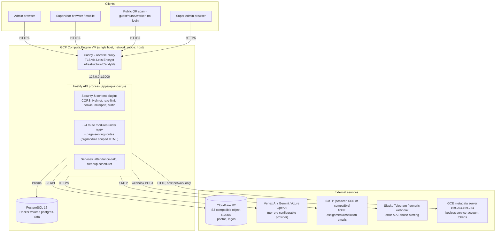

# PROJECT KNOWLEDGE BASE — Kodspot Housekeeping Platform

> **Purpose of this document.** This is a standalone, external reverse-engineering knowledge base for this repository, generated by reading the actual source code (routes, Prisma schema, migrations, middleware, static frontend, infrastructure config) rather than summarizing existing documentation. It is intended to let another engineer, or another AI assistant (ChatGPT, Claude, Gemini, Grok, DeepSeek, etc.), understand the whole system without re-opening the repository.
>
> **Evidence policy.** Every claim below is derived from a specific file in the repository (paths are given throughout). Where something could not be confirmed from the code, this document says explicitly **"Evidence not found in repository."** Nothing here is invented.
>
> **Relationship to existing docs.** This file is intentionally separate from, and does not modify, `README.md`, `docs/`, or the other root-level `*.md` files (`IMPLEMENTATION_SUMMARY.md`, `QUICK_START_GUIDE.md`, `DEPLOYMENT_CHECKLIST.md`, `CODE_REFERENCE.md`, `BEFORE_AFTER_COMPARISON.md`, `SUPERVISOR_UI_UPDATES.md`, `WORKFLOW_DIAGRAMS.md`). Those files were used only as supporting evidence (they document a specific past feature: multi-floor supervisor rosters) and are cross-referenced, not replaced. Where existing docs and the actual code disagreed, the code wins, and the discrepancy is called out.
>
> **Generated:** 2026-07-22. **Scope:** entire git-tracked repository at the time of writing (161 tracked files; `node_modules/`, `data/`, `tmp/` are local/untracked and excluded per `.gitignore`).

---

## Table of Contents

1. [Executive Summary](#1-executive-summary)
2. [System Architecture](#2-system-architecture)
3. [Repository Structure](#3-repository-structure)
4. [Technology Stack](#4-technology-stack)
5. [Configuration & Environment Variables](#5-configuration--environment-variables)
6. [Database Architecture (Full Data Dictionary)](#6-database-architecture-full-data-dictionary)
7. [API Reference](#7-api-reference)
8. [Business Modules & Rules](#8-business-modules--rules)
9. [Frontend / PWA Architecture](#9-frontend--pwa-architecture)
10. [Security](#10-security)
11. [Background Jobs & Data Retention](#11-background-jobs--data-retention)
12. [AI Assistant Subsystem](#12-ai-assistant-subsystem)
13. [DevOps, Deployment & Infrastructure](#13-devops-deployment--infrastructure)
14. [Testing](#14-testing)
15. [Known Inconsistencies, Risks & Technical Debt](#15-known-inconsistencies-risks--technical-debt)
16. [Glossary](#16-glossary)
17. [AI Knowledge Snapshot (machine-readable summary)](#17-ai-knowledge-snapshot-machine-readable-summary)

---

## 1. Executive Summary

**Project name:** Kodspot Housekeeping Platform (package name `housekeeping-api`; production domain `app.kodspot.in`, per `infrastructure/Caddyfile` and `.env.example`).

**What it is.** A production, multi-tenant SaaS backend + server-rendered frontend for operating hospital/facility housekeeping (cleaning), maintenance ticketing, and staff attendance/time-tracking, with an optional AI assistant and hospital-accreditation (NABH) compliance reporting layer. It is confirmed (`README.md`) to be in real production use in a hospital environment.

**Business problem it solves.** Facility teams (hospitals especially) running housekeeping operations across many floors/rooms and shifts need: proof that cleaning actually happened (photo evidence, QR-anchored location identity), a way for patients/nurses/staff to report problems without an account, a way to track staff attendance/hours without expensive hardware, and leadership-level visibility (dashboards, PDF reports, AI Q&A) into all of the above — while keeping each customer organization's data strictly isolated (multi-tenant).

**Target users / roles** (from `UserRole` enum + `Worker.type` + code):
- `SUPER_ADMIN` — Kodspot's own platform operators; manage all tenant organizations, billing-adjacent config (AI provider keys, token budgets), and can impersonate any org for support (`X-Org-Id` header).
- `ADMIN` — a customer organization's administrator; manages locations, staff, schedules, tickets, attendance rules, reports, AI config for their org only.
- `SUPERVISOR` — floor-level staff who log in to submit cleaning records, mark attendance, resolve tickets. Every supervisor `User` account has an auto-linked `Worker` record (`type: 'SUPERVISOR'`) so supervisors can also be tracked for their own attendance.
- Unauthenticated actors: hospital patients/visitors/staff (via `scan.html`, complaint submission), nurses (via a dedicated "nursing" complaint form), and workers doing self-service attendance (via `attendance.html`) — none of these require an account; access control is via QR-scoped location identity + rate limiting instead.

**Key capabilities** (confirmed in code):
- QR-code-anchored location hierarchy (Building → Floor → Room/Ward/ICU/etc.) with two independent QR namespaces (cleaning-scan `/s/{code}` and attendance `/a/{code}`).
- Photo-evidence cleaning verification, with duplicate-submission and photo-fraud (duplicate selfie hash) detection.
- Three attendance tracking modes per organization (`basic` / `semi` / `advanced`) driving how much time-tracking automation is applied.
- A full leave-management subsystem (policies, balances, accrual, approval workflow).
- A maintenance ticket system supporting three intake sources: internal (admin/supervisor-created), public/guest (QR-scanned complaint with a post-resolution guest confirm/reject review loop), and nursing (hospital nursing-station complaints with severity-based auto-priority).
- Multi-provider AI assistant (Vertex AI / Gemini / Azure OpenAI) with hard token/cost budgets, SQL-first query short-circuiting to avoid unnecessary LLM cost, and prompt-injection detection.
- NABH (National Accreditation Board for Hospitals & Healthcare Providers — an Indian hospital-accreditation standard) compliance PDF reporting, feature-flagged per org.
- A super-admin "tenant data reset" operation (dangerous, heavily guarded) that wipes an org's operational data while preserving its configuration.
- DPDP Act (India's data-protection law) related features: a personal-data export endpoint (`/auth/export`), automatic anonymization of old guest complaint contact info, and application-level AES-256-GCM encryption of specific PII fields (Aadhaar number, blood group).

**Core technologies:** Node.js + Fastify (backend), PostgreSQL + Prisma ORM (database), vanilla JS multi-page static HTML frontend (no SPA framework, no bundler), Cloudflare R2 (S3-compatible object storage for photos), Docker Compose + Caddy (reverse proxy/TLS) on a single GCP Compute Engine VM, GitHub Actions (CI/CD via SSH deploy).

**Architecture style:** Monolithic single-process Fastify API (`apps/api`) serving both JSON APIs (under `/api/*`) and static/dynamically-templated HTML pages (module- and org-scoped URLs) from the same process. Not a microservices architecture. Not a JAMstack/SPA — the "frontend" is server-served static HTML with client-side API calls.

**Scalability model:** Single VM, single Postgres instance, `network_mode: host` Docker networking (chosen specifically so the container can reach the GCE metadata server for keyless Vertex AI auth — see §12). Several in-process, non-distributed caches and rate limiters exist (AI cost controls, shift-config cache) that are explicitly **not** safe for horizontal scaling across multiple API replicas (see §15).

**Deployment model:** Continuous deployment — every push to `main` triggers `.github/workflows/deploy.yml`, which SSHes into a GCP VM, pulls the repo, rebuilds the Docker image, and redeploys with a post-deploy health check and an explicit content-freshness assertion (grep for a known marker string in `attendance.html`).

**Development philosophy observed in the code:** Defensive/backward-compatible coding is pervasive — many route handlers wrap newer-feature queries (e.g., `workShift` relations) in `try/catch` specifically to tolerate environments where a migration hasn't been applied yet; race conditions in create-if-not-exists flows are handled explicitly via Prisma `P2002` unique-constraint catches rather than pre-checks alone; several bug-fix comments are left in place inline (e.g., "C1 FIX", "SHIFT_OVERLAP", "6 blank pages bug") documenting exactly what production issue a piece of logic is guarding against.

**Known limitations (evidence-based, expanded in §15):** no automated test suite exists anywhere in the repository; several cost/rate-limit/cache mechanisms are per-process, not distributed; two independent implementations of monthly leave accrual exist; hard-delete safety checks are inconsistent between the Worker and Supervisor permanent-delete endpoints; SVG upload sanitization is a naive substring blocklist, not real XML sanitization.

---

## 2. System Architecture

### 2.1 High-level component diagram



### 2.2 Request lifecycle (authenticated API call)

```mermaid
sequenceDiagram
    participant Browser
    participant Caddy
    participant Fastify as Fastify (index.js)
    participant SecPlugins as CORS/Helmet/RateLimit/Cookie
    participant Auth as authenticateJWT + requireRole
    participant Route as Route handler
    participant Prisma
    participant R2 as Cloudflare R2 (optional)

    Browser->>Caddy: HTTPS request + Authorization: Bearer <JWT>
    Caddy->>Fastify: reverse_proxy 127.0.0.1:3000 (adds X-Forwarded-* headers)
    Fastify->>SecPlugins: CORS check, Helmet headers, global rate-limit (1000/min default, keyed by token or IP)
    SecPlugins->>Auth: authenticateJWT — verify JWT, load User, check isActive, check tokenInvalidBefore, check Organization.status, check dataResetInProgress
    Auth->>Auth: requireRole(...) — SUPER_ADMIN always passes; others checked against allowed list
    Auth->>Route: request.user populated {id, orgId, role}
    Route->>Prisma: query/mutate, always orgId-scoped (except SUPER_ADMIN routes)
    opt file upload
        Route->>R2: uploadToR2() - sharp resize/webp, validateImageBuffer magic-byte check
    end
    Route-->>Fastify: JSON response
    Fastify-->>Caddy: response
    Caddy-->>Browser: response + security headers (HSTS, CSP via Helmet, cache rules from Caddyfile)
```

### 2.3 Startup sequence (exact order, from `apps/api/index.js`)

1. `require('./src/config/env')` — loads `.env`, validates `REQUIRED_ENV`, exits process (`process.exit(1)`) if anything required is missing; in production only, also hard-requires a valid 64-hex-char `DATA_ENCRYPTION_KEY`.
2. Fastify instance created (`trustProxy: true`, `ignoreTrailingSlash: true`, custom `genReqId`, `pino` logger — pretty-printed in dev, `warn`-level JSON in production).
3. Prisma client (`src/lib/prisma.js`) and R2 client (`src/lib/r2.js`) modules loaded; R2's logger wired to `fastify.log`.
4. All ~24 route modules required (not yet registered).
5. `onClose` hook registered: disconnect Prisma on shutdown.
6. `start()` async function runs:
   a. `connectWithRetry(fastify.log)` — up to 5 attempts, 2s apart, to `prisma.$connect()`.
   b. `registerSecurityPlugins(fastify)` — CORS → Helmet → rate-limit → cookie, in that order.
   c. `registerContentPlugins(fastify)` — multipart → static.
   d. `registerErrorHandlers(fastify)` — global error handler + 404 handler.
   e. `healthRoutes` registered at root (`/health`, for Docker healthcheck, no auth, rate-limit exempt).
   f. All ~24 API route modules registered under prefix `/api`.
   g. `pageRoutes` registered (unprefixed — serves HTML pages and PWA assets at org/module-scoped paths).
   h. `fastify.listen({ port: PORT||3000, host: '127.0.0.1' })` — **binds to localhost only**; Caddy (same host network) is the only thing that can reach it directly, even if a cloud firewall rule were misconfigured to expose port 3000.
   i. `startCleanupScheduler(fastify.log)` — background retention/accrual jobs (see §11).
   j. A one-off query checks for orgs stuck with `dataResetInProgress: true` (crash recovery during a prior tenant-data-reset run) and logs a warning + error-alert for each, so a super admin knows to re-trigger the reset.
7. `SIGINT`/`SIGTERM` handlers call `fastify.close()` for graceful shutdown; unhandled promise rejections are logged and forwarded to `logError`.

### 2.4 Multi-tenancy model

`Organization` is the single tenant root (see §6.1 for the full mechanism). There is no separate "workspace" or "account" concept above or below `Organization` — one org = one customer/hospital. A `User` can belong to at most one org (`orgId` is part of a composite unique key with `email`), except `SUPER_ADMIN` users whose `orgId` is nullable (platform-level accounts) and who can act on any org by sending an `X-Org-Id` header, verified in `middleware/auth.js`.

### 2.5 Module system

Within one organization, functionality is further gated by an `enabledModules: String[]` array on `Organization`, validated against a fixed 6-value set found in multiple route files (`auth.js`, `superadmin.js`, `pages.js`): `hk` (housekeeping — the only module with a fully-implemented business-rule backend), `ele` (electrical), `civil`, `asset`, `complaints`, `nursing`. Each module gets its own URL namespace (`/{orgSlug}/{mod}/...`), its own dynamically-generated PWA manifest and service worker (with module-specific theme colors), and its own login pages. **Evidence found:** only the `hk` (housekeeping) module has real backend route logic (cleaning, attendance, tickets, etc.) and the `nursing` module has a real, distinct complaint-intake endpoint (`/public/nursing-complaint`) and gates hospital-structure endpoints. **Evidence not found in repository** for dedicated backend business logic behind `ele`, `civil`, or `asset` — these appear to be enabled/reserved module slots in the front-end module registry (`apps/api/public/js/modules.js`) and org config without corresponding route-level implementations found in `apps/api/src/routes/`. `complaints` overlaps with the ticket/public-complaint system already described.

---

## 3. Repository Structure

```
housekeeping-platform/
├── .github/workflows/          CI/CD — deploy.yml (SSH deploy to GCP VM), ping.yml (trivial CI smoke test)
├── apps/api/                   The entire application (single deployable unit)
│   ├── index.js                Entry point — see §2.3
│   ├── Dockerfile               Production image build
│   ├── .dockerignore
│   ├── package.json / package-lock.json
│   ├── prisma/
│   │   ├── schema.prisma        869-line data model (see §6)
│   │   └── migrations/          34 migrations, Mar–Jul 2026 (see §6.7)
│   ├── public/                  Static HTML/CSS/JS frontend — see §9 (39 HTML pages + shared js/css + PWA assets)
│   ├── scripts/
│   │   └── diagnose-cleaning-preselect.js   Read-only ops diagnostic script (see §14)
│   └── src/
│       ├── config/env.js        Env loading/validation, isProduction, APP_URL
│       ├── errors.js            Global error handler, alerting (Slack/Telegram/webhook), image magic-byte validation
│       ├── lib/                 prisma.js, r2.js, crypto.js, security.js, email.js, audit.js, report-signatories.js, upload-limits.js
│       ├── middleware/          auth.js (authenticateJWT, requireRole), rateLimits.js
│       ├── plugins/             security.js (CORS/Helmet/rate-limit/cookie), content.js (multipart/static)
│       ├── routes/               ~24 Fastify route modules — see §7 for the full list
│       └── services/             attendance-calc.js (shared time-tracking engine), cleanup.js (retention/accrual scheduler)
├── data/                        Local Docker bind-mount output (postgres data files, caddy data/config, logs) — gitignored, not part of the deployed codebase
├── docs/                        Existing supplementary docs — AUDIT-analytics-dashboard.md (a prior read-only frontend audit) and a replication-pack subfolder — treated as supporting evidence only, not modified by this document
├── infrastructure/
│   ├── Caddyfile                Reverse proxy config — TLS, security headers, cache rules (see §13)
│   └── setup-vm.sh              One-time GCP VM bootstrap script (Docker install, firewall, cron for image pruning)
├── tmp/diffs/                   Local scratch diffs from past edits — not part of the application
├── docker-compose.yml            3 services: db (Postgres 15), api (this app), caddy
├── .env / .env.example           Runtime configuration (see §5)
├── package.json (root)           Minimal — only declares prisma/@prisma/client as a convenience for root-level `npx prisma` usage; the real app lives in apps/api
├── README.md, IMPLEMENTATION_SUMMARY.md, QUICK_START_GUIDE.md,
│   DEPLOYMENT_CHECKLIST.md, CODE_REFERENCE.md, BEFORE_AFTER_COMPARISON.md,
│   SUPERVISOR_UI_UPDATES.md, WORKFLOW_DIAGRAMS.md   Existing docs — NOT modified by this file; the latter six all document one specific past feature (multi-floor supervisor rosters)
└── sa-key.json                   Local GCP service-account key placeholder (gitignored, 2 bytes in the working tree — not a real committed secret)
```

**Notable structural facts:**
- There is exactly **one** application (`apps/api`) — despite the `apps/` directory name suggesting a monorepo, no other app exists in it.
- There is no separate frontend build directory, no `client/` folder, no bundler config anywhere in the repo — the "frontend" is `apps/api/public/`, served by the same Fastify process.
- `apps/api/prisma/migrations/` is the authoritative history of schema evolution — see §6.7 for the full narrative reconstructed from migration names and content.

---

## 4. Technology Stack

| Layer | Technology | Version (from package.json) | Evidence / Notes |
|---|---|---|---|
| Runtime | Node.js | 20 (Alpine) | `apps/api/Dockerfile`: `FROM node:20-alpine` |
| Web framework | Fastify | ^4.26.0 | Chosen over Express — schema-based validation hooks, plugin architecture used extensively (`@fastify/*` ecosystem) |
| ORM | Prisma | ^5.9.0 (client + CLI) | `apps/api/prisma/schema.prisma`; migration-based (`prisma migrate deploy` in production) |
| Database | PostgreSQL | 15 (Alpine image) | `docker-compose.yml`: `postgres:15-alpine` |
| Object storage | Cloudflare R2 | via `@aws-sdk/client-s3` ^3.726.1 (S3-compatible API) | `apps/api/src/lib/r2.js` |
| Image processing | `sharp` | ^0.33.2 | resize/re-encode to WebP on upload; HEIC→JPEG conversion in cleaning uploads |
| Auth | `jsonwebtoken` + `bcrypt` | ^9.0.2 / ^5.1.1 | Stateless 24h JWTs (HS256 implicit default), bcrypt cost 12 |
| Validation | `zod` | ^3.22.4 | Used in virtually every route file for request body/query validation |
| PDF generation | `pdfkit` | ^0.18.0 | Attendance reports, org "full" reports, NABH compliance reports, Employee 360 reports |
| QR generation | `qrcode` | ^1.5.4 | Location scan/attendance QR SVGs, login QR codes |
| QR decoding (client) | `jsQR` (vendored) | n/a (vendored .min.js) | `apps/api/public/js/jsQR.min.js` — client-side camera QR scan in `supervisor-scan.html` |
| PDF generation (client) | `jsPDF` (vendored) | n/a (vendored UMD) | `apps/api/public/js/vendor/jspdf.umd.min.js` |
| Email | `nodemailer` | ^6.9.8 | SMTP (SES-compatible) — ticket notifications |
| Reverse proxy / TLS | Caddy 2 | `caddy:2-alpine` image | `infrastructure/Caddyfile` — automatic HTTPS via Let's Encrypt |
| Containerization | Docker + Docker Compose | n/a | `docker-compose.yml`, `apps/api/Dockerfile` |
| CI/CD | GitHub Actions | n/a | `.github/workflows/deploy.yml` — SSH-based deploy, no container registry used |
| Cloud provider | Google Cloud Platform | n/a | GCE VM (`infrastructure/setup-vm.sh`), GCE metadata server used for keyless Vertex AI auth |
| AI providers (per-org configurable) | Vertex AI (Gemini via Vertex), Google Gemini (consumer API), Azure OpenAI / OpenAI | n/a | `apps/api/src/routes/ai.js` |
| Logging | `pino` (via Fastify) + `pino-pretty` (dev only) | included with Fastify / ^10.3.1 | File-based error log also kept at `data/logs/error.log` with manual 50MB rotation (`src/errors.js`) |
| Rate limiting | `@fastify/rate-limit` | ^9.1.0 | Global tier + per-route overrides (login, bootstrap, public complaint endpoints, data-reset) |
| Security headers | `@fastify/helmet` | ^11.1.1 | CSP, HSTS (prod only), referrer policy — see §10 |
| CORS | `@fastify/cors` | ^9.0.1 | Locked to `CORS_ORIGINS`/`APP_URL` in production; wide open (`true`) in dev |
| File uploads | `@fastify/multipart` | ^8.0.0 | 20MB/file, 5 files, 10 fields limits |
| Static files | `@fastify/static` | ^6.12.0 | Serves `apps/api/public/` |
| Cookies | `@fastify/cookie` | ^9.3.1 | Registered but **not** used for the primary session mechanism (JWT is Bearer-token/localStorage-based) — see §10.4 |
| Frontend | Vanilla JS, no framework | n/a | `apps/api/public/js/app.js` — hand-written `window.App` IIFE module |
| PWA | Custom Service Worker + Web App Manifest, dynamically generated per org/module | n/a | `apps/api/src/routes/pages.js` |

**Alternatives considered:** Evidence not found in repository (no ADRs / architecture-decision records present).

---

## 5. Configuration & Environment Variables

Configuration sources, in load order: `apps/api/src/config/env.js` (`dotenv.config()` pointed at the repo-root `.env`) → `docker-compose.yml` (passes through the same variable names into the `api` container) → `.github/workflows/deploy.yml` (writes a fresh `.env` on the VM from GitHub Secrets on every deploy).

### 5.1 Required at boot (hard `process.exit(1)` if missing)

| Variable | Purpose | Failure impact |
|---|---|---|
| `DATABASE_URL` | Postgres connection string | Process exits immediately |
| `JWT_SECRET` | HMAC secret for signing/verifying session JWTs | Process exits immediately |
| `R2_ACCOUNT_ID`, `R2_ACCESS_KEY_ID`, `R2_SECRET_ACCESS_KEY`, `R2_BUCKET_NAME` | Cloudflare R2 object storage credentials | Process exits immediately (even if the org never uploads a file) |
| `ADMIN_KEY` | Bootstrap/emergency super-admin key | Process exits immediately |
| `COOKIE_SECRET` | Cookie-signing secret (also used as JWT_SECRET fallback for cookies specifically, and as the HMAC key in `hashAdminKey`) | Process exits immediately |

### 5.2 Production-only additional hard requirement

| Variable | Purpose | Failure impact |
|---|---|---|
| `DATA_ENCRYPTION_KEY` | 64-char hex (32-byte) AES-256-GCM key for encrypting Worker PII (`aadharNo`, `bloodGroup`) and `Organization.aiApiKey` | In production, process exits with an explicit message that PII would otherwise be stored in plaintext. In non-production, encryption silently no-ops (plaintext) with a one-time console warning — **not** a hard failure outside prod. |

### 5.3 Optional / feature-gated

| Variable | Purpose | Default if absent | Module |
|---|---|---|---|
| `NODE_ENV` | production/development switch | `development` semantics unless `'production'` | Global — controls CORS looseness, Helmet HSTS, logger verbosity, cookie `secure`/`sameSite`, error-message verbosity |
| `PORT` | Listen port | `3000` | `index.js` |
| `APP_URL` | Public base URL, used in generated QR codes, PWA scope, emails | `http://localhost:{PORT}` | Many (locations.js QR, auth.js login QR, email templates) |
| `COOKIE_DOMAIN` | Cookie domain scoping | unset (host-only cookie) | `lib/security.js` (production only) |
| `CORS_ORIGINS` | Comma-separated allowed origins | falls back to `[APP_URL]` | `plugins/security.js` |
| `RATE_LIMIT_MAX` / `RATE_LIMIT_WINDOW` | Global Fastify rate-limit tier | 1000 / 60000ms | `plugins/security.js` |
| `ADMIN_RATE_LIMIT_MAX` / `ADMIN_RATE_LIMIT_WINDOW` | "Strict" tier (bootstrap, sensitive resets) | 5 / 900000ms (15 min) | `middleware/rateLimits.js` |
| `SES_SMTP_HOST` / `SES_SMTP_USER` / `SES_SMTP_PASS` / `SES_FROM_EMAIL` | SMTP email sending | Email sending silently disabled if any missing | `lib/email.js` (ticket assignment/resolution notifications) |
| `ALERT_TELEGRAM_BOT_TOKEN` / `ALERT_TELEGRAM_CHAT_ID` | Telegram error/AI-abuse alerting | Disabled if absent | `errors.js`, `routes/ai.js` |
| `ALERT_WEBHOOK_URL` | Generic webhook alerting | Disabled if absent | `errors.js` |
| `SLACK_WEBHOOK_URL` | Slack error/AI-abuse alerting | Disabled if absent | `errors.js`, `routes/ai.js` |
| `VERTEX_AI_PROJECT` | GCP project ID for Vertex AI | falls back to service-account key's `project_id`, then GCE metadata | `routes/ai.js` |
| `VERTEX_AI_REGION` | Vertex AI region | `asia-south1` | `routes/ai.js` |
| `VERTEX_AI_ENABLED` | Global LLM kill switch | enabled unless explicitly `'false'`/`'0'` | `routes/ai.js` |
| `GOOGLE_SA_KEY` / `GOOGLE_APPLICATION_CREDENTIALS` | Fallback (non-keyless) Vertex AI auth via service-account JSON | Only used if GCE metadata server is unreachable | `routes/ai.js`, `routes/superadmin.js` (`ai-diagnostic`) |
| `DB_USER` / `DB_PASSWORD` / `DB_NAME` | Postgres container credentials | n/a (required by `docker-compose.yml`'s `db` service) | docker-compose only, not read by the app directly (app uses `DATABASE_URL`) |
| `TZ` | Container timezone | set to `Asia/Kolkata` in `docker-compose.yml` | Note: application code does **not** rely on this — all IST math is done manually via `+5:30` offset arithmetic in JS (see §8.9), so this variable is more of a defensive/observability setting than a functional dependency. |

**Security classification summary:** `JWT_SECRET`, `COOKIE_SECRET`, `ADMIN_KEY`, `DATA_ENCRYPTION_KEY`, `DATABASE_URL`, `R2_SECRET_ACCESS_KEY`, `SES_SMTP_PASS`, and any `GOOGLE_SA_KEY` contents are all high-sensitivity secrets. `.env` is git-ignored; `.env.example` ships only placeholders. `sa-key.json` at the repo root is also git-ignored and, per the file listing, is only a 2-byte placeholder in this working tree (not a real committed credential).

---

## 6. Database Architecture (Full Data Dictionary)

**Engine:** PostgreSQL 15. **ORM:** Prisma 5.9, migration-based (`apps/api/prisma/schema.prisma`, 869 lines; `apps/api/prisma/migrations/`, 34 migrations). Generator targets `["native", "linux-musl-openssl-3.0.x"]` (Alpine/musl Docker deploy target).

### 6.1 Multi-tenancy mechanism

`Organization` is the tenant root. Nearly every model carries `orgId String` with `onDelete: Cascade` back to `Organization` — deleting an org cascades through essentially the entire dataset. Two models have **nullable** `orgId` (`User`, `LoginSession`, `AuditLog`) to accommodate platform-level (`SUPER_ADMIN`) actors not tied to any one org.

Tenant isolation is enforced not just by the foreign key but by **composite uniqueness scoped to `orgId`** on every model where a natural key could otherwise collide across tenants:

| Model | Composite unique constraint |
|---|---|
| `User` | `[orgId, email]` |
| `Worker` | `[orgId, employeeId]` |
| `WorkShift` | `[orgId, name]` |
| `ShiftConfig` | `[orgId, shift]` |
| `LeavePolicy` | `[orgId, code]` |
| `Holiday` | `[orgId, date]` |
| `DutyRoster` | `[orgId, date, shift, supervisorId, locationId]` (widened over time — see §6.7) |
| `LeaveBalance` | `[workerId, policyId, year]` |
| `CleaningSchedule` | `[locationId]` (transitively per-org since `Location` is org-scoped) |

Globally-unique (not per-org) fields exist specifically where a value must be resolved **without** org context: `Organization.slug`, `Location.qrCode` (scanned blind), `Worker.linkedUserId` (1:1), `Ticket.reviewToken` (public review link).

Almost every list-heavy model also carries `@@index([orgId, ...])` composite indexes purely for tenant-scoped query performance.

### 6.2 Audit / soft-delete / timestamp conventions

- Standard `createdAt`/`updatedAt` on mutable models; append-only/log-style models (`CleaningImage`, `AuditLog`, `Notification`, `Holiday`, `AiUsageLog`, `TimePunch`, `LeaveTransaction`, `LoginSession`) have `createdAt` only.
- **Soft delete exists only at the `Organization` level**: `status: OrgStatus` (`ACTIVE`/`SUSPENDED`/`DELETED`), `deletedAt`, `purgeAfter`. No child model has its own `isDeleted`/`deletedAt` flag; most "delete" operations on child records (`Worker`, `Ticket`'s soft states, etc.) are implemented as `isActive: false` toggles, not a generic soft-delete field.
- **Generic audit trail:** `AuditLog` — polymorphic (`actorType`/`actorId` as loose strings, not FKs; `entityType`/`entityId` likewise), `oldValue`/`newValue` as `Json?` diff snapshots, plus `ipAddress`/`userAgent`/`deviceType`/`sessionId` (added in a later migration, see §6.7).
- **Domain-specific ledger:** `LeaveTransaction` — immutable financial-ledger-style record of every leave credit/debit/adjustment/expiry, each row carrying a `balanceAfter` snapshot.
- **Session tracking:** `LoginSession` — full login/logout lifecycle (`loginAt`, `logoutAt`, `lastSeenAt` throttled to 1 update/min, computed `duration`, `logoutType` ∈ manual/token_expiry/auto_idle/forced).
- **Fraud/anti-spoofing tracking:** `Attendance.fraudFlags String[]` and `TimePunch.fraudFlags String[]`, plus `photoHash` (MD5 of the compressed selfie, indexed) on both — used to detect the same selfie photo being reused for a different worker within 7 days.

### 6.3 Enums (complete)

| Enum | Values |
|---|---|
| `UserRole` | `SUPER_ADMIN`, `ADMIN`, `SUPERVISOR` |
| `OrgStatus` | `ACTIVE`, `SUSPENDED`, `DELETED` |
| `LocationType` | `BUILDING`, `FLOOR`, `ROOM`, `CORRIDOR`, `WASHROOM`, `ICU`, `LOBBY`, `KITCHEN`, `WARD`, `MEETING_ROOM`, `NURSE_STATION`, `OFFICE`, `OTHER` |
| `Shift` | `MORNING`, `AFTERNOON`, `EVENING`, `NIGHT`, `GENERAL` |
| `CleaningFrequency` | `ONCE_DAILY`, `TWICE_DAILY`, `THRICE_DAILY`, `WEEKLY`, `CUSTOM` |
| `CleaningRecordStatus` | `SUBMITTED`, `FLAGGED` |
| `TicketPriority` | `LOW`, `NORMAL`, `HIGH`, `URGENT` |
| `TicketStatus` | `OPEN`, `IN_PROGRESS`, `RESOLVED`, `CLOSED` |
| `AttendanceStatus` | `PRESENT`, `ABSENT`, `LEAVE`, `HALF_DAY` |
| `PunchType` | `IN`, `OUT` |
| `LeaveType` | `PAID`, `UNPAID`, `SICK`, `COMPENSATORY` |
| `LeaveRequestStatus` | `PENDING`, `APPROVED`, `REJECTED`, `CANCELLED` |

Native type usage: only `@db.Date` is used, exclusively on "calendar date, no time" fields (`Attendance.date`, `DutyRoster.date`, `Holiday.date`, `TimePunch.date`, `LeaveTransaction.date`, `LeaveRequest.fromDate/toDate`), a deliberate choice to avoid timezone drift in day-bucketing since all other `DateTime` fields are stored as plain UTC timestamps. No `@db.Bytes`, `@db.Decimal`, or `@db.Timestamptz` are used anywhere.

### 6.4 Model reference by domain

**Identity & Tenancy**

- **`Organization`** — tenant root. Config fields of note: `enabledModules String[] @default(["hk"])`, `attendanceMode String @default("basic")` (off/basic/semi/advanced), `defaultWorkShiftId?`, `weeklyOffDays Int[] @default([0])`, `presentThreshold Float @default(0.75)`, `halfDayThreshold Float @default(0.40)`, `allowDuplicateCleaning Boolean @default(false)`, `reportSignatories Json? @default("[]")`, `nabhEnabled Boolean @default(true)`, `aiEnabled/aiProvider/aiModel/aiApiKey/aiMonthlyTokenLimit(default 500000)/aiTokensUsedThisMonth/aiTokensResetAt/aiDailyUserQueryLimit(default 100)`, `status OrgStatus @default(ACTIVE)`, `dataResetInProgress/dataResetStartedAt`, `deletedAt/purgeAfter`.
- **`User`** — staff logins (`SUPER_ADMIN`/`ADMIN`/`SUPERVISOR`). HR-style fields (`designation`, `employeeId`, `department`, `gender`, `bloodGroup`, `dateOfBirth`, `dateOfJoin`, `address`, `aadharNo`, `notes`), `passwordHash`, `isActive`, `tokenInvalidBefore` (JWT-revocation marker). **Note:** `User.aadharNo`/`bloodGroup` are *not* passed through the PII encryption helper in the reviewed code paths — only the equivalent `Worker` fields are (see §10.3) — a plaintext-PII inconsistency worth flagging.
- **`Worker`** — field staff record; `type String @default("WORKER")` (`"WORKER"` or `"SUPERVISOR"`); `linkedUserId String? @unique` — the mechanism that ties a supervisor's login (`User`) to their own attendance-trackable staff record (`Worker`). `aadharNo`/`bloodGroup` here **are** application-level encrypted (AES-256-GCM) before storage.

**Locations & Cleaning**

- **`Location`** — self-referential hierarchy (`parentId`, `onDelete: SetNull` on the parent relation — deleting a parent unlinks rather than cascades children), `qrCode String @unique`, `type LocationType`.
- **`CleaningSchedule`** — one row per location (`@@unique([locationId])`), `frequency CleaningFrequency`, `shifts Shift[]`.
- **`CleaningRecord`** — actual logged clean; `supervisor User` relation is `onDelete: Restrict` (cannot delete a User with cleaning-record history), `workers Worker[]` m:m, `status` (`SUBMITTED`/`FLAGGED`), `isLate`/`lateReason`/`expectedShift`.
- **`CleaningImage`** — one-to-many photo evidence, `onDelete: Cascade` from `CleaningRecord`.

**Tickets / Complaints**

- **`Ticket`** — `source String @default("INTERNAL")` (`INTERNAL`/`PUBLIC`/`NURSING`), `imageUrls String[]` (≤5), guest fields (`guestName`, `guestPhone`, `issueType`), nursing fields (`nurseName`, `nurseEmployeeId`), review workflow fields (`reviewToken @unique`, `reviewExpiresAt`, `reviewStatus`, `rejectionCount`, `reviewImageUrl`), `createdBy`/`assignedTo` both `onDelete: SetNull`, `resolvedWorkers Worker[]` m:m.

**Attendance & Shifts**

- **`ShiftConfig`** — legacy per-`Shift`-enum time window (one row per shift value per org), lunch/break fields, `graceMinutes`, `autoDeductBreaks`.
- **`WorkShift`** — newer named/custom shift definitions superseding the rigid enum for time-tracking, `breaks Json?`, unique per `[orgId, name]`.
- **`Attendance`** — one row per `[workerId, date, shift]` (`@@unique`). Carries both the manual status (`AttendanceStatus`) and a full set of computed time-tracking fields (`firstIn`, `lastOut`, `totalWorkMins`, `totalBreakMins`, `expectedWorkMins`, `overtimeMins`, `shortfallMins`, `lateByMins`, `earlyByMins`, `punchCount`), plus `photoUrl`/`photoHash`/`fraudFlags` for self-service selfie attendance, and `source` (`self`/`supervisor`/`admin`/`bulk`).
- **`TimePunch`** — raw IN/OUT events (`PunchType`), `isAutoBreak Boolean` (system-generated break deductions vs. real punches), `fraudFlags`, `photoHash`.
- **`WorkerAssignment`** — default floor assignment (`isPrimary`), unique per `[workerId, locationId]`.
- **`DutyRoster`** / **`DutyRosterWorker`** — supervisor-owned daily/shift/location roster and its worker membership join table.
- **`Holiday`** — org calendar, `type` ("full"/"half"/"optional" — **note:** `"optional"` is accepted by the API schema but has no effect anywhere in the payroll/attendance calendar math, an incomplete feature — see §15).

**Leave Management**

- **`LeavePolicy`** — accrual rules (`accrualMode`, `accrualAmount`, `accrualDay`, `maxBalance`, `maxConsecutive`, `carryForward`+`maxCarryForward`+`carryForwardExpiryDays`, `requiresApproval`, `allowHalfDay`, `allowBackdated`, `minNoticeDays`, `applicableTo` ∈ ALL/WORKERS/SUPERVISORS).
- **`LeaveBalance`** — per worker/policy/year running total, unique per `[workerId, policyId, year]`.
- **`LeaveTransaction`** — immutable ledger (`type` ∈ CREDIT/DEBIT/EXPIRY/ADJUSTMENT/CARRY_FORWARD).
- **`LeaveRequest`** — optional approval workflow, `status LeaveRequestStatus`, `days Float` (supports 0.5 for half-day).

**Notifications, Audit & Sessions**

- **`Notification`** — in-app notifications (`type` ∈ ticket_assigned/ticket_created/ticket_resolved/public_complaint), per-user, `isRead`.
- **`AuditLog`** — see §6.2.
- **`LoginSession`** — see §6.2.

**AI Usage / Cost Controls**

- **`AiUsageLog`** — per-query log, `source` ('sql'/'llm'), `handler?`, `provider?`, `model?`, `query?` (first 200 chars), token counts, `estimatedCostUsd`, `flagged Boolean` (abuse/injection detection marker).

### 6.5 Encryption of PII at rest

There is **no database-level encryption** — no `Bytes` columns, no pgcrypto, no column-level encryption declared in the schema itself. Encryption is entirely **application-level**, in `apps/api/src/lib/crypto.js`:

- Algorithm: AES-256-GCM, 12-byte IV, 16-byte auth tag, key = the 64-hex-char `DATA_ENCRYPTION_KEY` env var (32 raw bytes).
- Stored format: `"iv:ciphertext:tag"` (hex-joined) inside an ordinary Prisma `String` column.
- If the key is missing/invalid, encryption **silently degrades to plaintext** (with a one-time console warning) outside production; in production, the process refuses to boot without a valid key (see §5.2).
- Only two fields are actually encrypted this way: `Worker.aadharNo` and `Worker.bloodGroup` (via `encryptWorkerPII`/`decryptWorkerPII`, called from `routes/workers.js` and `routes/superadmin.js`). The same primitive (`encryptField`/`decryptField`) is reused to encrypt `Organization.aiApiKey` (third-party LLM provider credentials).
- **Gap:** the structurally identical `aadharNo`/`bloodGroup` fields on the `User` model (used historically for supervisor personal records before the Worker-link pattern existed) do not appear to be routed through the same encryption helpers in the reviewed code — see §15.

### 6.6 Migrations — full list (34 files)

```
20260312000000_housekeeping_init
20260313000000_expand_worker_fields
20260313000000_public_complaints
20260315000000_add_supervisor_designation
20260315000000_add_token_invalid_before
20260315000000_ticket_resolution
20260316000000_drop_worker_name_unique
20260316000001_add_personal_fields_to_user
20260316000002_add_flag_reason_and_updated_at
20260316000003_add_shift_validation_fields
20260317000000_add_org_slug
20260318000000_add_enabled_modules
20260319000000_add_notifications
20260320000000_ticket_workers_and_shift_config
20260321000000_review_system_and_attendance
20260322000000_add_duty_roster
20260404000000_add_allow_duplicate_cleaning
20260404000001_add_ai_assistant_fields
20260409000000_add_audit_log_device_tracking
20260410022708_add_ai_cost_controls_and_usage_log
20260411000000_add_multi_image_rejection_fields
20260411130822_attendance_advanced
20260412000000_add_nursing_fields
20260413000000_add_data_reset_fields
20260414000000_add_half_day_type
20260414100000_add_fraud_flags
20260415000000_add_worker_supervisor_link
20260415100000_add_nurse_station_office_types
20260416000000_add_time_tracking_leave_login_session
20260418000000_add_work_shifts_and_evening
20260422094500_multi_floor_roster_unique
20260512000000_add_nabh_compliance_reports
20260528010000_add_report_signatories
20260711000000_add_default_work_shift
```

### 6.7 Schema evolution narrative

**Phase 1 — Core HK platform (Mar 12–22, 2026).** `housekeeping_init` lays down the original 9-table core (`Organization`, `User`, `Worker`, `Location`, `CleaningSchedule`, `CleaningRecord`, `CleaningImage`, `Ticket`, `AuditLog`). The following two weeks rapidly rounded out an MVP: HR-style personal fields on `Worker`/`User`; guest complaint intake (`public_complaints`); ticket resolution fields; JWT revocation support (`add_token_invalid_before`); cleaning-record flagging; shift-mismatch validation fields on `CleaningRecord`; org slugs and the `enabledModules` feature-flag array; the `Notification` model; `ShiftConfig`; the guest review/confirm-reject flow plus the first cut of `Attendance`; `DutyRoster`/`DutyRosterWorker`.

**Phase 2 — Ops hardening & AI (April 2026).** Duplicate-cleaning toggle; first AI-assistant config fields; audit-log device/session tracking; the big `add_ai_cost_controls_and_usage_log` migration (token budgets + the entire `AiUsageLog` table); multi-image + guest-rejection support on `Ticket`; the start of "advanced attendance mode" (photo capture, `source`, QR `locationId` on `Attendance`); nursing-specific ticket fields; the superadmin tenant-data-reset workflow fields; half-day attendance tracking; fraud-flag arrays + photo-hash indexing; the `Worker.linkedUserId`/`type` unification of supervisor User↔Worker records (with a data-backfill INSERT for existing supervisors); additional `LocationType` values for hospital layouts (`NURSE_STATION`, `OFFICE`).

**Phase 3 — Full time & leave management (Apr 16–18, 2026).** `add_time_tracking_leave_login_session` is the single largest migration: 3 new enums and 5 new tables in one shot (`TimePunch`, `LeavePolicy`, `LeaveBalance`, `LeaveTransaction`, `LeaveRequest`, `LoginSession`), plus attendance-threshold org config (`weeklyOffDays`, `presentThreshold`, `halfDayThreshold`) and a large batch of computed time-tracking columns on `Attendance`. Two days later, `add_work_shifts_and_evening` added the `EVENING` shift value and the whole `WorkShift` model, wiring `workShiftId` into `Worker`/`Attendance`/`TimePunch` so time-tracking could move off the rigid `Shift` enum onto flexible per-org shift definitions.

**Phase 4 — Roster refinement & compliance (Apr 22 – Jul 2026).** `multi_floor_roster_unique` relaxed `DutyRoster`'s uniqueness so one supervisor can own rosters across multiple floors in the same shift (this is the schema-level change underlying the "multi-floor supervisor support" feature documented in the existing root-level markdown files `SUPERVISOR_UI_UPDATES.md`/`BEFORE_AFTER_COMPARISON.md`/`WORKFLOW_DIAGRAMS.md`). `add_nabh_compliance_reports` added the `nabhEnabled` flag gating the hospital-accreditation compliance feature. `add_report_signatories` added the configurable PDF sign-off block reused across three different report generators. `add_default_work_shift` (the most recent migration, Jul 11 2026) let an org designate a fallback `WorkShift` for unassigned workers.

**Overall trajectory:** the schema began as a straightforward cleaning-verification tracker and grew three major subsystems on the same tenant model — (1) a public/guest complaint-and-review loop, (2) a full attendance→time-punch→leave-accrual HR stack with fraud detection, and (3) a metered, cost-capped AI assistant — while progressively hardening audit/device-tracking and adding hospital-specific compliance features, without ever introducing a second tenant-root model.

---

## 7. API Reference

All API routes are mounted under the `/api` prefix (see `index.js`). Route files live in `apps/api/src/routes/`. Global conventions, confirmed across essentially every file:

- **Auth:** `authenticateJWT` (verifies `Authorization: Bearer <JWT>`, HS256 implicit, `JWT_SECRET`) then `requireRole(...roles)`. `SUPER_ADMIN` always passes `requireRole` regardless of the listed roles. A small, deliberately unauthenticated surface exists (`public.js`, `images.js`'s query-token scheme, `health.js`, `pages.js`) — see §7.10–7.13.
- **Validation:** `zod` schemas on request bodies/queries in virtually every mutating endpoint.
- **Multi-tenancy:** every query is scoped by `request.user.orgId`, except the `superadmin.js` module (cross-org by design) and `SUPER_ADMIN`'s `X-Org-Id` impersonation.
- **Audit:** most mutations fire-and-forget an `AuditLog` write (`.catch(() => {})`), so a logging failure never blocks the actual operation.
- **Rate limiting:** a global tier (1000/min default) applies everywhere except explicitly-exempted routes (`/health`, page-serving routes); several sensitive/public endpoints define their own stricter per-route `config.rateLimit`.

### 7.1 `auth.js` — Authentication & Session Lifecycle

| Method & Path | Auth | Rate limit | Purpose |
|---|---|---|---|
| `POST /auth/bootstrap` | `ADMIN_KEY` (no JWT) | strict (5/15min/IP) | One-time creation of the first `SUPER_ADMIN`; 409 if one already exists |
| `POST /auth/login` | none (credentials in body) | 10/15min/IP | Email+password or `adminKey`-only login; multi-org email disambiguation; issues 24h JWT |
| `GET /auth/me` | JWT only | global | Current user + org config (`enabledModules`, `attendanceMode`, thresholds, `nabhEnabled`) |
| `PATCH /auth/password` | JWT | global | Change password; sets `tokenInvalidBefore` (revokes all other sessions), issues a fresh token |
| `POST /auth/logout` | JWT | global | Audit log + closes the current `LoginSession` |
| `GET /auth/export` | JWT | strict | DPDP data-portability export (profile + up to 500 rows each of cleaning records/tickets/audit logs) as downloadable JSON |
| `GET /auth/login-qr` | JWT + ADMIN | global | SVG login QR for a given module+role, validated against `enabledModules` |
| `GET /auth/login-sessions` | JWT + ADMIN | global | Paginated `LoginSession` history for the org |

Business rules: 24h flat JWT expiry everywhere, no refresh-token table (revocation is purely via `tokenInvalidBefore` compared to the JWT `iat`). Admin-key comparisons use constant-time hashing (`safeCompareKeys`) plus a randomized 500–1000ms delay on failure (timing-attack mitigation).

### 7.2 `superadmin.js` — Cross-Org Platform Administration

Entire file gated `SUPER_ADMIN`-only at the file level.

| Area | Endpoints |
|---|---|
| Organizations | `GET/POST/PATCH/DELETE /superadmin/organizations[/:id]`, `POST /superadmin/organizations/:id/logo` |
| Cross-org users | `POST /superadmin/organizations/:orgId/admins`, `GET/PATCH /superadmin/users[/:id]` (supports cross-org transfer), `PATCH /superadmin/users/:id/password` |
| Cross-org supervisors/workers | `POST /superadmin/organizations/:orgId/supervisors` (dual-writes `User`+linked `Worker`), `GET/POST /superadmin/organizations/:orgId/workers`, `PATCH /superadmin/workers/:id` |
| Analytics | `GET /superadmin/analytics`, `/superadmin/analytics/orgs`, `/superadmin/analytics/orgs/:orgId/workers`, `GET /superadmin/audit-logs` (global) |
| QR / login | `GET /superadmin/organizations/:id/login-qr` |
| AI configuration | `GET/PATCH /superadmin/organizations/:id/ai-config` (masked key display), `GET /superadmin/ai-health`, `GET /superadmin/ai-diagnostic` (live Vertex AI auth probe with human-readable diagnosis) |
| Tenant data reset | `GET /superadmin/organizations/:id/reset-preview`, `POST /superadmin/organizations/:id/reset-data` |

**Tenant Data Reset** (the most operationally dangerous endpoint in the codebase): rate-limited to 1 request/5min/IP; requires the caller to type the org's exact slug (`confirmSlug`) plus a `reason` (≥3 chars); sets a lock (`dataResetInProgress`) with 10-minute stale-lock auto-recovery; force-invalidates all of the org's user JWTs; deletes `AiUsageLog` → `Notification` → `DutyRoster` (cascades workers) → `Attendance` → `CleaningRecord` (cascades images) → `Ticket` → `AuditLog`, in that specific order; resets AI token counters; writes one final audit entry documenting the reason and delete counts (recreated after the audit-log wipe); unlocks; then asynchronously purges the org's R2 object-storage prefix. If deletion throws mid-way, the lock is deliberately **not** cleared so the operation is safely re-runnable. Org configuration (users, locations, schedules) is preserved — this is an operational data wipe, not org deletion.

### 7.3 `locations.js` — Location Hierarchy & QR

Key endpoints: `GET /locations` (flat/tree), `GET /locations/qr/:code` (public-facing QR resolution, `Cache-Control: no-store`, 410 if the location or any ancestor is inactive), `GET/POST /locations/:id/qr-image[-attendance]` (two independent QR namespaces — `/s/{code}` for cleaning, `/a/{code}` for attendance), `POST/PATCH/DELETE /locations[/:id]` (ADMIN), `GET/PUT /locations/:id/schedule`, `GET /locations/tree`, `POST /locations/org-logo`.

Business rules: location `type` must nest under `BUILDING`/`FLOOR` parents; QR codes are 8-char alphanumeric (`A-Z0-9` only); **activation/deactivation cascades** enforce the invariant "if active, all ancestors must be active" (walking both up and down the tree, with explicit self-healing logic for pre-existing broken data caused by a previously-fixed bug); org-logo SVG uploads are sanitized via a naive substring blocklist (`<script`, `javascript:`, `onerror`, `onload`) — not a real XML sanitizer (see §15).

### 7.4 `workers.js` / `supervisors.js` — Staff Management

`workers.js` (ADMIN+SUPERVISOR read, ADMIN write): CRUD + stats (`/workers/:id/stats`) + `WorkerAssignment` management + a **permanent hard-delete** endpoint (`DELETE /workers/:id/permanent`) that does **not** check for existing `Attendance`/`CleaningRecord` history before deleting.

`supervisors.js` (ADMIN-only): CRUD over `User(role: SUPERVISOR)` with an auto-linked `Worker` record created on every supervisor creation; profile edits are synced to the linked worker (`syncFields`); its own **permanent hard-delete** endpoint, in contrast to `workers.js`, explicitly checks cleaning-record/attendance/duty-roster/ticket history first and refuses (409, with a full breakdown) if any exists.

### 7.5 `duty-roster.js` — Daily Roster Management

Supervisor self-assigns to a location for a date/shift (`POST /duty-roster`, idempotent via `P2002` race handling), bulk multi-location assignment (up to 50), worker-list replacement (`PUT /duty-roster/:id/workers`, up to 200), and a 3-tier worker-suggestion heuristic (`GET /duty-roster/suggested-workers`) combining default assignments (+1000), historical roster membership over the last 180 rosters (+20 each), and recent attendance at that location over the last 1500 rows (+5 each).

### 7.6 `cleaning.js` — Cleaning Record Submission

`POST /cleaning-records` (SUPERVISOR): multipart, ≥1 worker + ≥1 image required; HEIC/HEIF images are transcoded to JPEG via `sharp`; blocks submission for a shift whose window hasn't started yet (`FUTURE_SHIFT`); toggleable duplicate-submission guard per org/location/shift/day (checked twice — pre-check and in-transaction re-check, for race safety); submissions outside the shift's own configured time window are marked `isLate` and require a `lateReason`. `GET /cleaning-records/export` (CSV, ADMIN, capped 5000 rows). `GET /my-day` — supervisor's "my work" view, hard-clamped to the 30-day photo-retention window.

### 7.7 `tickets.js` — Maintenance Ticket Lifecycle

Status machine: `OPEN → IN_PROGRESS → RESOLVED → CLOSED`; `PUBLIC`-source tickets additionally track a guest `reviewStatus` (`PENDING`→`CONFIRMED`/`REJECTED`). Race-safe accept/pickup (`POST /tickets/:id/accept`, `/pickup`) via atomic conditional `updateMany`. `POST /tickets/:id/resolve` requires a mandatory proof photo; `PUBLIC`-source resolution generates a 30-minute guest-review token; `NURSING`-source resolution skips guest review and closes directly. `autoCloseExpiredReviews()` lazily force-closes expired pending reviews on every `GET /tickets` call.

### 7.8 `attendance.js` / `time-punch.js` / `duty-roster.js` / `work-shifts.js` / `holidays.js` / `leave.js` — Workforce Tracking

The largest and most business-rule-dense area of the codebase — fully detailed in §8.1–§8.5.

### 7.9 `analytics.js` / `reports.js` / `nabh.js` / `employee360.js` — Reporting & Insight Layer

`analytics.js`: real-time admin dashboard (`/analytics/dashboard`), overdue-shift detection, weighted "problem locations" risk scoring, room-status boards, the flagship period `/analytics/report`, and heatmaps. `reports.js`: the "full organization" PDF export with 10 sections and a configurable signatory block. `nabh.js`: feature-flagged (`Organization.nabhEnabled`) hospital-accreditation compliance scoring and PDF, deliberately always styled in positive (teal/green) tones since it's meant for external accreditation review. `employee360.js`: explicitly documented as a **read-only** aggregation layer over data computed elsewhere (attendance-calc.js) — never recomputes business logic itself.

### 7.10 `public.js` — Unauthenticated Public Surface

The single largest unauthenticated attack surface in the app; every route has its own per-IP rate limit (5–30 requests per window ranging 60s–15min). Covers: QR location resolution, guest complaint submission (`POST /public/complaint`), nursing complaint submission (`POST /public/nursing-complaint`, severity-mapped priority), guest ticket-status tracking and the post-resolution confirm/reject review loop (with auto-escalation to `URGENT` priority after ≥2 guest rejections), and self-service worker attendance kiosk endpoints (`GET /public/attendance/workers`, `POST /public/attendance/mark`) gated to organizations in `advanced` attendance mode.

### 7.11 `images.js` — Private Image Proxy

`GET /images/*` — the only route with a bespoke, non-shared auth mechanism: JWT passed as a `?token=` query parameter (since `` tags can't set headers), independently verified, with path-traversal and cross-org access guards (`SUPER_ADMIN` may cross orgs, others may not).

### 7.12 `health.js` / `pages.js` — Infra & Static Serving

`GET /health` — no auth, rate-limit exempt, `SELECT 1` Postgres liveness probe for Docker healthchecks. `pages.js` — serves all 39 static HTML pages plus dynamically-generated per-org/per-module PWA manifests and service workers; no server-side authentication on any HTML page route (access control for admin/supervisor pages is entirely client-side, enforced by the JS calling the actual `/api/*` endpoints after page load).

### 7.13 `notifications.js` / `audit-logs.js`

`notifications.js`: in-app notification inbox (ADMIN+SUPERVISOR), with a self-healing mechanism that silently marks stale `public_complaint` notifications read once their linked ticket is already resolved/closed. `audit-logs.js`: the org-scoped (non-superadmin) audit log viewer.

---

## 8. Business Modules & Rules

### 8.1 Attendance

Three org-level modes (`Organization.attendanceMode`): `off`, `basic` (manual marking only, no time-tracking), `semi`, `advanced` (photo-based self-service kiosk + full time-punch tracking). Status values: `PRESENT`, `ABSENT`, `LEAVE`, `HALF_DAY` (requiring a `halfDayType` of `FIRST_HALF`/`SECOND_HALF` in every write path, enforced in application code even though the DB column is nullable). Supervisors may only mark/edit attendance for **today or yesterday**; admins are unrestricted. Auto-classification (in `services/attendance-calc.js`): work ratio ≥ `presentThreshold` (org-configurable, default 0.75) → `PRESENT`; ≥ `halfDayThreshold` (default 0.40) → `HALF_DAY`; else `ABSENT`. Lateness (`isLate`) is a separate concept from presence, gated by a configurable `graceMinutes` (default 10) against the shift start time — a worker can be "late" and still fully "present." A manual admin override of status is never silently reverted by later automatic recalculation from new punches (`recalculateAndPersist`'s preservation rule) — only the numeric time-tracking fields update.

Photo-based self-marking (both `attendance.js`'s admin/supervisor photo endpoint and `public.js`'s kiosk endpoint) computes an MD5 hash of the uploaded selfie and flags (but does not block) a submission if the same hash was used for a *different* worker within the last 7 days — a duplicate-photo/buddy-punching fraud signal stored in `fraudFlags`.

### 8.2 Time-Tracking

Raw `IN`/`OUT` punches are recorded in `TimePunch`; `services/attendance-calc.js`'s `calculateDailySummary` pairs them into work sessions and computes `firstIn`/`lastOut`/`totalWorkMins`/`overtimeMins`/`shortfallMins`/`lateByMins`/`earlyByMins`. Two distinct calculation modes: `semi` treats all punches as one continuous span and subtracts *configured* break windows; `advanced` sums each IN/OUT pair as work time and treats gaps between pairs as unstructured break time. A 30-second duplicate-punch guard on `POST /time-punch` protects against accidental double-submission/network retries.

### 8.3 Duty Rosters

A `DutyRoster` groups workers under one supervisor, for one location, date, and shift. Supervisors can now own rosters at **multiple locations** simultaneously in the same shift (schema-level change in `multi_floor_roster_unique`, corroborated by the existing `SUPERVISOR_UI_UPDATES.md`/`WORKFLOW_DIAGRAMS.md`/`BEFORE_AFTER_COMPARISON.md` documents describing the frontend side of this feature). Roster creation is idempotent (returns the existing roster on a duplicate attempt rather than erroring).

### 8.4 Leave Management

Org-defined `LeavePolicy` rows drive accrual (monthly/yearly/none), balance caps, consecutive-day caps, approval requirements, half-day eligibility, backdating rules, and minimum-notice requirements. Applying for leave debits a `LeaveBalance` (unless the policy requires approval, in which case a `LeaveRequest` is created instead) and writes matching `Attendance` rows with `status: 'LEAVE'` for every day in the range. **Known inconsistency:** leave-day counting is simple calendar-day arithmetic, not weekly-off/holiday-aware, unlike the more sophisticated business-day calendar logic used for payroll attendance reporting — see §15.

### 8.5 Cleaning Verification

Every cleaning submission requires photo evidence and is bound to a specific `Location` (identified via its QR code) and shift window. Duplicate submissions for the same location/shift/day are blocked unless the org has explicitly enabled `allowDuplicateCleaning`. Submissions outside the configured shift window are still accepted but are marked late and require a supervisor-entered reason — a deliberate relaxation from an earlier, stricter "exact shift match" rule that had broken under legitimate overlapping shift configurations (documented in an inline code comment).

### 8.6 Maintenance Tickets

Three intake sources with different rules: `INTERNAL` (created by staff), `PUBLIC` (anonymous QR-scanned guest complaints, with a post-resolution guest confirm/reject loop and automatic priority escalation to `URGENT` after 2+ rejections), and `NURSING` (nurse-submitted, hospital-severity-mapped priority, no guest review step — resolves straight to `CLOSED`).

### 8.7 NABH Compliance Reporting

Feature-flagged per org (`nabhEnabled`). Computes schedule-adherence, documentation rate (% of cleaning records with photo evidence), on-time rate, ticket resolution rate and mean-time-to-resolve, and attendance rate over a date range, rendered as a deliberately positive-toned PDF intended for external accreditation review (explicit code comment: never use red/orange on the compliance score itself).

### 8.8 Super Admin / Multi-Tenant Operations

Organization lifecycle (create/suspend/soft-delete with a 30-day purge window), cross-org user/worker management, per-org AI provider configuration and budget management, and the tenant data-reset operation (§7.2).

### 8.9 IST (India Standard Time) Handling

**No timezone library is used anywhere in the codebase.** Every "current IST date/time" computation is done manually by adding a fixed `+5:30` offset to a UTC `Date` object (helper functions named things like `getISTDateStr()` recur independently across `attendance.js`, `analytics.js`, `services/attendance-calc.js`, etc. — not a single shared utility). This is a deliberate, simple approach that works because the business only ever operates in one timezone, but it means DST-naive logic is scattered across many files rather than centralized (a maintainability note, not presently a functional bug since India does not observe DST).

---

## 9. Frontend / PWA Architecture

**Style:** Vanilla JavaScript, no framework, no bundler, no build step. 39 standalone HTML files in `apps/api/public/`, each served as-is by `@fastify/static`/`reply.sendFile`. The same physical HTML file is reused across every tenant organization and module — org/module context is carried entirely client-side via the URL path and `localStorage`, not server-side templating.

**Page inventory (grouped by role):**
- **Admin** (15 pages, `admin-*.html`): login, dashboard, analytics, locations, workers, supervisors, cleaning, tickets, audit-logs, QR print, attendance, AI assistant, work-shifts, NABH, employee (Employee 360).
- **Supervisor** (6 pages, `supervisor-*.html`): login, scan, clean (cleaning-record submission), tickets, attendance, my-day.
- **Super Admin** (2 pages): login, dashboard.
- **Public/unauthenticated** (3 pages): `attendance.html` (self-service kiosk, reached via `/a/:code`), `scan.html` (guest/nursing complaint submission, reached via `/s/:code` or `/scan/:code`), `review.html` (token-based post-resolution guest review, reached via `/review/:token`).
- **Org/module routing shells**: `index.html` (org-code entry), `org-home.html` (module picker), `module-home.html` (role picker).
- **Static/legal:** `privacy.html`, `terms.html`, `offline.html` (service-worker offline fallback).

**Shared JS:** `js/app.js` (~1489 lines) — the global `window.App` module: authenticated fetch wrapper (`apiFetch`/`apiFetchJson`, `adminHeaders()`, `supHeaders()`), toast notifications, PWA/service-worker registration (`initModulePWA`), in-app notification polling, client-side 429 backoff/retry with jitter, and portrait-orientation locking for mobile. `js/modules.js` — the single source of truth for the 6-module registry (`hk`, `ele`, `civil`, `asset`, `complaints`, `nursing`) and their metadata/theme colors, shared by `org-home.html`, `module-home.html`, and superadmin pages. Vendored third-party libraries: `jsQR.min.js` (client-side camera QR decoding, used in `supervisor-scan.html`) and `jspdf.umd.min.js`.

**Auth mechanism (client side):** Pure Bearer-token-in-`localStorage` — **no cookies used for session state** despite `@fastify/cookie` being registered server-side. Two entirely separate token namespaces: admin (`localStorage.token`/`user`) and supervisor (`localStorage.sup_token`/`sup_user`), each with its own login page and its own fetch-header helper. A 401 response from any API call clears the relevant keys and redirects to the appropriate login page.

**Camera/QR usage:** `supervisor-scan.html` uses `navigator.mediaDevices.getUserMedia` (rear camera) + client-side `jsQR` decoding — QR codes are never decoded server-side. `attendance.html` (self-service kiosk) uses the front camera to capture a bounded-size selfie photo via canvas, submitted as `FormData`. No `navigator.geolocation` usage was found anywhere — location identity for both cleaning and attendance flows comes entirely from the scanned QR code, not GPS coordinates.

**PWA:** Two layers of service worker — a static root `sw.js` (network-first, versioned cache `kodspot-v91`) and a **dynamically generated, per-org-per-module** service worker (`GET /:orgSlug/:mod/sw.js` in `pages.js`, cache name `kodspot-{mod}-v10`, scoped via the `Service-Worker-Allowed` header) so each organization's installed PWA icon deep-links straight into its own module. Web app manifests are likewise both static (root `site.webmanifest`) and dynamically generated per org+module (`GET /:orgSlug/:mod/manifest.json`) with module-specific theme colors (e.g., teal for housekeeping, violet for nursing).

**CSS:** One shared design-system stylesheet (`css/design-system.css`, ~1686 lines, CSS custom-property token system) used by all authenticated/internal pages. The two public QR-landing pages (`scan.html`, `attendance.html`) deliberately inline their own critical CSS instead, optimizing for fast first paint on a cold QR scan with no cache warm.

---

## 10. Security

### 10.1 Authentication

Stateless JWT (`jsonwebtoken`, HS256 implicit default, `JWT_SECRET`, flat 24-hour expiry, payload `{userId, orgId, role}`). No refresh-token table — session revocation works only via `User.tokenInvalidBefore` (set on password change or a forced admin reset), compared against the JWT's `iat` claim on every request. `bcrypt` cost factor 12 for password hashing.

### 10.2 Authorization

Two-layer: `authenticateJWT` (identity) then `requireRole(...roles)` (RBAC). `SUPER_ADMIN` universally bypasses any `requireRole` check. Multi-tenant boundary is enforced by scoping every query to `request.user.orgId`, with `SUPER_ADMIN` able to override this via an `X-Org-Id` header (checked against the target org's `ACTIVE` status).

### 10.3 PII Encryption

AES-256-GCM, application-level, for `Worker.aadharNo`/`Worker.bloodGroup` and `Organization.aiApiKey` — see §6.5.

### 10.4 Transport & HTTP Security

- **CORS** (`@fastify/cors`): locked to `CORS_ORIGINS`/`APP_URL` in production, wide open (`origin: true`) in development.
- **Helmet CSP** (exact directives): `default-src 'self'`; `style-src 'self' 'unsafe-inline' https://fonts.googleapis.com`; `script-src 'self' 'unsafe-inline'`; `img-src 'self' data: https: blob:`; `connect-src 'self'`; `font-src 'self' https://fonts.gstatic.com`; `frame-src 'none'`; `object-src 'none'`; `media-src 'self'`; `upgrade-insecure-requests`.
- **HSTS**: production-only, `max-age=31536000; includeSubDomains; preload`.
- **Caddy-layer headers** (`infrastructure/Caddyfile`): additionally sets `X-Content-Type-Options: nosniff`, `X-Frame-Options: DENY`, `X-XSS-Protection`, `Referrer-Policy: strict-origin-when-cross-origin`, a restrictive `Permissions-Policy`, strips the `Server` header, and forces `no-cache, no-store, must-revalidate` + `X-Robots-Tag: noindex, nofollow` on every org-scoped admin/supervisor page and on `/superadmin*`.
- **Cookies**: `@fastify/cookie` is registered (`httpOnly`, `secure` in prod, `sameSite: strict` in prod, 24h `maxAge`) but is **not** the session transport — JWTs travel as `Authorization: Bearer` headers (or a `?token=` query param specifically for `` tags in `routes/images.js`) and are stored in browser `localStorage`.

### 10.5 Rate Limiting

Global tier (`@fastify/rate-limit`): 1000 requests/min default, keyed by the first 40 chars of the bearer token for authenticated calls, else by IP. Stricter overrides: login (10/15min/IP), bootstrap/admin-sensitive (5/15min/IP, env-configurable), tenant data-reset (1/5min/IP), and a wide range of per-route limits on every public/unauthenticated endpoint in `public.js` (5–30 requests per window ranging 60s–15min). A separate, additional in-process rate limiter (15 requests/60s/user) applies specifically to the AI chat endpoint.

### 10.6 File Upload Security

`@fastify/multipart` caps: 20MB/file, 5 files, 10 fields per request (`lib/upload-limits.js`). All image uploads are validated by **magic-byte signature** (`validateImageBuffer` in `errors.js`), not just declared MIME type — JPEG/PNG/WEBP signatures checked explicitly. Uploaded images are re-encoded via `sharp` (resize to fit 800×800, re-encoded to WebP quality 80) before storage in R2, which also strips most embedded metadata/exploits incidentally. HEIC/HEIF images (cleaning-record uploads only) are separately transcoded to JPEG. SVG uploads (org logos only) are checked against a **naive substring blocklist** (`<script`, `javascript:`, `onerror`, `onload`) rather than real XML sanitization — a known gap, see §15.

### 10.7 Injection & Abuse Prevention

- SQL injection: mitigated structurally by Prisma's parameterized query builder everywhere except a handful of explicit `$queryRaw` calls for date-bucketed aggregates — these use tagged-template parameterization, not string concatenation (confirmed pattern across `analytics.js`, `superadmin.js`, `reports.js`).
- CSV injection: explicit escaping (`esc()` helper, prefixes cells starting with `=+-@\t\r`) on every CSV export endpoint (attendance report, cleaning export).
- Prompt injection (AI assistant): a regex-based detector (`INJECTION_PATTERNS`) flags suspicious chat messages (jailbreak attempts, "ignore previous instructions," etc.) — logs + alerts + prefixes the message with a `[SECURITY: ...]` warning before it reaches the LLM, but does **not** block the message outright.
- Timing-attack mitigation: constant-time comparison (`safeCompareKeys`) plus randomized response delay on `ADMIN_KEY` checks.

### 10.8 Audit Logging

Nearly every state-changing operation across the entire codebase writes to the polymorphic `AuditLog` table (actor, action, entity, before/after JSON snapshot, IP/device/session where available). The global error handler additionally logs every 5xx/API error as an `api_error` audit entry. A separate org-scoped `GET /audit-logs` endpoint (ADMIN) and a cross-org `GET /superadmin/audit-logs` endpoint (SUPER_ADMIN) expose this trail.

### 10.9 Data Privacy / Compliance Features (India DPDP Act)

- `GET /auth/export` — self-service personal data export.
- `anonymizeGuestData()` (background job) — nulls guest contact info (`guestName`/`guestPhone`) on `PUBLIC`-source tickets after 180 days.
- 30-day automatic deletion of cleaning-record photos, ticket resolution photos, and attendance selfies (metadata retained, only the media is purged) — see §11.

---

## 11. Background Jobs & Data Retention

All scheduling is done with plain `setTimeout`/`setInterval` in `apps/api/src/services/cleanup.js` — **no cron library, no external job queue**. `startCleanupScheduler(logger)` is invoked once from `index.js` immediately after the HTTP server starts listening.

| Job | Frequency | Retention/threshold | Behavior |
|---|---|---|---|
| `cleanupExpiredImages` | Daily (first run 30s after boot, then every 24h) | 30 days | Deletes `CleaningImage` rows + their R2 objects older than 30 days; the parent `CleaningRecord` metadata is kept forever. R2 delete failures leave the DB row intact for retry the next day. |
| `cleanupTicketImages` | Daily | 30 days, **only** for `RESOLVED`/`CLOSED` tickets | Nulls image URL fields on old resolved/closed tickets; active tickets are never purged regardless of age. |
| `cleanupAttendancePhotos` | Daily | 30 days | Deletes selfie photos from R2 and nulls `Attendance.photoUrl`; the attendance record itself is kept. |
| `anonymizeGuestData` | Daily | 180 days | DPDP-compliance anonymization of guest contact info on old `PUBLIC` tickets. |
| `runMonthlyLeaveAccrual` | Daily (self-gates to once per calendar month per policy) | n/a | Credits `LeaveBalance` for policies with `accrualMode: 'monthly'`; idempotent via checking for an existing `CREDIT` transaction in the current month. **Duplicated** by an independent, separately-invokable implementation in `routes/leave.js`'s `POST /leave/accrue` — see §15. |
| `autoCloseIdleSessions` | Every 5 minutes | 30 minutes idle | Closes `LoginSession` rows with no activity heartbeat in 30 min (`logoutType: 'auto_idle'`). |

Additional lazy (request-triggered, not scheduled) background-style jobs: `autoCloseExpiredReviews()` in `tickets.js` (force-closes expired pending guest reviews, fired on every `GET /tickets` call) and `migrateSpecialCharQrCodes()` in `locations.js` (one-off QR-code format self-heal, runs at route registration time).

---

## 12. AI Assistant Subsystem

Implemented entirely in `apps/api/src/routes/ai.js` (2671 lines) — the single most complex file in the codebase. Per-organization configurable provider (`Organization.aiProvider`): **Vertex AI** (primary/first-class), **Gemini** (consumer API), or **Azure OpenAI/OpenAI**.

**Vertex AI keyless auth** (the reason `docker-compose.yml` uses `network_mode: host`): tries the **GCE metadata server** (`169.254.169.254`) first for a service-account access token; falls back to a manually RS256-signed JWT-bearer exchange against Google's OAuth2 endpoint using a service-account key (`GOOGLE_SA_KEY` or `GOOGLE_APPLICATION_CREDENTIALS`) if the metadata server is unreachable (e.g., local dev, or a container not on host networking).

**Cost controls (all in-process, non-distributed — see §15):**
- Per-user daily call cap (`Organization.aiDailyUserQueryLimit`, default 100).
- Per-org monthly token budget (`aiMonthlyTokenLimit`, default 500,000) with an 80%-usage Slack/Telegram alert.
- Per-user rate limit: 15 requests/60 seconds, independent of and additional to the global Fastify rate limiter.
- Hardcoded Vertex pricing used to estimate cost per call (`$0.00015`/1M input tokens, `$0.0006`/1M output tokens), logged to `AiUsageLog.estimatedCostUsd`.

**Cost avoidance:** a large regex-based query classifier (`SQL_PATTERNS`) routes most common questions (dashboard stats, overdue rounds, worker/supervisor lookups, ticket counts, attendance, trends) to zero-cost, template-based SQL handlers **before** ever considering the LLM; only unmatched free-form queries reach the actual model. A global kill switch (`VERTEX_AI_ENABLED`) forces the app into "data-only mode" (SQL handlers only) if unset to false.

**Abuse detection:** an off-topic filter blocks non-housekeeping questions before they reach the LLM; a prompt-injection detector flags (but does not block) suspicious phrasing.

**Endpoints:** `POST /ai/chat` (free-form Q&A), `POST /ai/analyze` (8 structured analysis types, 6 of which are answered by SQL handlers with zero LLM cost — `recommendations` and `weekly-report` intentionally always use the LLM), `GET /ai/usage`, `GET /ai/status`, `GET /ai/suggestions`.

---

## 13. DevOps, Deployment & Infrastructure

### 13.1 Topology

Single GCP Compute Engine VM running three Docker Compose services, all on `network_mode: host` (chosen specifically so the `api` container can reach the GCE metadata server for Vertex AI auth):
- **`db`** — `postgres:15-alpine`, bound to `127.0.0.1:5432` only, 400MB memory limit.
- **`api`** — this application, built from `apps/api/Dockerfile`, read-only root filesystem (`read_only: true`, with `tmpfs` mounts for `/tmp` and the node_modules cache), `no-new-privileges`, non-root user (`nodejs`, uid 1001), listens on `127.0.0.1:3000` only, 400MB memory limit.
- **`caddy`** — `caddy:2-alpine`, `network_mode: host`, reverse-proxies to `127.0.0.1:3000`, automatic Let's Encrypt TLS, 100MB memory limit.

### 13.2 CI/CD

`.github/workflows/deploy.yml` runs on every push to `main` (or manual `workflow_dispatch`): SSHes into the GCP VM using a deploy key from GitHub Secrets, `git fetch`+`reset --hard` to the exact triggering commit SHA (verified with an explicit SHA-mismatch guard), regenerates `.env` on the VM from GitHub Secrets, rebuilds the API image with `--no-cache` ("to guarantee fresh public/ assets"), does a content-freshness sanity check (`grep` for the `availableWorkShifts` marker string in both the source tree and the running container's `public/attendance.html` — guards against a stale build being deployed unnoticed), runs the `/health` endpoint check, prunes old Docker images, and restarts Caddy for TLS renewal. `.github/workflows/ping.yml` is a trivial one-line smoke-test workflow with no real function beyond confirming Actions can run.

### 13.3 VM Bootstrap

`infrastructure/setup-vm.sh` — a one-time Ubuntu 22.04 setup script: installs Docker CE, adds the deploy user to the `docker` group, installs Git, configures UFW (allow SSH/80/443), clones the repo, and installs two weekly maintenance cron jobs (`docker system prune`, `docker builder prune`).

### 13.4 Reverse Proxy Rules

`infrastructure/Caddyfile` (see §10.4 for the security-header specifics): the primary app domain (`app.{DOMAIN}`) gets automatic HTTPS, gzip, no-cache headers on all admin/supervisor/superadmin pages and the service worker/manifest, long-cache (`max-age=86400`) for static CSS/JS; the naked domain and `www` both permanent-redirect to the app subdomain.

### 13.5 Object Storage

Cloudflare R2 (S3-compatible), accessed via `@aws-sdk/client-s3`. Bucket key convention: `uploads/{orgId}/{timestamp}-{16 hex chars}.{ext}`. Images are never served directly from R2 — everything is proxied through the app's own `/images/*` endpoint (§7.11) so the bucket itself never needs to be public.

---

## 14. Testing

**Evidence found:** a single read-only diagnostic script, `apps/api/scripts/diagnose-cleaning-preselect.js`, which reproduces (for manual verification, not automated CI) the worker-matching logic shared by `GET /attendance/present-workers` and `GET /duty-roster/floor-workers`, run manually against a real database via CLI flags (`--date=`, `--org=`, `--floor=`).

**Evidence not found in repository:** no unit tests, no integration tests, no end-to-end tests, no test runner configuration (no `jest`/`mocha`/`vitest`/`playwright` dependency in `package.json`), and no test-related CI step in either GitHub Actions workflow. `docs/AUDIT-analytics-dashboard.md` is a manual, read-only audit document (a prior human/AI review of the analytics/dashboard pages), not an automated test suite. This is a significant coverage gap for a system explicitly described as production-critical for hospital operations — see §15.

---

## 15. Known Inconsistencies, Risks & Technical Debt

Each item below is drawn directly from code evidence gathered during this analysis (see the relevant section for detail).

| # | Finding | Evidence | Risk |
|---|---|---|---|
| 1 | No automated test suite anywhere in the repository | §14 | High — a hospital-production system with zero regression safety net; every deploy relies on manual verification and the CI content-freshness grep check alone |
| 2 | AI cost/rate-limit state is entirely in-process (`Map`s + `setInterval`), not shared across replicas | §12, ai.js analysis | Medium — fine on the current single-VM deployment, but the daily-limit/monthly-budget/rate-limit guarantees would silently break under horizontal scaling |
| 3 | Monthly leave accrual is implemented twice independently (`routes/leave.js POST /leave/accrue` and `services/cleanup.js runMonthlyLeaveAccrual`) | §8.4, §11 | Medium — the two can drift out of sync over time since they aren't code-shared |
| 4 | `DELETE /workers/:id/permanent` does not check attendance/cleaning history before hard-deleting, while the equivalent `DELETE /supervisors/:id/permanent` explicitly guards against exactly this | §7.4 | Medium/High — potential silent loss or orphaning of historical attendance/cleaning data for permanently-deleted workers |
| 5 | Org logo SVG upload sanitization is a naive substring blocklist (`<script`, `javascript:`, `onerror`, `onload`), not real XML/SVG sanitization | §7.3, §10.6 | Medium — plausibly bypassable via encoding tricks or other SVG-based XSS vectors (e.g. `xlink:href` payloads) not covered by the blocklist |
| 6 | `Holiday.type: 'optional'` is accepted by the API/schema but has no effect on any attendance/payroll calendar calculation, which only branches on `'full'`/`'half'` | §6.4 | Low — a UI-visible option with silently no backend effect |
| 7 | Leave-day counting (`leave.js`) is simple calendar-day arithmetic, not weekly-off/holiday-aware, unlike the more sophisticated business-day calendar used for attendance/payroll reporting | §8.4 | Medium — leave balances may be debited for weekends/holidays inconsistently with how "working days" are defined elsewhere in the same system |
| 8 | `User.aadharNo`/`User.bloodGroup` do not appear to be routed through the same AES-256-GCM encryption helper applied to the equivalent `Worker` fields | §6.5, §10.3 | Medium — potential plaintext-PII-at-rest inconsistency for supervisor personal records predating the Worker-link pattern |
| 9 | `PDFKit` auto-pagination bug workaround (temporarily zeroing bottom margin near page edges) is copy-pasted independently into `reports.js`, `nabh.js`, and `employee360.js` rather than centralized into a shared PDF helper | §7.9 (agent findings) | Low — maintenance/DRY debt, not a functional risk today |
| 10 | `GENERAL` shift's default time window is defined inconsistently between two handlers in the same file (`analytics.js`'s `/overdue` vs `/problem-locations`) | analytics.js analysis | Low/Medium — could produce inconsistent "overdue" determinations for the GENERAL shift depending on which endpoint is queried |
| 11 | Several route files defensively `try/catch` around `workShift`-relation queries specifically to tolerate environments where that migration hasn't been applied, implying not all deployments are guaranteed to be on the same schema version at the same time | attendance.js, time-punch.js, workers.js analyses | Low — suggests migration rollout discipline could be tightened, though the defensive coding itself prevents actual breakage |
| 12 | `ele`, `civil`, and `asset` are valid `enabledModules` values with frontend module-registry entries but no dedicated backend route logic was found for them | §2.5 | Low — likely intentionally reserved/future modules, but worth confirming with the team whether they're planned, abandoned, or mis-scoped |
| 13 | The image-token-in-query-string pattern (`GET /images/*?token=<JWT>`) reuses the full 24h session JWT rather than a short-lived, scope-limited image token | §7.11 | Low/Medium — a documented, deliberate tradeoff for `` compatibility, but means these tokens can end up in browser history/server logs/Referer headers |
| 14 | `work-shifts.js`'s break-overlap validation contains a redundant/likely-ineffective outer conditional (a `- shiftStartMin + shiftStartMin` term that cancels to zero), meaning only gross break-duration overrun is actually caught, not breaks starting outside the shift window entirely | work-shifts.js analysis | Low — narrow edge-case validation gap in an admin-only configuration form |
| 15 | Two `Ticket` image-handling code paths differ in format support: `cleaning.js` transcodes HEIC/HEIF to JPEG via `sharp`, while `tickets.js`'s image handling does not appear to support HEIC | tickets.js/cleaning.js analyses | Low — inconsistent mobile-photo compatibility between the two upload flows |

**Future roadmap signals found in the code:** none of the reviewed files contained explicit `TODO`/`FIXME` roadmap markers beyond the inline bug-fix explanatory comments already cited above. **Evidence not found in repository** for a formal roadmap document, feature-flag system beyond `enabledModules`/`nabhEnabled`/`allowDuplicateCleaning`, or planned-but-unbuilt features described anywhere in code comments.

---

## 16. Glossary

| Term | Meaning |
|---|---|
| **NABH** | National Accreditation Board for Hospitals & Healthcare Providers — an Indian hospital-accreditation standard; the platform has a feature-flagged compliance-scoring/reporting module named after it |
| **DPDP Act** | Digital Personal Data Protection Act — India's data-protection law; referenced directly in code comments for the data-export endpoint and guest-data-anonymization job |
| **HK** | Housekeeping — the primary/default module (`enabledModules: ["hk"]`) |
| **R2** | Cloudflare R2 — the S3-compatible object storage service used for all photo/logo uploads |
| **IST** | India Standard Time (UTC+5:30) — computed manually throughout the codebase via fixed offset arithmetic, no timezone library |
| **GCE** | Google Compute Engine — the VM hosting the entire stack |
| **Vertex AI** | Google Cloud's managed AI platform; the primary LLM provider, accessed keylessly via the GCE metadata server when possible |
| **Org / Organization** | The tenant root entity — one customer/hospital per `Organization` row |
| **Worker** | A field staff HR record (housekeeper or supervisor); distinct from `User` (a login account) but linkable 1:1 via `linkedUserId` |
| **DutyRoster** | A supervisor's daily/shift/location assignment grouping of workers |
| **WorkShift** | A named, custom-configured attendance/time-tracking shift definition (superseding the older rigid `Shift` enum for this purpose) |
| **ShiftConfig** | The older, per-`Shift`-enum-value time-window configuration, still used for cleaning-round scheduling |
| **CleaningRecord** | A logged, photo-verified cleaning event at a specific location/shift |
| **Ticket** | A maintenance/complaint record; may originate internally, from an anonymous public QR scan, or from a nursing-station complaint |
| **Employee 360** | The read-only per-employee (worker or supervisor) aggregated insight view (`employee360.js`) |
| **Tenant Data Reset** | The super-admin-only operation that wipes an organization's operational data (attendance, tickets, cleaning records, etc.) while preserving its configuration |
| **AiUsageLog** | The per-query metering table backing the AI assistant's cost/budget controls |
| **PWA** | Progressive Web App — this codebase generates per-org, per-module web app manifests and service workers so each tenant's installed app icon deep-links into its own module |

---

## 17. AI Knowledge Snapshot (machine-readable summary)

```yaml
project:
  name: Kodspot Housekeeping Platform
  package_name: housekeeping-api
  domain: app.kodspot.in
  status: production, actively used in a real hospital
  repo_type: single deployable app (apps/api), not a monorepo of multiple apps

architecture:
  style: monolithic Fastify API + server-served static HTML, single process
  backend: Node.js 20 + Fastify 4.26 + Prisma 5.9 + PostgreSQL 15
  frontend: vanilla JS, no framework, no bundler, 39 static HTML pages, custom PWA per org+module
  hosting: single GCP Compute Engine VM, Docker Compose (db + api + caddy), network_mode host
  entry_point: apps/api/index.js
  api_prefix: /api
  auth: stateless JWT (24h, HS256 implicit), Bearer header (localStorage client-side), revocation via User.tokenInvalidBefore
  multitenancy: Organization is sole tenant root; orgId FK + composite-unique constraints everywhere; SUPER_ADMIN can impersonate via X-Org-Id header

core_domain_models:
  - Organization (tenant root, module flags, attendance/AI config, status lifecycle)
  - User (login accounts: SUPER_ADMIN, ADMIN, SUPERVISOR)
  - Worker (HR/staff record, optionally linked 1:1 to a SUPERVISOR User)
  - Location (self-referential hierarchy, QR-coded)
  - CleaningSchedule / CleaningRecord / CleaningImage
  - Ticket (INTERNAL / PUBLIC / NURSING sources, full lifecycle + guest review loop)
  - Attendance / TimePunch / WorkShift / ShiftConfig / Holiday
  - DutyRoster / DutyRosterWorker / WorkerAssignment
  - LeavePolicy / LeaveBalance / LeaveTransaction / LeaveRequest
  - Notification / AuditLog / LoginSession
  - AiUsageLog

business_domains:
  - QR-anchored cleaning verification with photo evidence and fraud detection
  - Three-mode attendance tracking (off/basic/semi/advanced) with auto present/half-day/absent classification
  - Full leave management with policy-driven accrual and optional approval workflow
  - Maintenance ticketing with internal/public-guest/nursing intake and guest confirm-reject review
  - Multi-provider AI assistant (Vertex AI primary, Gemini, Azure OpenAI) with hard cost/token budgets and SQL-first cost avoidance
  - NABH hospital-accreditation compliance PDF reporting (feature-flagged)
  - Super-admin cross-org management including a guarded tenant-data-reset operation

security_summary:
  pii_encryption: AES-256-GCM app-level, only Worker.aadharNo/bloodGroup + Organization.aiApiKey (NOT the analogous User fields)
  password_hashing: bcrypt cost 12
  rate_limiting: global 1000/min (@fastify/rate-limit) + many stricter per-route overrides, especially on public.js
  csp_hsts: helmet-managed, HSTS production-only
  known_gaps: naive SVG sanitization (substring blocklist), no test suite, per-process (non-distributed) AI rate/budget state

deployment:
  ci_cd: GitHub Actions -> SSH into GCP VM -> git reset --hard to exact commit -> docker compose build --no-cache -> health check -> restart caddy
  object_storage: Cloudflare R2 (S3-compatible), proxied through /images/*, never served publicly direct from the bucket
  reverse_proxy: Caddy 2, automatic Let's Encrypt TLS, no-cache headers on all admin/supervisor/superadmin pages

testing: no automated test suite found; one manual read-only diagnostic script exists (apps/api/scripts/diagnose-cleaning-preselect.js)

notable_risks:
  - no CI test gate before production deploy
  - Worker permanent-delete endpoint lacks the history-check guard that the equivalent Supervisor endpoint has
  - duplicated (non-shared) monthly leave accrual logic in two code paths
  - AI cost/abuse controls are in-memory per-process, won't hold under horizontal scaling
```
